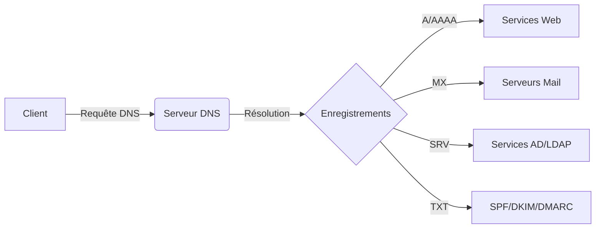

Le système DNS est une cible privilégiée lors de la phase de reconnaissance pour cartographier l'infrastructure d'une cible, identifier des services internes ou exposés, et préparer des vecteurs d'attaque comme le spoofing ou l'énumération de sous-domaines.



## Enregistrements de Base

### A (Address Record)
Associe un nom de domaine à une adresse **IPv4**.

```bash
dig A example.com
nslookup example.com
```

### AAAA (IPv6 Address Record)
Associe un nom de domaine à une adresse **IPv6**.

```bash
dig AAAA example.com
```

### CNAME (Canonical Name Record)
Redirige un domaine vers un autre nom de domaine.

```bash
dig CNAME www.example.com
```

> [!warning] Limitations
> Un domaine avec un **CNAME** ne peut pas avoir d'autres enregistrements. Des problèmes de performance peuvent survenir en cas de chaînes de **CNAME** trop longues.

### MX (Mail Exchange Record)
Définit les serveurs responsables de la réception des emails pour un domaine. La priorité est définie par un entier (plus il est bas, plus le serveur est prioritaire).

```bash
dig MX example.com
```

### TXT (Text Record)
Contient du texte arbitraire utilisé pour des vérifications de sécurité comme **SPF**, **DKIM** et **DMARC**.

```bash
dig TXT example.com
```

> [!info] Importance des enregistrements TXT
> Les enregistrements **TXT** sont cruciaux pour l'usurpation d'identité. Une mauvaise configuration **SPF** peut permettre à un attaquant d'envoyer des emails frauduleux au nom du domaine.

## Enregistrements pour Réseaux et Sécurité

### PTR (Pointer Record)
Utilisé pour la résolution inverse (IP vers nom de domaine).

```bash
dig -x 192.168.1.1
nslookup 192.168.1.1
```

### SRV (Service Record)
Spécifie les services disponibles sur un domaine avec leur port.

```bash
dig SRV _sip._tcp.example.com
```

> [!info] Utilisation des enregistrements SRV
> Les enregistrements **SRV** sont essentiels lors de l'**Active Directory Reconnaissance** pour localiser les contrôleurs de domaine et les services associés comme **LDAP** ou **Kerberos**.

### NS (Name Server Record)
Indique les serveurs DNS autorisés pour un domaine.

```bash
dig NS example.com
```

### SOA (Start of Authority)
Contient les informations sur la zone DNS principale, incluant l'email de l'administrateur et les délais de rafraîchissement.

```bash
dig SOA example.com
```

## DNS Zone Transfer (AXFR)
Le transfert de zone est un mécanisme utilisé pour répliquer les bases de données DNS entre serveurs maîtres et esclaves. Si la configuration est permissive, n'importe quel client peut demander une copie complète de la zone.

```bash
dig axfr @ns1.example.com example.com
```

> [!danger] Risque de transfert de zone (AXFR)
> Si le serveur DNS est mal configuré, il peut autoriser un transfert de zone (**AXFR**), permettant à un attaquant de récupérer l'intégralité de la zone DNS et de découvrir des sous-domaines cachés.

## DNS Enumeration techniques
L'énumération DNS est une étape critique de la **DNS Enumeration** pour découvrir des actifs non documentés.

### Subdomain Brute-forcing
Utilisation de listes de mots pour tester l'existence de sous-domaines.

```bash
gobuster dns -d example.com -w /usr/share/wordlists/subdomains.txt
```

### Reverse Lookups
Permet d'identifier d'autres domaines hébergés sur la même infrastructure IP.

```bash
dig -x 192.168.1.1 +short
```

## DNS Spoofing / Cache Poisoning concepts
Le **Cache Poisoning** consiste à injecter de fausses entrées dans le cache d'un résolveur DNS pour rediriger le trafic vers un serveur malveillant.

*   **Concept** : Exploitation de la prédictibilité des identifiants de transaction (TXID) et des ports sources.
*   **Protection** : L'implémentation de **DNSSEC** est le mécanisme principal de protection contre l'empoisonnement de cache, garantissant l'intégrité des données via des signatures cryptographiques.

## DNS over HTTPS (DoH) / DNS over TLS (DoT) considerations
Ces protocoles chiffrent les requêtes DNS pour empêcher l'interception et l'analyse du trafic (Eavesdropping).

*   **DoH** : Encapsule les requêtes DNS dans du trafic HTTPS (port 443).
*   **DoT** : Utilise TLS pour sécuriser les requêtes DNS (port 853).
*   **Impact Pentest** : Le chiffrement rend l'analyse passive du trafic réseau plus complexe, nécessitant souvent une compromission au niveau de l'hôte (Endpoint) pour intercepter les requêtes avant chiffrement.

## Enregistrements Modernes et Avancés

### CAA (Certification Authority Authorization)
Indique quelles autorités de certification sont autorisées à délivrer un certificat SSL pour le domaine.

```bash
dig CAA example.com
```

### NSEC / NSEC3 (Next Secure Record)
Utilisé dans **DNSSEC** pour prouver l'inexistence d'un enregistrement.

```bash
dig NSEC example.com
```

### DS (Delegation Signer Record)
Contient la clé de signature pour une délégation **DNSSEC**.

```bash
dig DS example.com
```

## Résumé des Principaux Types d'Enregistrements DNS

| Type | Fonction |
| :--- | :--- |
| **A** | Associe un domaine à une adresse IPv4 |
| **AAAA** | Associe un domaine à une adresse IPv6 |
| **CNAME** | Redirige un domaine vers un autre |
| **MX** | Indique les serveurs de messagerie |
| **TXT** | Contient du texte (SPF, DKIM, DMARC) |
| **PTR** | Résolution inverse (IP → Domaine) |
| **SRV** | Définit les services réseau (VoIP, LDAP, etc.) |
| **NS** | Indique les serveurs DNS autorisés |
| **SOA** | Informations sur la zone DNS |
| **CAA** | Définit l'autorité de certification pour SSL |
| **NSEC/NSEC3** | Sécurité DNSSEC |
| **DS** | Clé de délégation pour DNSSEC |

Ces concepts sont fondamentaux pour les phases de **DNS Enumeration** et de **Network Scanning**.