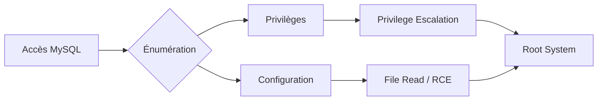

Ce document détaille les configurations à risque de **MySQL** et les procédures de durcissement associées, dans le cadre d'une évaluation de sécurité post-exploitation.



## Authentification Faible

L'absence de mots de passe sur les comptes utilisateurs permet un accès non autorisé immédiat. Cette problématique est souvent corrélée aux techniques de **Linux Privilege Escalation**.

### Vérification des comptes
```sql
SELECT user, host, authentication_string FROM mysql.user;
```

### Remédiation
```sql
ALTER USER 'root'@'localhost' IDENTIFIED BY 'StrongP@ssw0rd!';
```

## Accès Root distant

L'exposition du compte **root** sur des interfaces réseau externes augmente la surface d'attaque pour des attaques de type brute-force.

### Vérification des hôtes autorisés
```sql
SELECT user, host FROM mysql.user WHERE user='root';
```

### Remédiation
```sql
UPDATE mysql.user SET host='localhost' WHERE user='root';
FLUSH PRIVILEGES;
```

## Privilèges excessifs

L'attribution de droits globaux facilite le mouvement latéral et l'élévation de privilèges. L'énumération des privilèges nécessite un accès initial, via des **crédentials** ou une **SQL Injection Exploitation**.

### Vérification des droits
```sql
SHOW GRANTS FOR 'user'@'host';
```

### Remédiation
```sql
REVOKE ALL PRIVILEGES ON *.* FROM 'user'@'host';
GRANT SELECT, INSERT, UPDATE ON database.* TO 'user'@'host';
```

## Exposition réseau

Le service **MySQL** ne doit pas écouter sur des interfaces publiques.

### Vérification de l'écoute réseau
```bash
netstat -tulnp | grep mysql
```

### Remédiation
Modifier `/etc/mysql/mysql.conf.d/mysqld.cnf` :
```ini
bind-address = 127.0.0.1
```
Redémarrer le service :
```bash
systemctl restart mysql
```

## Lecture de fichiers locaux (LOAD_FILE)

La fonction **LOAD_FILE** peut être utilisée pour exfiltrer des fichiers sensibles du système d'exploitation si les permissions du service le permettent.

### Exploitation
```sql
SELECT LOAD_FILE('/etc/passwd');
```

### Remédiation
Désactiver dans `/etc/mysql/my.cnf` :
```ini
local-infile=0
```

## Exécution de commandes système

L'utilisation de fonctions comme **sys_exec** permet une exécution de code arbitraire sur le serveur.

> [!warning] Risque
> L'exécution de **sys_exec** nécessite souvent des privilèges root sur le service **MySQL**.

### Exploitation
```sql
SELECT sys_exec('whoami');
```

### Vérification et durcissement
```sql
SHOW VARIABLES LIKE 'secure_file_priv';
```

> [!danger] Attention
> La modification de **secure_file_priv** nécessite un redémarrage du service.

Désactiver dans `/etc/mysql/my.cnf` :
```ini
secure_file_priv=''
```

## Énumération des plugins malveillants (UDF)

Les bibliothèques UDF (User Defined Functions) permettent d'étendre les fonctionnalités de MySQL en chargeant du code arbitraire. Un attaquant peut charger une bibliothèque malveillante pour obtenir une RCE.

### Énumération des plugins chargés
```sql
SELECT * FROM mysql.func;
SHOW PLUGINS;
```

### Recherche de fichiers de plugins suspects
```bash
# Vérifier le répertoire des plugins
SHOW VARIABLES LIKE 'plugin_dir';
ls -la /usr/lib/mysql/plugin/
```

## Analyse des logs de requêtes (general_log)

Le `general_log` enregistre toutes les requêtes reçues par le serveur. S'il est activé, il peut contenir des mots de passe en clair ou des tokens de session.

### Vérification de l'état
```sql
SHOW VARIABLES LIKE 'general_log%';
```

### Activation temporaire pour audit (si nécessaire)
```sql
SET GLOBAL general_log = 'ON';
SET GLOBAL log_output = 'TABLE';
SELECT * FROM mysql.general_log;
```

## Techniques de bypass de secure_file_priv

Si `secure_file_priv` est restreint, il est parfois possible de contourner la limitation en utilisant des points de montage ou en exploitant des vulnérabilités dans le chargement des plugins.

### Vérification de la restriction
```sql
SHOW VARIABLES LIKE 'secure_file_priv';
```

### Stratégies de bypass
- **Recherche de répertoires inattendus** : Parfois, le répertoire de données (datadir) est accessible en écriture.
- **Chargement de bibliothèque** : Si `plugin_dir` est accessible en écriture, il est possible d'y déposer une bibliothèque malveillante.

## Recherche de mots de passe en clair dans les fichiers de configuration (.my.cnf)

Les utilisateurs stockent souvent des identifiants dans des fichiers de configuration locaux pour éviter de les saisir à chaque connexion.

### Recherche récursive
```bash
find / -name ".my.cnf" -exec grep -H "password" {} \; 2>/dev/null
```

### Sécurisation
```bash
chmod 600 ~/.my.cnf
```

## Sauvegardes exposées

Les fichiers de sauvegarde contiennent souvent des données en clair ou des hashs exploitables.

### Recherche de fichiers
```bash
find / -name "*.sql" -o -name "*.bak" -o -name "*.dump"
```

### Remédiation
```bash
chmod 600 /path/to/backup.sql
```

## Tableau récapitulatif des configurations

| Vulnérabilité | Solution |
| :--- | :--- |
| Comptes sans mot de passe | `ALTER USER 'user'@'host' IDENTIFIED BY 'StrongP@ss';` |
| Root accessible à distance | `UPDATE mysql.user SET host='localhost' WHERE user='root';` |
| Utilisateurs avec trop de privilèges | `REVOKE ALL PRIVILEGES ON *.* FROM 'user'@'host';` |
| MySQL exposé à Internet | `bind-address = 127.0.0.1` |
| Lecture de fichiers avec LOAD DATA | `local-infile=0` |
| Exécution de commandes système | `secure_file_priv=''` |
| Dumps SQL non protégés | `chmod 600 /path/to/backup.sql` |

> [!note] Prérequis
> L'énumération des privilèges nécessite un accès initial (crédentials ou injection SQL).

Ces points doivent être intégrés dans une stratégie globale de **Service Hardening** et complètent les notes sur **MySQL Enumeration** et **SQL Injection Exploitation**.