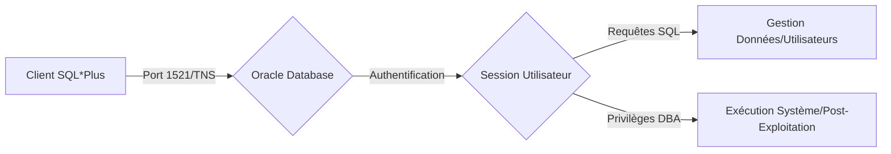

Ce document détaille les opérations d'administration et d'exploitation via **SQL*Plus** sur une instance **Oracle Database**.



> [!warning] Prérequis
> Nécessite un accès réseau au port 1521 (**TNS Listener**) et l'installation des outils **Oracle Client**.

## Énumération initiale (TNS Listener)

Avant toute exploitation, il est nécessaire de valider la configuration du service TNS. Voir la note **TNS Listener Attacks**.

```bash
# Vérification de l'état du listener via nmap
nmap -p 1521 --script oracle-tns-version <target>

# Énumération des SIDs via tnscmd10g
tnscmd10g version -h <target>
tnscmd10g status -h <target>
```

## Connexion à Oracle Database

```bash
sqlplus user/password@target.com:1521/SID
sqlplus / as sysdba
```

> [!tip]
> Utiliser **sqlplus / as sysdba** nécessite un accès shell local sur le serveur cible.

## Informations sur la base

```sql
SELECT * FROM v$version;
SHOW USER;
SELECT name FROM v$database;
SELECT instance_name FROM v$instance;
```

## Gestion des utilisateurs

```sql
SELECT username FROM all_users;
CREATE USER hacker IDENTIFIED BY Pass123;
GRANT DBA TO hacker;
ALTER USER hacker ACCOUNT UNLOCK;
DROP USER hacker CASCADE;
```

> [!danger]
> L'utilisation de **GRANT DBA** est bruyante et peut déclencher des alertes EDR/SIEM. La suppression d'utilisateurs avec **CASCADE** est irréversible.

## Gestion des bases et tables

```sql
SELECT tablespace_name FROM dba_tablespaces;
SELECT table_name FROM all_tables;
DESC users;
SELECT column_name FROM all_tab_columns WHERE table_name='USERS';
```

## CRUD

```sql
INSERT INTO users (id, name) VALUES (1, 'Alice');
SELECT * FROM users;
UPDATE users SET name='Bob' WHERE id=1;
DELETE FROM users WHERE id=1;
```

## Privilèges et rôles

```sql
SELECT * FROM user_sys_privs;
GRANT CONNECT, RESOURCE TO hacker;
REVOKE DBA FROM hacker;
```

## Escalade de privilèges (PL/SQL injection)

L'exploitation de procédures stockées vulnérables (ex: injection SQL dans un bloc PL/SQL exécuté avec les droits du propriétaire - `AUTHID DEFINER`) permet d'élever ses privilèges.

```sql
-- Exemple d'injection dans une procédure vulnérable
EXECUTE vulnerable_proc('admin''--');
```

## Exécution de commandes système

```sql
SELECT sys_context('USERENV', 'CURRENT_USER') FROM dual;
SELECT utl_inaddr.get_host_address FROM dual;
```

> [!note]
> Ces commandes permettent d'extraire des informations contextuelles sur l'environnement serveur, souvent utiles lors des phases d'énumération post-exploitation ou de **Database Exploitation Techniques**.

## Exploitation de vulnérabilités spécifiques (CVE)

L'exploitation repose souvent sur des composants obsolètes ou des packages PL/SQL mal configurés.

```bash
# Recherche de vulnérabilités via nmap
nmap --script oracle-brute,oracle-enum-users,oracle-tns-version <target>
```

## Post-exploitation (Exfiltration, dump de hashs)

Récupération des hashs des utilisateurs pour une attaque hors-ligne.

```sql
-- Dump des hashs (nécessite privilèges DBA)
SELECT name, password FROM sys.user$;
```

## Persistence (Triggers, Jobs)

Mise en place de triggers pour maintenir l'accès ou exécuter du code à chaque connexion.

```sql
CREATE OR REPLACE TRIGGER persistence_trigger
AFTER LOGON ON DATABASE
BEGIN
  -- Action malveillante
END;
/
```

## Déconnexion

```sql
EXIT;
```

Pour approfondir ces sujets, consulter les notes sur **Oracle Database Enumeration**, **Database Exploitation Techniques** et **TNS Listener Attacks**.