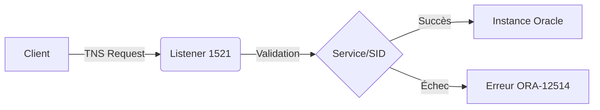

Ce guide détaille les procédures de diagnostic et d'interaction avec le service **Oracle TNS** dans le cadre d'une phase de reconnaissance ou de troubleshooting.



> [!info]
> Le port 1521 est la cible principale pour l'énumération **Oracle**.

## Vérification du Listener

### État du service
La commande **lsnrctl** permet d'interagir avec le processus **TNSLSNR**.

```bash
lsnrctl status
```

Exemple de sortie :
```text
TNSLSNR for Linux: Version 12.2.0.1.0
Service "ORCL" has 1 instance(s)
Instance "orcl", status READY
```

### Gestion du service
```bash
lsnrctl stop
lsnrctl start
```

## Configuration listener.ora

Le fichier `/opt/oracle/network/admin/listener.ora` définit les paramètres d'écoute du serveur.

> [!warning]
> La modification de **listener.ora** nécessite souvent un redémarrage du service.

```ini
LISTENER =
  (DESCRIPTION_LIST =
    (DESCRIPTION =
      (ADDRESS = (PROTOCOL = TCP)(HOST = 192.168.1.100)(PORT = 1521))
    )
  )
```

### Validation réseau
L'outil **tnsping** vérifie la connectivité sans établir de session complète.

```bash
tnsping target.com
```

## Configuration tnsnames.ora

Le fichier `/opt/oracle/network/admin/tnsnames.ora` contient les alias de connexion.

```ini
ORCL =
  (DESCRIPTION =
    (ADDRESS_LIST =
      (ADDRESS = (PROTOCOL = TCP)(HOST = 192.168.1.100)(PORT = 1521))
    )
    (CONNECT_DATA =
      (SERVICE_NAME = orcl)
    )
  )
```

Vérification des ports ouverts via **netstat** :
```bash
netstat -tulnp | grep 1521
```

## Énumération des SID/Service Names via brute-force (nmap/odat)

L'énumération des SID est cruciale pour accéder à l'instance. On utilise **nmap** pour les SID connus et **odat** pour une énumération exhaustive.

```bash
# Nmap avec script dédié
nmap -p 1521 --script oracle-sid-brute <target>

# Utilisation d'ODAT pour énumérer les SID via dictionnaire
odat sidguesser -s <target> -p 1521
```

> [!tip]
> Référez-vous à la note **Oracle Database Enumeration** pour les listes de mots de passe et SID par défaut.

## Exploitation des vulnérabilités TNS (TNS Poisoning)

Le **TNS Poisoning** permet de rediriger le trafic vers un serveur malveillant en manipulant le fichier `listener.ora` ou en injectant des configurations via le protocole TNS si le listener est mal configuré.

```bash
# Vérification de la vulnérabilité avec ODAT
odat tnscmd -s <target> -p 1521 --ping
```

Cette technique permet souvent de contourner l'authentification ou d'intercepter des sessions. Voir **Oracle Database Exploitation** pour les vecteurs d'attaque avancés.

## Configuration de sécurité du listener (PASSWORD_LISTENER)

Un listener non protégé permet à n'importe quel utilisateur distant d'arrêter le service.

```bash
# Vérification de la protection
lsnrctl status
# Si "The command completed successfully" sans mot de passe, le listener est vulnérable.

# Configuration de la protection dans listener.ora
ADMIN_RESTRICTIONS_LISTENER = ON
# Définition du mot de passe via lsnrctl
lsnrctl
LSNRCTL> change_password
LSNRCTL> save_config
```

## Analyse des permissions sur les fichiers de configuration

L'accès en lecture/écriture sur les fichiers de configuration permet une élévation de privilèges ou une persistance.

```bash
# Vérification des permissions Linux
ls -la /opt/oracle/network/admin/
```

| Fichier | Permission recommandée | Risque |
| :--- | :--- | :--- |
| listener.ora | 640 (oracle:oinstall) | Modification du comportement du listener |
| tnsnames.ora | 644 (oracle:oinstall) | Injection de redirections malveillantes |

Voir **Linux Enumeration** pour l'analyse des droits d'accès.

## Test de connexion SQLPlus

### Connexion par SID
```bash
sqlplus user/password@192.168.1.100:1521/ORCL
```

> [!note]
> L'erreur **ORA-12514** est un indicateur clé pour identifier des services cachés.

### Connexion par Service Name
```bash
sqlplus user/password@'(DESCRIPTION=(ADDRESS=(PROTOCOL=TCP)(HOST=192.168.1.100)(PORT=1521))(CONNECT_DATA=(SERVICE_NAME=orcl)))'
```

Vérification du **SERVICE_NAME** côté serveur :
```sql
SELECT value FROM v$parameter WHERE name = 'service_names';
```

## Analyse des logs

> [!danger]
> Attention aux logs : ils peuvent contenir des informations sensibles sur les tentatives de connexion.

### Logs du Listener
```bash
cat $ORACLE_HOME/diag/tnslsnr/$(hostname)/listener/alert/log.xml | grep ERROR
```

### Logs de l'instance
```bash
tail -f $ORACLE_BASE/diag/rdbms/orcl/ORCL/trace/alert_ORCL.log
```

## Matrice de résolution des erreurs

| Problème | Solution |
| :--- | :--- |
| No Listener (TNS-12541) | **lsnrctl start** et vérifier **listener.ora** |
| Service non trouvé (TNS-12514) | **lsnrctl services** pour voir les services actifs |
| SID incorrect (ORA-12505) | Vérifier **tnsnames.ora** et **v$parameter** |
| Connexion impossible (ORA-12154) | Vérifier **tnsnames.ora** et tester **tnsping** |
| Listener non sécurisé | Ajouter **ADMIN_RESTRICTIONS=ON** dans **listener.ora** |

Pour approfondir ces sujets, consulter les notes sur **Oracle Database Enumeration**, **Oracle Database Exploitation**, **Linux Enumeration** et **SQL Injection**.