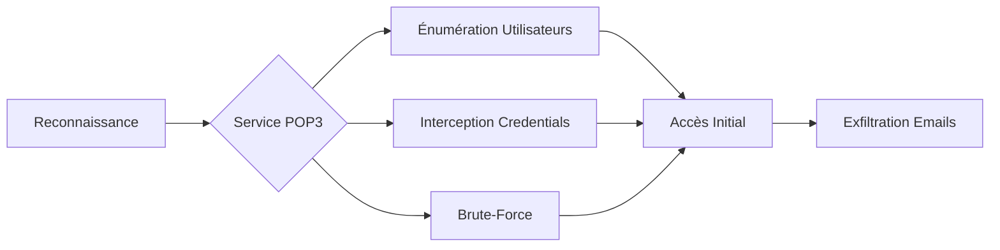

L'analyse des configurations du protocole POP3 révèle plusieurs vecteurs d'attaque exploitables lors de la phase de reconnaissance.



## Ports POP3

| Protocole | Port | Description |
| :--- | :--- | :--- |
| POP3 | 110 | Standard, non chiffré |
| POP3S | 995 | Chiffré avec SSL/TLS |

> [!danger]
> Le port 110 transmet les **credentials** en clair ; privilégier systématiquement le port 995 (**POP3S**).

## Analyse des certificats SSL/TLS (si POP3S est utilisé)

Lorsqu'une connexion chiffrée est établie, il est impératif de vérifier la validité du certificat pour détecter des configurations erronées ou des attaques de type **MITM** potentielles.

```bash
openssl s_client -connect target.com:995 -showcerts
```

Vérification des détails du certificat (expiration, autorité de certification) :
```bash
openssl s_client -connect target.com:995 </dev/null 2>/dev/null | openssl x509 -noout -text
```

## Recherche de vulnérabilités connues sur la version du service (CVE)

L'identification précise de la bannière permet de corréler la version du service avec des vulnérabilités connues (référencées dans **Service Enumeration**).

```bash
nmap -sV -p 110,995 --script=banner target.com
```

Une fois la version identifiée (ex: Dovecot 2.2.10), rechercher les CVE associées :
```bash
searchsploit dovecot 2.2.10
```

## Authentification en clair

L'absence de **SSL/TLS** expose les identifiants à des attaques de type **MITM**.

### Vérification de la configuration SSL

```bash
nmap --script=pop3-capabilities -p 110,995 target.com
```

### Capture de trafic avec tcpdump

> [!warning]
> L'utilisation de **tcpdump** sur un réseau de production peut être détectée par les solutions IDS/IPS.

```bash
tcpdump -i eth0 port 110 -A
```

Exemple de sortie :
```text
USER admin
PASS secret123
```

### Mitigation
Configurer le service (ex: **dovecot.conf**) pour forcer le chiffrement :
```ini
ssl=yes
disable_plaintext_auth=yes
```

## Énumération des utilisateurs

Certains serveurs **POP3** confirment l'existence d'un compte via des réponses différenciées.

> [!warning]
> L'énumération d'utilisateurs est souvent le prérequis pour des attaques de **credential stuffing**.

### Test manuel
```bash
nc target.com 110
USER admin
```

Réponse indicative :
```text
+OK User exists
-ERR Unknown user
```

### Automatisation
```bash
for user in $(cat users.txt); do echo "USER $user" | nc target.com 110; done
```

### Mitigation
Configurer le serveur pour renvoyer une erreur générique :
```ini
disable_user_unknown_response=yes
```

## Authentification faible

### Bruteforce des identifiants
> [!tip]
> Toujours vérifier la bannière du service avant de lancer des outils automatisés comme **hydra** pour éviter de bloquer le compte.

```bash
hydra -L users.txt -P passwords.txt target.com pop3 -V
```

### Mitigation
Appliquer une politique de mots de passe robustes et limiter les tentatives :
```ini
auth_fail_delay = 5s
max_auth_failures = 3
```

## Absence de protection contre les attaques Brute-Force

### Test de résistance
```bash
hydra -L users.txt -P passwords.txt target.com pop3 -V -t 20
```

### Mitigation via Fail2Ban
Installation et configuration :
```bash
sudo apt install fail2ban
```

Configuration dans `/etc/fail2ban/jail.local` :
```ini
[pop3]
enabled = true
port = 110
filter = pop3
logpath = /var/log/mail.log
maxretry = 3
bantime = 3600
```

```bash
sudo systemctl restart fail2ban
```

## POP3 ouvert à Internet

### Vérification de l'exposition
```bash
nmap -p 110,995 --script=pop3-capabilities target.com
```

### Mitigation
Restreindre l'accès via **iptables** :
```bash
iptables -A INPUT -p tcp --dport 110 -s 0.0.0.0/0 -j DROP
```

## Analyse des headers de mail pour fuite d'informations (OSINT)

L'analyse des en-têtes (headers) d'un email récupéré peut révéler des informations sur l'infrastructure interne (adresses IP privées, noms de serveurs internes, versions de logiciels).

Exemple de headers analysés :
```text
Received: from mail-internal.local (10.0.0.5) by mail-gateway.target.com
X-Mailer: Dovecot v2.3.4
```

Cette étape permet de cartographier le réseau interne (voir **Network Traffic Analysis**).

## Messages sensibles non chiffrés

### Récupération des emails
```bash
telnet target.com 110
USER admin
PASS secret123
LIST
RETR 1
```

Exemple de contenu sensible :
```text
From: support@bank.com
Subject: Your new password
Message: Your password is P@ssword123
```

## Techniques de contournement de WAF/IPS

Si un WAF ou un IPS bloque les tentatives d'énumération ou de brute-force, il est possible de tenter de contourner ces protections :

1. **Fragmentation des paquets** : Utiliser `nmap -f` pour fragmenter les paquets et tenter de passer outre les signatures IDS.
2. **Slow rate limiting** : Réduire la vitesse des requêtes pour rester sous le seuil de détection (ex: `-t 1` avec hydra).
3. **Rotation d'IP** : Utiliser des proxies pour distribuer les tentatives d'authentification.

## Résumé des paramètres

| Vulnérabilité | Solution |
| :--- | :--- |
| Authentification en clair | Activer `ssl=yes` et `disable_plaintext_auth=yes` |
| Énumération des utilisateurs | Configurer une réponse générique : `-ERR Authentication failed` |
| Mots de passe faibles | Exiger un mot de passe fort, activer `max_auth_failures` |
| Bruteforce non limité | Configurer **Fail2Ban** avec `maxretry = 3` |
| POP3 ouvert à Internet | Restreindre avec **iptables** et `listen = 192.168.1.1` |
| Emails non chiffrés | Utiliser **PGP**/**S-MIME** et sensibiliser les utilisateurs |

**Liens associés :**
- Service Enumeration
- Password Attacks
- Network Traffic Analysis
- Hardening Mail Servers