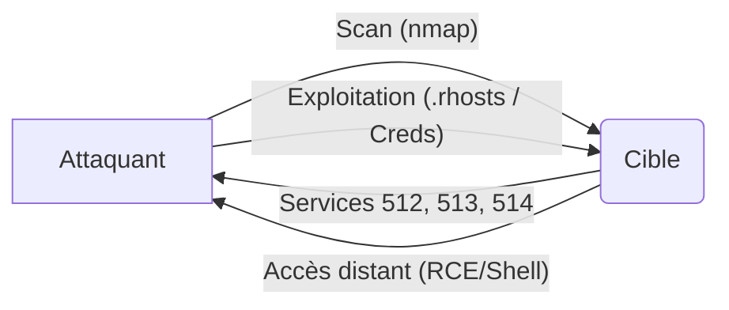

Ce document détaille l'énumération et l'exploitation des **R-Services** (**rsh**, **rlogin**, **rexec**). Ces services sont obsolètes et présentent des risques critiques de sécurité, notamment l'absence de chiffrement et une authentification basée sur la confiance IP.



## Détection des services

Les **R-Services** opèrent sur les ports 512, 513 et 514. L'utilisation de **nmap** permet d'identifier leur présence sur une cible.

### Scan avec Nmap

```bash
nmap -p 512,513,514 --script=rservices target.com
```

Sortie attendue :

```text
512/tcp open  exec
513/tcp open  login
514/tcp open  shell
```

> [!danger] Risque de sécurité
> Les **R-Services** transmettent les données en clair sur le réseau, exposant les identifiants et les commandes à une interception par sniffing.

## Énumération des utilisateurs

L'outil **rusers** permet de lister les utilisateurs actuellement connectés sur le système distant, facilitant ainsi la phase de reconnaissance des cibles potentielles.

### Lister les utilisateurs actifs

```bash
rusers target.com
```

Sortie attendue :

```text
admin    target.com
john     target.com
```

> [!info] Prérequis
> L'énumération nécessite souvent une connaissance préalable des utilisateurs valides sur le système cible pour cibler les sessions actives.

## Analyse des fichiers de configuration (.rhosts, /etc/hosts.equiv)

La sécurité des **R-Services** repose sur des fichiers de configuration qui définissent des relations de confiance entre hôtes et utilisateurs. Si ces fichiers sont mal configurés (ex: `+ +`), l'accès est trivial.

- `/etc/hosts.equiv` : Définit les hôtes et utilisateurs autorisés à se connecter sans mot de passe à l'échelle du système.
- `~/.rhosts` : Définit les permissions spécifiques à un utilisateur dans son répertoire personnel.

Une ligne contenant `+ +` dans ces fichiers autorise n'importe quel utilisateur depuis n'importe quel hôte à se connecter.

## Techniques de spoofing IP (pour contourner les restrictions basées sur l'hôte)

Puisque l'authentification **R-Services** repose sur l'adresse IP source, il est théoriquement possible de contourner ces restrictions en usurpant l'adresse IP d'un hôte de confiance.

> [!danger] Condition critique
> L'exploitation repose souvent sur la confiance IP définie dans .rhosts.

Cette technique nécessite d'être sur le même segment réseau local ou de pouvoir injecter des paquets avec une IP source falsifiée (IP Spoofing) tout en désactivant la réponse de la machine légitime (via un déni de service temporaire sur l'hôte usurpé).

## Analyse de trafic réseau (Wireshark/tcpdump pour capture d'identifiants rexec)

Le protocole **rexec** transmet le nom d'utilisateur et le mot de passe en clair avant l'exécution de la commande.

### Capture avec tcpdump

```bash
tcpdump -i eth0 port 512 -A -vv
```

En filtrant le trafic sur le port 512, il est possible d'extraire les chaînes de caractères correspondant aux identifiants lors d'une tentative de connexion légitime sur le réseau.

## Exploitation rlogin

Le service **rlogin** (port 513) permet une connexion distante. L'accès est accordé sans mot de passe si l'adresse IP de l'attaquant est listée dans le fichier `.rhosts` ou `/etc/hosts.equiv` de l'utilisateur cible.

### Connexion via rlogin

```bash
rlogin -l root target.com
```

## Exploitation rsh

Le service **rsh** (port 514) permet l'exécution de commandes à distance sans authentification interactive, sous réserve de configurations permissives.

### Exécution de commande distante

```bash
rsh target.com -l root "whoami"
```

## Exploitation rexec

Le service **rexec** (port 512) nécessite des identifiants. Ces derniers étant transmis en clair, ils peuvent être capturés via une analyse de trafic réseau.

### Connexion via rexec

```bash
rexec target.com -l user -p password "id"
```

## Escalade de privilèges post-accès initial

Une fois un accès obtenu via les **R-Services**, l'escalade de privilèges peut être facilitée par la persistance des configurations de confiance.

1. **Vérification des droits SUID** : Rechercher des binaires avec le bit SUID actif appartenant à root.
2. **Injection dans .rhosts** : Si l'utilisateur compromis a des droits d'écriture sur le répertoire personnel d'un autre utilisateur (ou root), ajouter l'IP de l'attaquant dans `.rhosts` pour obtenir un accès permanent et privilégié.
3. **Analyse des tâches planifiées** : Vérifier les crontabs qui pourraient exécuter des scripts avec des privilèges élevés.

## Mitigation

La sécurisation des systèmes implique la désactivation systématique de ces services au profit de solutions chiffrées comme **SSH**.

### Désactivation des services

```bash
systemctl disable rlogin.socket
systemctl disable rsh.socket
systemctl disable rexec.socket
```

> [!note] Recommandations
> En complément de la désactivation des services, il est nécessaire de supprimer les fichiers de configuration `.rhosts` et `/etc/hosts.equiv` pour éliminer toute persistance de règles de confiance obsolètes.

## Synthèse des commandes

| Étape | Commande |
| :--- | :--- |
| Scanner les ports | `nmap -p 512,513,514 --script=rservices target.com` |
| Lister les utilisateurs | `rusers target.com` |
| Tester rlogin | `rlogin -l root target.com` |
| Exécuter commande rsh | `rsh target.com -l root "whoami"` |
| Tester rexec | `rexec target.com -l user -p password "id"` |

Ce sujet est lié aux phases d'**Enumeration**, de **Service Enumeration**, de sécurisation **Linux** et de **SSH Hardening**.