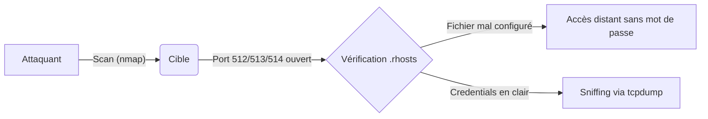

Les **R-Services** (**Remote Services**) sont des services Unix historiques permettant l’accès distant via des listes de confiance. Ils sont obsolètes et présentent des risques critiques de sécurité, notamment l'absence de chiffrement et une authentification basée sur la confiance réseau.



## Reconnaissance (nmap/scripts de scan)
L'identification des services **rexec**, **rlogin** et **rsh** s'effectue via une énumération réseau. Il est nécessaire de vérifier la présence des services et de tenter d'identifier les configurations permissives.

```bash
# Scan de détection de services
nmap -sV -p 512,513,514 <target_ip>

# Utilisation des scripts NSE pour tester l'accessibilité
nmap -p 512,513,514 --script rlogin-brute,rexec-brute <target_ip>
```

## Ports associés

| Port | Service | Fonction |
|---|---|---|
| 512/TCP | **rexec** | Exécute des commandes à distance avec login/mot de passe en clair |
| 513/TCP | **rlogin** | Permet la connexion sans mot de passe via fichier .rhosts |
| 514/TCP | **rsh** | Exécute des commandes à distance sans mot de passe via .rhosts |

> [!danger] Risque de sniffing
> Les **R-Services** transmettent les données en clair, vulnérables au **Network Sniffing and Spoofing**.

## Analyse des fichiers de configuration (.rhosts, /etc/hosts.equiv)
> [!warning] Condition critique
> L'exploitation de **rlogin** et **rsh** dépend entièrement de la présence et de la configuration du fichier `.rhosts` ou `/etc/hosts.equiv`.

Ces fichiers définissent les relations de confiance entre les hôtes. Si un utilisateur a configuré `+ +` dans son fichier `~/.rhosts`, n'importe quel utilisateur provenant de n'importe quelle machine peut se connecter sans mot de passe.

- `/etc/hosts.equiv` : Liste les hôtes et utilisateurs autorisés globalement.
- `~/.rhosts` : Liste les hôtes et utilisateurs autorisés pour un compte spécifique.

## Techniques de bypass ou d'usurpation d'IP (IP spoofing)
Puisque l'authentification repose sur l'adresse IP source, il est possible de contourner ces contrôles si l'attaquant peut usurper l'adresse IP d'un hôte de confiance.

```bash
# Exemple conceptuel d'usurpation pour injection de commande
# L'attaquant envoie un paquet forgé avec l'IP source d'un hôte autorisé
hping3 -S -s 514 -p 514 <target_ip> -c 1
```
Cette technique nécessite une connaissance préalable de la topologie réseau et des hôtes de confiance identifiés lors de la phase de **Network Sniffing and Spoofing**.

## Exploitation rexec (Port 512)
**rexec** permet l'exécution de commandes distantes en fournissant un couple utilisateur/mot de passe.

```bash
rexec target.com -l user -p password "id"
```

> [!tip] Capture de credentials
> Utiliser **tcpdump** pour intercepter les credentials lors de l'utilisation de **rexec**.
```bash
tcpdump -i eth0 port 512 -A
```

## Exploitation rlogin (Port 513)
**rlogin** permet une connexion interactive sans mot de passe si la configuration du serveur autorise l'hôte distant.

```bash
rlogin -l root target.com
```

## Exploitation rsh (Port 514)
**rsh** permet l'exécution de commandes distantes sans authentification, sous réserve que la machine source soit définie dans les fichiers de confiance.

```bash
rsh target.com -l root "whoami"
```

## Escalade de privilèges post-accès
Une fois l'accès initial obtenu via les R-Services, l'objectif est d'élever ses privilèges. Les méthodes classiques de **Linux Enumeration** s'appliquent :

1. **Recherche de SUID** : `find / -perm -u=s -type f 2>/dev/null`
2. **Credential Harvesting** : Recherche de mots de passe en clair dans les scripts de sauvegarde ou fichiers de configuration.
3. **SSH Hardening** : Vérifier si des clés privées SSH sont accessibles dans `~/.ssh/` pour pivoter vers des accès plus sécurisés.

## Mitigation

Pour sécuriser le système, il est impératif de désactiver les services et de supprimer les fichiers de configuration obsolètes.

```bash
systemctl disable rexec.socket
systemctl disable rlogin.socket
systemctl disable rsh.socket
```

## Résumé des risques

| Port | Service | Usage | Risque | Mitigation |
|---|---|---|---|---|
| 512/TCP | **rexec** | Commande distante avec login/mot de passe | Mot de passe en clair | Désactiver et utiliser SSH |
| 513/TCP | **rlogin** | Connexion sans mot de passe via .rhosts | Authentification basée sur la confiance | Supprimer .rhosts, désactiver rlogin |
| 514/TCP | **rsh** | Exécution de commandes sans mot de passe | Pas d'authentification | Désactiver rsh, utiliser SSH |

## Liens associés
- **Linux Enumeration**
- **Network Sniffing and Spoofing**
- **SSH Hardening**
- **Credential Harvesting**