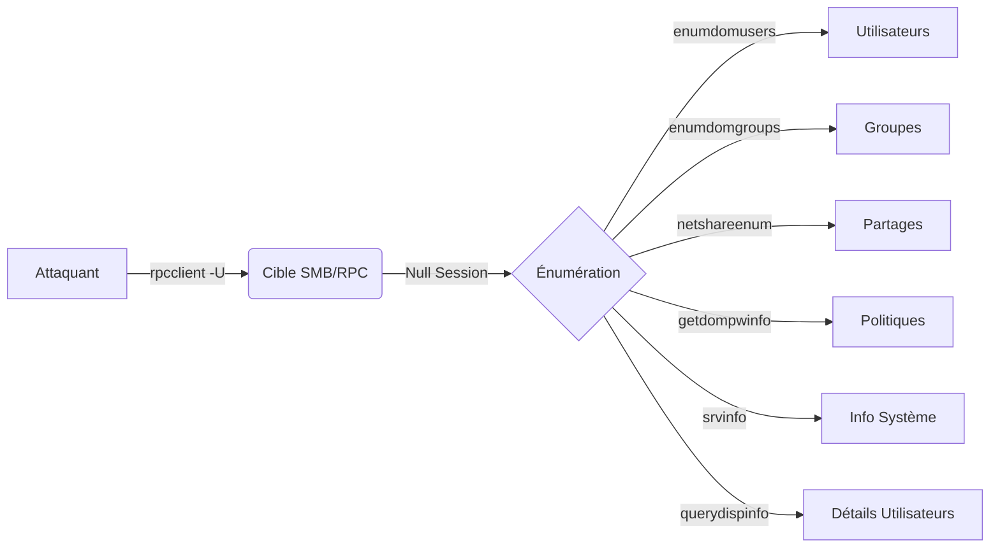

L'énumération via **rpcclient** permet d'interagir avec les services RPC d'un système Windows ou d'un contrôleur de domaine via le protocole SMB. Cette phase est souvent corrélée avec l'**Active Directory Enumeration** et l'**SMB Enumeration with CrackMapExec**.



## Connexion au serveur RPC sur SMB

L'outil **rpcclient** fait partie de la suite **Samba**. Il communique via les ports **445/TCP** (SMB Direct) ou **139/TCP** (NetBIOS).

> [!warning]
> Les **Null Sessions** sont de plus en plus restreintes par les politiques de sécurité comme **RestrictAnonymous**. Toujours vérifier la version du protocole SMB (**SMBv1** vs **SMBv2/3**).

### Connexion anonyme
```bash
rpcclient -U "" target.com
```

### Connexion avec identifiants
```bash
rpcclient -U "administrator" target.com
```

## Gestion des erreurs et troubleshooting

Lors de l'utilisation de **rpcclient**, plusieurs erreurs courantes peuvent survenir selon la configuration de la cible :

| Erreur | Cause probable | Action recommandée |
| :--- | :--- | :--- |
| `NT_STATUS_ACCESS_DENIED` | Accès refusé par la politique `RestrictAnonymous` | Tenter une authentification valide ou passer par **Null Session Exploitation** |
| `NT_STATUS_LOGON_FAILURE` | Identifiants invalides | Vérifier les credentials via **SMB Enumeration with CrackMapExec** |
| `Connection refused` | Port 445/139 fermé ou filtré | Vérifier la connectivité réseau et le scan de ports |

Si une erreur `RPC_S_ACCESS_DENIED` survient, cela indique que le service RPC restreint l'accès aux utilisateurs non authentifiés. Il est alors nécessaire de disposer d'un compte valide pour poursuivre l'énumération.

## Différences entre Workgroup et Domain Controller

Il est crucial de distinguer la cible :
- **Workgroup (Standalone)** : L'énumération se limite souvent à la base SAM locale. Les commandes comme `enumdomusers` peuvent échouer ou ne retourner que des comptes locaux.
- **Domain Controller (AD)** : L'énumération via **rpcclient** permet d'extraire des informations sur l'ensemble de la forêt Active Directory (utilisateurs, groupes, politiques de domaine).

## Énumération des utilisateurs

### Lister les utilisateurs du domaine
```bash
enumdomusers
```

Exemple de sortie :
```text
User RID  : 500
User Name : Administrator
User RID  : 501
User Name : Guest
```

### Récupérer les informations d'un utilisateur
```bash
queryuser Administrator
```

## Techniques d'énumération avancées

### Informations système
La commande `srvinfo` permet de récupérer des détails sur le système d'exploitation distant, la version du build et le rôle du serveur (ex: Domain Controller).
```bash
srvinfo
```

### Énumération détaillée des comptes
La commande `querydispinfo` offre une vue plus complète des utilisateurs et de leurs descriptions, souvent utile pour identifier des comptes de service ou des comptes administrateurs.
```bash
querydispinfo
```

## Énumération des groupes

### Lister les groupes du domaine
```bash
enumdomgroups
```

Exemple de sortie :
```text
Group RID  : 512
Group Name : Domain Admins
Group RID  : 513
Group Name : Domain Users
```

### Lister les membres d'un groupe
```bash
querygroupmem 512
```

## Énumération des partages SMB

### Lister les partages accessibles
```bash
netshareenum
```

Exemple de sortie :
```text
Share Name  : ADMIN$
Share Type  : Disk
Share Name  : Public
Share Type  : Disk
```

## Énumération des politiques de sécurité

### Vérifier la politique de mot de passe
```bash
getdompwinfo
```

Exemple de sortie :
```text
Minimum password length: 8
Maximum password age: 30 days
Lockout threshold: 5 attempts
```

## Énumération des sessions

### Lister les informations du domaine
```bash
querydominfo
```

## Récupération d'informations système et SID

> [!danger]
> Les commandes **lsaenumsid** et **lookupnames** ne permettent pas directement de dumper des hashes **SAM** via **rpcclient**. Cette action nécessite des privilèges **SYSTEM** ou l'utilisation d'outils comme **secretsdump.py**.

### Énumérer les SID
```bash
lsaenumsid
```

### Résoudre les noms d'utilisateurs
```bash
lookupnames Administrator
```

## Nettoyage des traces

Lors d'un pentest, il est nécessaire de limiter l'empreinte laissée sur les logs Windows (Event ID 4624/4625) :
1. **Éviter les scans massifs** : Ne pas automatiser les requêtes `rpcclient` en boucle.
2. **Utiliser des comptes légitimes** : Si possible, utiliser des comptes de service existants pour éviter de créer des alertes sur des tentatives de connexion infructueuses.
3. **Nettoyage local** : Supprimer l'historique de la console (`history -c` ou `unset HISTFILE`) si des commandes sensibles ont été tapées en clair.

## Récapitulatif des commandes

| Étape | Commande |
| :--- | :--- |
| Connexion anonyme | `rpcclient -U "" target.com` |
| Connexion avec identifiants | `rpcclient -U "admin" target.com` |
| Lister les utilisateurs | `enumdomusers` |
| Lister les groupes | `enumdomgroups` |
| Lister les membres d'un groupe | `querygroupmem 512` |
| Lister les partages SMB | `netshareenum` |
| Vérifier la politique de mot de passe | `getdompwinfo` |
| Lister les infos du domaine | `querydominfo` |
| Récupérer les SID | `lsaenumsid` |
| Info système avancée | `srvinfo` |

Pour approfondir, consulter les notes sur le **Null Session Exploitation** et le **Password Cracking with Hashcat** pour le traitement des données extraites.