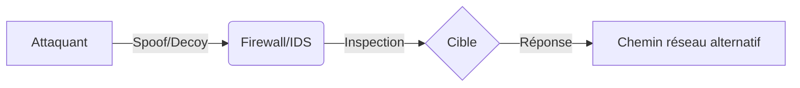

## Nmap - Firewall & IDS/IPS Evasion

Ce diagramme illustre le flux de paquets lors de l'utilisation de techniques d'évasion comme le spoofing d'IP ou l'utilisation de leurres.



## Techniques de contournement

| Option | Fonction |
| :--- | :--- |
| `-sA` | **ACK scan** (utile pour déterminer règles de firewall) |
| `-sS` | **SYN scan**, classique mais plus détectable |
| `--source-port 53` | Scanne depuis port 53 (souvent autorisé) |
| `-D RND:5` | Scan avec 5 IP leurres (**Decoys**) |
| `-S <IP>` | Spoof l’adresse source |
| `-e tun0` | Utilise une interface spécifique |
| `--packet-trace` | Montre tous les paquets envoyés/reçus |
| `-O` | Détection système d’exploitation |
| `--dns-servers <IP>` | Utilise un DNS spécifique |
| `-Pn -n --disable-arp-ping` | Mode silencieux (pas d'ARP/DNS/ICMP) |

## Comparaison SYN vs ACK scan

> [!warning]
> Le scan **ACK** (-sA) ne permet pas de découvrir des ports ouverts, seulement de cartographier les règles de filtrage.

```bash
sudo nmap 10.129.2.28 -p 21,22,25 -sS -Pn -n --disable-arp-ping --packet-trace
sudo nmap 10.129.2.28 -p 21,22,25 -sA -Pn -n --disable-arp-ping --packet-trace
```

| Résultat attendu |
| :--- |
| `filtered` si aucune réponse (drop) |
| `unfiltered` si RST reçu (ACK passé par firewall) |

## Scan avec leurres (decoys)

```bash
sudo nmap 10.129.2.28 -p 80 -sS -Pn -n --disable-arp-ping --packet-trace -D RND:5
```

## Spoof de l’IP source

> [!danger]
> Le spoofing d'IP (-S) nécessite un accès à la réponse (ex: via un autre chemin réseau ou sniffing) pour être utile.

```bash
sudo nmap 10.129.2.28 -p 445 -O -S 10.129.2.200 -e tun0 -Pn -n
```

## Scan depuis un port confiance

> [!warning]
> L'utilisation de **--source-port 53** est une technique legacy, souvent bloquée par les firewalls modernes avec inspection applicative.

```bash
sudo nmap 10.129.2.28 -p50000 -sS -Pn -n --disable-arp-ping --packet-trace --source-port 53
```

## Connexion manuelle

```bash
ncat -nv --source-port 53 10.129.2.28 50000
```

## Fragmentation des paquets (--mtu, -f)

La fragmentation permet de diviser les en-têtes TCP sur plusieurs paquets, rendant la reconstruction difficile pour certains IDS/IPS anciens.

```bash
# Fragmentation simple (paquets de 8 octets de données)
sudo nmap -f 10.129.2.28

# Fragmentation personnalisée (MTU doit être un multiple de 8)
sudo nmap --mtu 24 10.129.2.28
```

## Temporisation et vitesse (--min-rate, -T)

Le contrôle du débit est crucial pour éviter de saturer les IDS ou de déclencher des alertes de scan agressif.

```bash
# Limiter le nombre de paquets par seconde
sudo nmap --min-rate 10 10.129.2.28

# Utilisation de -T (0=Paranoïde, 1=Sneaky, 2=Polite, 3=Normal, 4=Aggressive, 5=Insane)
sudo nmap -T2 10.129.2.28
```

## Manipulation de données (data-length, --randomize-hosts)

Ajouter des données aléatoires ou modifier la taille des paquets peut contourner les signatures basées sur la taille fixe des paquets Nmap.

```bash
# Ajouter 20 octets de données aléatoires à chaque paquet
sudo nmap --data-length 20 10.129.2.28

# Randomiser l'ordre des hôtes pour éviter la détection de scan séquentiel
sudo nmap --randomize-hosts 10.129.2.1-254
```

## Utilisation de scripts NSE pour l'évasion

Certains scripts NSE permettent de tester la résilience des firewalls ou de récupérer des informations sans scan de ports complet.

```bash
# Utilisation de scripts de découverte pour éviter le scan de ports bruyant
sudo nmap -sC -sV --script=firewall-bypass 10.129.2.28
```

## Codes ICMP utiles

| Code ICMP | Signification |
| :--- | :--- |
| type 3 code 3 | Port unreachable → fermé |
| type 3 code 1 / 10 | Host/net prohibited |
| Aucun retour | Probablement **drop** par firewall |

## IDS / IPS - Détection & contournement

| Méthode | Usage |
| :--- | :--- |
| Scan rapide + spécifique | Évite de tout déclencher à la fois |
| Découpage (scan IP par IP) | Empêche corrélation trop rapide |
| VPS + IP rotation | Contourne blocage IP |
| Banner grabbing manuel | Évite usage de signatures **Nmap** détectables |
| Utiliser **--source-port** DNS | Déguiser le trafic en DNS légitime |

> [!note]
> Ces techniques s'inscrivent dans une méthodologie globale de **Reconnaissance** et doivent être corrélées avec les concepts de **Nmap Network Scanning**, **Firewall Evasion Techniques** et **Network Traffic Analysis**.