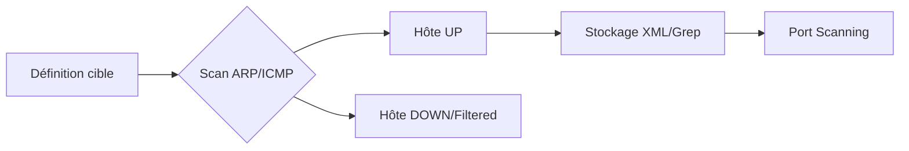

Ce document détaille les méthodologies de découverte d'hôtes via **Nmap**, essentielles pour la phase de reconnaissance réseau avant toute interaction avec les services cibles, comme détaillé dans **Network Enumeration** et **Active Reconnaissance**.



## Objectif
Identifier les hôtes actifs sur un réseau interne sans lancer de port scan, afin de cartographier les machines vivantes. Cette étape est un prérequis à toute phase de reconnaissance approfondie.

## Scans Essentiels

| Type de scan | Commande | Description |
| :--- | :--- | :--- |
| Réseau complet (CIDR) | `sudo nmap -sn 10.129.2.0/24 -oA tnet` | Scan ICMP & ARP, sans portscan |
| Liste IPs | `sudo nmap -sn -iL hosts.lst -oA tnet` | Lecture des IP depuis un fichier |
| IP unique | `sudo nmap -sn 10.129.2.18 -oA host` | Vérification d'un hôte spécifique |
| Plage d’IP | `sudo nmap -sn 10.129.2.18-20 -oA tnet` | Spécification d'une plage sans CIDR |

> [!tip] Extraction des résultats
> Utiliser **grep** et **cut** pour isoler les adresses IP actives :
> `nmap -sn 10.129.2.0/24 | grep "for" | cut -d" " -f5`

## Options de découverte

| Option | Utilité |
| :--- | :--- |
| `-sn` | **Ping scan only** (désactive le portscan) |
| `-iL <file>` | Fournit une liste d’IP en entrée |
| `-PE` | Force **ICMP Echo Request** (ping) |
| `--disable-arp-ping` | Désactive le scan ARP |
| `--packet-trace` | Affiche les paquets envoyés/reçus |
| `--reason` | Affiche pourquoi une IP est considérée "up" |
| `-oA <prefix>` | Sauvegarde dans 3 formats (`.nmap`, `.gnmap`, `.xml`) |

## Détails Techniques

> [!danger] Prérequis ARP
> L'utilisation de **sudo** est requise pour l'ARP scan sur les réseaux locaux.

> [!warning] Faux négatifs
> Attention aux faux négatifs : un hôte peut être up mais bloquer les paquets ICMP.

> [!info] Debug réseau
> L'utilisation de **--packet-trace** est cruciale pour le debug en cas de filtrage réseau.

- Sur un **LAN**, **Nmap** utilise l’**ARP** automatiquement, ce qui est plus fiable que l’**ICMP**.
- Sans **ARP** (hors **LAN** ou via `--disable-arp-ping`), **Nmap** utilise par défaut `-PE` pour le ping **ICMP**.
- Si un pare-feu bloque l'**ICMP**, l'hôte peut être déclaré "down" à tort.

## Techniques de découverte avancées (TCP SYN/ACK, UDP, ICMP Timestamp)

Lorsque les méthodes classiques échouent, des sondes spécifiques permettent de contourner certains filtrages :

- **TCP SYN Ping (`-PS`)** : Envoie un paquet SYN sur un port (ex: 80, 443). Si un SYN/ACK ou RST est reçu, l'hôte est considéré actif.
  `sudo nmap -sn -PS22,80,443 10.129.2.0/24`
- **UDP Discovery (`-PU`)** : Envoie des paquets UDP vides. Une réponse ICMP "port unreachable" confirme que l'hôte est actif.
  `sudo nmap -sn -PU53,161 10.129.2.0/24`
- **ICMP Timestamp (`-PP`)** : Utilise les requêtes d'horodatage ICMP (Type 13) qui sont parfois autorisées là où les Echo Requests (Type 8) sont bloquées.
  `sudo nmap -sn -PP 10.129.2.0/24`

## Gestion des pare-feux et IDS/IPS

Pour maintenir la discrétion ou traverser des filtrages, **Nmap** propose des techniques d'évasion :

- **Fragmentation (`-f`)** : Fragmente les paquets IP pour éviter la détection par des IDS simples.
- **Decoys (`-D`)** : Génère des adresses IP leurres pour masquer la véritable origine du scan.
  `sudo nmap -sn -D RND:5 10.129.2.18`
- **Source Port (`--source-port`)** : Force l'utilisation d'un port source spécifique (ex: 53 pour DNS), souvent autorisé par les pare-feux.

## Analyse des résultats (parsing XML)

Le format **XML** est indispensable pour automatiser le traitement des données via des outils tiers ou des scripts personnalisés :

```bash
# Conversion du résultat XML en rapport HTML lisible
xsltproc -o scan_report.html scan_results.xml
```

L'utilisation de `nmap-parse-output` ou de scripts Python avec `BeautifulSoup` permet d'extraire rapidement les IPs actives pour les phases suivantes de **Nmap Port Scanning**.

## Considérations sur la discrétion (timing templates)

Le contrôle du timing est essentiel pour éviter de saturer le réseau ou de déclencher des alertes **IDS/IPS** :

- `-T0` (Paranoid) : Très lent, idéal pour éviter la détection IDS.
- `-T2` (Polite) : Réduit la vitesse pour ne pas impacter la bande passante.
- `-T4` (Aggressive) : Vitesse rapide, recommandé pour les réseaux internes de confiance.
- `-T5` (Insane) : Très rapide, risque élevé de perte de paquets et de détection.

*Note : Pour une discrétion maximale, privilégiez `-T2` combiné avec des délais aléatoires (`--scan-delay`).*

## Outils complémentaires

- **ping**, **arping**, **fping** : Tests individuels de connectivité.
- **masscan** : Scan de larges réseaux (haute vitesse).
- **zmap** : Scans massifs (attention à la détection).

## Cas pratique

Analyse des hôtes actifs et préparation pour un scan de ports ultérieur, en lien avec **Nmap Port Scanning** et **Firewall Evasion** :

```bash
sudo nmap -sn -iL hosts.lst -oA live_hosts | grep "for" | cut -d" " -f5 > up.txt
```

> [!note] Traçabilité
> Toujours privilégier le format **-oA** pour une traçabilité complète des preuves.

Lancement du scan de ports sur les cibles identifiées :

```bash
nmap -sS -Pn -iL up.txt -oA deepscan
```