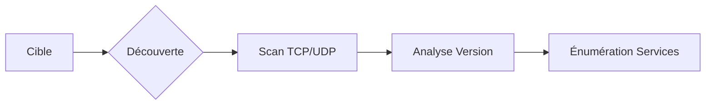

Cette documentation détaille les techniques de scan d'hôtes et de ports avec **Nmap**, essentielles pour la phase de reconnaissance.



## Host Discovery (ARP vs ICMP vs TCP SYN ping)

La découverte d'hôtes est la première étape pour identifier les cibles actives. La méthode varie selon la topologie réseau.

| Méthode | Option | Description |
| :--- | :--- | :--- |
| ARP Ping | `-PR` | Utilisé sur le même segment réseau (le plus rapide). |
| ICMP Echo | `-PE` | Ping classique (Echo Request). |
| TCP SYN Ping | `-PS[port]` | Envoie un SYN sur un port spécifique (ex: 80, 443). |
| TCP ACK Ping | `-PA[port]` | Envoie un ACK pour traverser certains firewalls. |

> [!info] Différence entre -Pn et découverte
> L'option `-Pn` désactive toute découverte d'hôte et considère que la cible est en ligne. À utiliser si la cible bloque les paquets ICMP ou les sondes de découverte. Voir [[Host Discovery]] pour plus de détails.

## Timing templates (-T0-5)

Le contrôle de la vitesse est crucial pour éviter la détection ou la saturation des services.

| Template | Vitesse | Usage |
| :--- | :--- | :--- |
| `-T0` / `-T1` | Très lent | Éviter les IDS (Paranoïaque/Sneaky). |
| `-T2` | Lent | Réseaux instables. |
| `-T3` | Normal | Par défaut. |
| `-T4` | Agressif | Standard en CTF/CPTS pour gagner du temps. |
| `-T5` | Insensé | Réseaux rapides uniquement, risque de perte de paquets. |

## États de port

| État | Signification technique |
| :--- | :--- |
| `open` | Port ouvert (SYN-ACK reçu) |
| `closed` | Port fermé (RST reçu) |
| `filtered` | Pas de réponse ou ICMP unreachable |
| `unfiltered` | Accessible mais état inconnu |
| `open\|filtered` | Port ouvert ou filtré |
| `closed\|filtered` | Port fermé ou filtré |

## Scans TCP

| Type | Commande | Description |
| :--- | :--- | :--- |
| Top ports | `--top-ports=10` | Ports les plus fréquents |
| Port spécifique | `-p 443` | Scan d’un seul port |
| Plage | `-p 1-65535` | Tous les ports |
| Fast | `-F` | Top 100 ports |
| SYN scan | `-sS` | _Stealth_ TCP |
| Connect scan | `-sT` | Full TCP handshake |

> [!danger] Privilèges root requis pour -sS
> Le scan **-sS** nécessite des privilèges élevés pour manipuler les sockets bruts (raw sockets). Le scan **-sT** est utilisé en mode utilisateur standard.

> [!tip] Options de contrôle
> Utilisez `-Pn` pour ignorer la découverte d'hôte, `-n` pour désactiver la résolution DNS, et `--disable-arp-ping` pour forcer le scan réseau sans ARP.

### Exemple : SYN scan et top ports
```bash
sudo nmap 10.129.2.28 --top-ports=10 -sS -Pn -n --disable-arp-ping --reason
```

## Analyse paquet (debug)

L'utilisation de `--packet-trace` permet d'observer les échanges de paquets, ce qui est crucial pour le troubleshooting réseau.

```bash
sudo nmap 10.129.2.28 -p 21 --packet-trace -Pn -n --disable-arp-ping
```

> [!info] Importance de --reason
> L'option `--reason` est indispensable pour comprendre pourquoi **Nmap** a déterminé un état de port spécifique, facilitant l'analyse des réponses ICMP ou des timeouts.

## Version Detection

L'option `-sV` permet d'identifier le service et sa version sur les ports ouverts.

```bash
sudo nmap 10.129.2.28 -p 445 -sV -Pn -n --disable-arp-ping --packet-trace --reason
```

## OS Fingerprinting (-O)

Tente de déterminer le système d'exploitation distant en analysant la pile TCP/IP.

```bash
sudo nmap -O 10.129.2.28
```

## Scripting Engine (NSE)

Le moteur de script de **Nmap** permet d'automatiser l'énumération avancée et la détection de vulnérabilités. Voir [[Nmap Scripting Engine (NSE)]].

```bash
# Scan de vulnérabilités basique
nmap -sV --script vuln 10.129.2.28

# Scan spécifique à un service (ex: SMB)
nmap -p 445 --script smb-enum-shares 10.129.2.28
```

## Evasion techniques (--mtu, --data-length, --spoof-mac)

Techniques pour contourner les firewalls ou les IDS/IPS. Voir [[Firewall Evasion]].

```bash
# Fragmentation de paquets (MTU doit être multiple de 8)
nmap -f --mtu 24 10.129.2.28

# Ajouter des données aléatoires pour masquer la signature du scan
nmap --data-length 200 10.129.2.28

# Spoofing d'adresse MAC
nmap --spoof-mac 00:11:22:33:44:55 10.129.2.28
```

## Scans UDP

Le scan UDP est nettement plus lent que le TCP car il ne repose pas sur un handshake.

| Option | Description |
| :--- | :--- |
| `-sU` | Scan UDP |
| `open` | Réponse directe (rare) |
| `closed` | ICMP type 3/code 3 reçu |

> [!warning] Lenteur extrême des scans UDP
> Les scans UDP peuvent être très longs en raison de l'absence de réponse ACK et de la gestion des timeouts. Ciblez toujours des ports spécifiques.

```bash
sudo nmap 10.129.2.28 -sU -p 137 --packet-trace --reason -Pn -n --disable-arp-ping
```

## Analyse rapide des ports filtrés

| Symptôme | Cause probable |
| :--- | :--- |
| Retransmissions fréquentes | Drop silencieux (firewall) |
| ICMP port unreachable | Port fermé |
| Aucun retour | Firewall avec drop |
| Retour ICMP immédiat | Rejet actif |

> [!danger] Risque de détection
> Les scans agressifs augmentent la probabilité d'être détecté par des solutions IDS/IPS. Adaptez la vitesse de scan en fonction de l'environnement.

## Output formats (-oA, -oN, -oG)

Il est impératif de sauvegarder les résultats pour la documentation du rapport de pentest.

| Option | Format | Description |
| :--- | :--- | :--- |
| `-oN` | Normal | Format lisible par l'humain. |
| `-oG` | Grepable | Facile à parser avec `grep` ou `awk`. |
| `-oX` | XML | Format structuré pour outils tiers. |
| `-oA` | All | Exporte dans les 3 formats simultanément. |

```bash
nmap -sC -sV -oA scan_result 10.129.2.28
```

---

*Voir également : [[Host Discovery]], [[Nmap Scripting Engine (NSE)]], [[Firewall Evasion]], [[Enumeration Methodology]]*