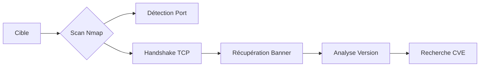

La reconnaissance des services est une étape critique pour identifier les vecteurs d'attaque potentiels via l'analyse des versions et des bannières.



## Objectif

Identifier le **service** actif, sa **version** exacte, et extraire un **banner** utile pour corréler avec des vulnérabilités connues (CVE, exploit-db).

> [!danger] Risque de détection
> L'utilisation de scans agressifs peut déclencher des alertes sur les systèmes **IDS/IPS**. Privilégier des scans ciblés pour limiter le bruit réseau.

> [!warning] Prérequis techniques
> L'utilisation de **-sS** (scan SYN) ou la capture de paquets via **tcpdump** nécessite des privilèges **root**.

## Options de base

| Option | Fonction |
| :--- | :--- |
| **-sV** | Détection version/service |
| **-p-** | Scan tous les ports TCP |
| **--stats-every=5s** | Affiche la progression (utile sur gros scans) |
| **-v**, **-vv** | Verbosité élevée : affiche ports dès découverte |
| **-Pn** | Ignore ICMP echo |
| **-n** | Ignore résolution DNS |
| **--disable-arp-ping** | Ignore scan ARP |
| **--packet-trace** | Affiche tous les paquets (SYN, ACK, PSH, etc.) |
| **--reason** | Explique la détection (syn-ack, no-response, etc.) |

> [!warning] Latence réseau
> Une valeur trop basse dans **--stats-every** peut impacter la précision du scan sur des connexions instables.

## Scan complet et version

```bash
sudo nmap 10.129.2.28 -p- -sV -Pn -n --disable-arp-ping --reason
```

## Gestion de la vitesse et timing (T0-T5)

Le paramètre **-T** définit la vitesse du scan. Un timing élevé augmente la vitesse mais accroît le risque de perte de paquets et de détection par les **IDS/IPS**.

| Timing | Nom | Usage |
| :--- | :--- | :--- |
| **-T0** | Paranoid | Très lent, évite IDS |
| **-T2** | Polite | Réduit la bande passante |
| **-T3** | Normal | Défaut |
| **-T4** | Aggressive | Recommandé pour réseaux rapides |
| **-T5** | Insane | Risque de faux négatifs |

```bash
sudo nmap -T4 10.129.2.28 -p- -sV
```

## Scan UDP

Le scan UDP est plus lent car il nécessite d'attendre une réponse ou un timeout. Il est crucial pour identifier des services comme **DNS**, **SNMP** ou **DHCP**.

```bash
sudo nmap -sU -sV 10.129.2.28 --top-ports 20
```

## Service fingerprinting avancé (--version-intensity)

Pour forcer Nmap à tester davantage de sondes (plus complet mais plus lent), on ajuste l'intensité de 0 à 9.

```bash
nmap -sV --version-intensity 9 10.129.2.28
```

## Scripts NSE (Nmap Scripting Engine)

Les scripts **NSE** permettent d'automatiser l'énumération et la détection de vulnérabilités. Voir la note **Nmap Scripting Engine (NSE)** pour plus de détails.

```bash
# Scan de vulnérabilités basique
nmap --script vuln 10.129.2.28 -p 80,443

# Énumération spécifique (ex: SMB)
nmap -p 445 --script smb-enum-shares 10.129.2.28
```

## Output formats (oA, oN, oX)

Il est indispensable de sauvegarder les résultats pour analyse ultérieure. L'option **-oA** génère trois fichiers simultanément (Nmap, XML, Grepable).

```bash
nmap -sV 10.129.2.28 -oA scan_initial
```

## Statut du scan

```bash
sudo nmap 10.129.2.28 -p- -sV --stats-every=5s
```

## Exemple de résultat

```text
PORT    STATE SERVICE  VERSION
80/tcp  open  http     Apache httpd 2.4.29 ((Ubuntu))
22/tcp  open  ssh      OpenSSH 7.6p1 Ubuntu 4ubuntu0.3
143/tcp open  imap     Dovecot imapd (Ubuntu)
995/tcp open  ssl/pop3 Dovecot pop3d
```

## Analyse manuelle du banner

> [!info] Vérification manuelle
> En cas de bannière tronquée ou absente par **nmap**, la vérification manuelle est indispensable.

```bash
nc -nv 10.129.2.28 25
# Résultat attendu : 220 inlane ESMTP Postfix (Ubuntu)
```

## Capture live des échanges

```bash
sudo tcpdump -i eth0 host 10.10.14.2 and 10.129.2.28
```

Le 4e paquet avec le flag **P.** (PSH) indique généralement l'envoi du banner :
`220 inlane ESMTP Postfix (Ubuntu)`

## Méthodes complémentaires

**Nmap** peut parfois échouer à récupérer des bannières si celles-ci ne suivent pas immédiatement le handshake TCP. Les outils suivants permettent de compléter l'énumération :

- **nc** (Netcat) : Connexion brute au port.
- **curl** : Analyse des en-têtes HTTP/HTTPS.
- **openssl s_client** : Analyse des services chiffrés (TLS/SSL).

## Utilité du banner, service et version

| Info obtenue | Utilisation |
| :--- | :--- |
| **OpenSSH 7.6p1** | Lookup vuln **SSH** |
| **Apache 2.4.29** | Check exploits **Apache** |
| **Postfix (Ubuntu)** | Confirme le système et le type de service |
| **Dovecot imapd** | Énumération email / auth bruteforce |

Ces informations sont essentielles pour la phase de recherche de vulnérabilités, souvent couplée avec le **Nmap Scripting Engine (NSE)** ou les fondamentaux du **Network Scanning** et des **Banner Grabbing Techniques**.