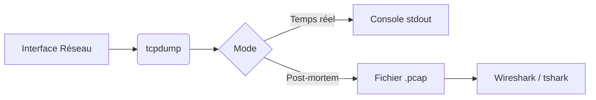

## Flux de capture réseau

Ce diagramme illustre le processus de capture et d'analyse de trafic réseau via **tcpdump**.



## Privilèges requis (sudo)

> [!danger] Privilèges requis
> L'utilisation de **tcpdump** nécessite les privilèges root (ou la capacité `CAP_NET_RAW`) pour placer l'interface réseau en mode promiscuité et intercepter le trafic qui ne lui est pas destiné.

```bash
sudo tcpdump -i eth0
```

## Analyse de paquets en temps réel vs post-mortem

L'analyse en temps réel est utilisée pour le débogage immédiat ou la détection d'activité suspecte, tandis que le mode post-mortem permet une analyse approfondie sans impacter les performances du système cible.

- **Temps réel** : Affichage direct dans le terminal.
- **Post-mortem** : Enregistrement dans un fichier `.pcap` pour analyse ultérieure avec **Wireshark Cheatsheet**.

```bash
# Temps réel avec affichage verbeux
sudo tcpdump -i eth0 -vv

# Post-mortem : capture vers fichier
sudo tcpdump -i eth0 -w capture.pcap
```

## Gestion des interfaces réseau

Pour lister les interfaces disponibles sur le système :

```bash
tcpdump -D
```

Pour capturer le trafic sur une interface spécifique :

```bash
tcpdump -i eth0
```

## Limitation de la taille des paquets (-s)

> [!warning] Risque de saturation
> L'utilisation de **-w** écrit les données brutes, ce qui peut saturer rapidement un système de fichiers. Utilisez le flag **-s** (snaplen) pour limiter la taille capturée par paquet si seul l'en-tête est nécessaire.

```bash
# Capture uniquement les 64 premiers octets de chaque paquet
sudo tcpdump -i eth0 -s 64 -w capture.pcap
```

## Exemples de syntaxe BPF (Berkeley Packet Filter)

Les filtres **BPF** permettent de cibler précisément le trafic lors de la capture pour réduire le bruit.

| Type | Syntaxe | Description |
| :--- | :--- | :--- |
| **Host** | `host 10.10.10.1` | Filtre par IP source ou destination |
| **Net** | `net 192.168.1.0/24` | Filtre par sous-réseau |
| **Proto** | `proto \tcp` | Filtre par protocole |
| **Logique** | `src host 10.10.10.1 and dst port 80` | Combinaison de conditions |

```bash
# Exclure le trafic SSH pour nettoyer la sortie
sudo tcpdump -i eth0 'not port 22'

# Capturer uniquement le trafic TCP SYN (flags)
sudo tcpdump -i eth0 'tcp[tcpflags] & tcp-syn != 0'
```

## Privilèges et configuration

> [!tip] Performance
> L'utilisation du flag **-nn** est indispensable pour éviter la résolution DNS et de noms de services, ce qui réduit la charge CPU et accélère l'affichage en temps réel.

## Capture de base

Capture standard sur l'interface par défaut :

```bash
tcpdump -i any
```

## Filtres de base

Filtrage par adresse IP source ou destination :

```bash
tcpdump host 192.168.1.1
tcpdump src 192.168.1.1
tcpdump dst 192.168.1.5
```

## Filtres par port

Filtrage par port spécifique ou plage de ports :

```bash
tcpdump port 80
tcpdump portrange 80-443
```

## Filtres par protocole

Filtrage basé sur les protocoles de la couche transport ou application :

```bash
tcpdump icmp
tcpdump tcp
tcpdump udp
tcpdump arp
```

## Filtres avancés (BPF)

Les filtres **BPF** (Berkeley Packet Filter) permettent des requêtes complexes :

```bash
tcpdump 'src host 10.0.0.1 and dst port 443'
tcpdump 'tcp and (port 80 or port 443)'
```

> [!note] Syntaxe
> Les filtres doivent être placés entre guillemets simples pour éviter l'interprétation des caractères spéciaux par le shell.

## Affichage et lecture avancée

Affichage détaillé du contenu des paquets (hexadécimal et ASCII) :

```bash
tcpdump -X -i eth0
```

Affichage des en-têtes de niveau liaison (Ethernet) :

```bash
tcpdump -e -i eth0
```

## Enregistrement et analyse

Enregistrement dans un fichier pour analyse ultérieure avec **Wireshark** :

```bash
tcpdump -i eth0 -w capture.pcap
```

Lecture d'un fichier de capture existant :

```bash
tcpdump -r capture.pcap
```

## Capture de trafic spécifique

Capture de trafic **HTTP** (port 80) avec affichage du contenu :

```bash
tcpdump -i eth0 -A 'tcp port 80'
```

Capture de trafic **DNS** (port 53) :

```bash
tcpdump -i eth0 udp port 53
```

## Analyse post-mortem avec tshark

Pour une analyse automatisée ou en ligne de commande des fichiers **pcap**, **tshark** est l'outil complémentaire recommandé, souvent utilisé dans le cadre de **Network Enumeration** ou lors de **Man-in-the-Middle Attacks**.

```bash
tshark -r capture.pcap -z http,stats
```

Ces méthodes permettent une transition fluide entre la capture brute et l'analyse approfondie, similaire aux workflows utilisés dans la **Wireshark Cheatsheet**.